<link rel=stylesheet href=style.css>

# **组合逻辑电路**
## **概述**
> <big>组合电路的特点</big>
  - 逻辑功能的特点
    - 电路在任何时刻的输出状态只取决于该时刻的输入状态，而与原来的状态无关
  - 电路结构特点
    - 输出、输入之间没有反馈延迟电路
    - 不包含记忆性元件(触发器)，仅由门电路构成
> <big>组合电路逻辑功能表示方法</big>
  - 真值表，卡诺图，逻辑表达式，时间图(波形图)
> <big>组合电路分类</big>
  - 按逻辑功能不同
    - 加法器 比较器 编码器 译码器 数据选择器和分配器 只读存储器

## **组合电路的分析方法和设计方法**
> <big> 组合电路的基本分析方法 </big>
  - 分析步骤
    - 逻辑图 &rarr; 逻辑表达式 &rarr; 化简 &rarr; 真值表 &rarr; 说明功能
  - 解题步骤
    - 逻辑表达式 &rarr; 化简 &rarr; 列真值表 &rarr; 功能说明
> <big> 组合电路的基本设计方法 </big>
  - 设计步骤
    - 逻辑抽象 &rarr; 列真值表 &rarr; 写表达式化简/变换 &rarr; 画逻辑图

## **加法比较器和数值比较器**
> <big> 加法器 </big>
  - 半加器（Half  Adder）
    - 定义：两个 1 位二进制数相加不考虑低位进位

        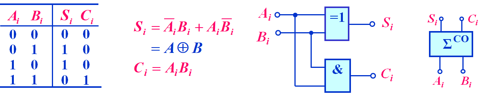
  - 全加器（Full  Adder）
    - 定义：两个 1 位二进制数相加，考虑低位进位
  
      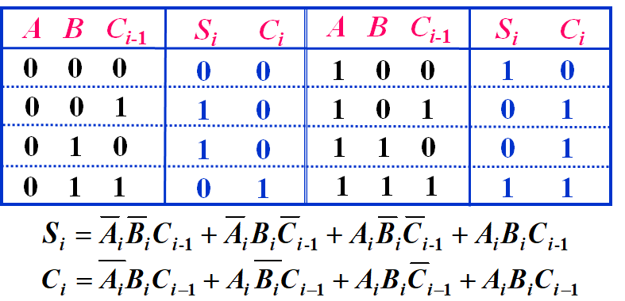
      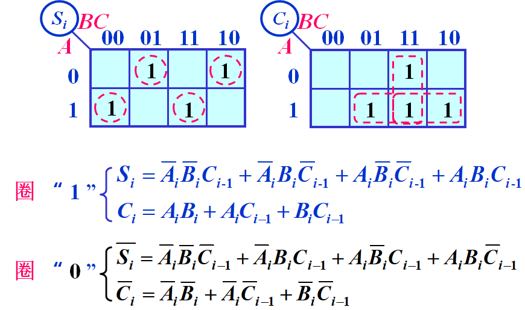
      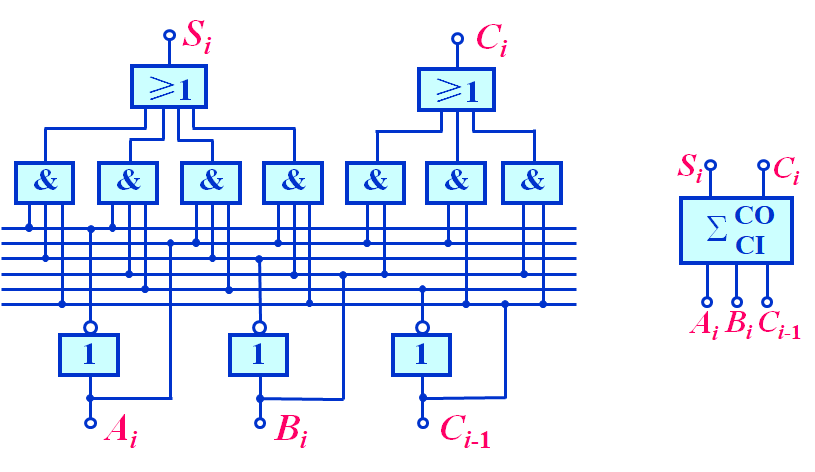

  - 加法器
    - 4 位串行进位加法器
      - 特点：电路简单，连接方便；速度低

      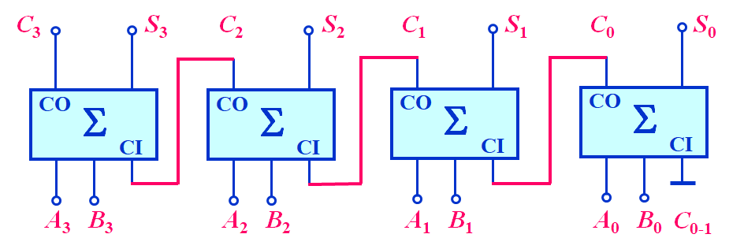

    - 超前进位加法器
      - 特点：速度快，电路比较复杂

> <big> 数值比较器 </big>
  - 1 位数值比较器

      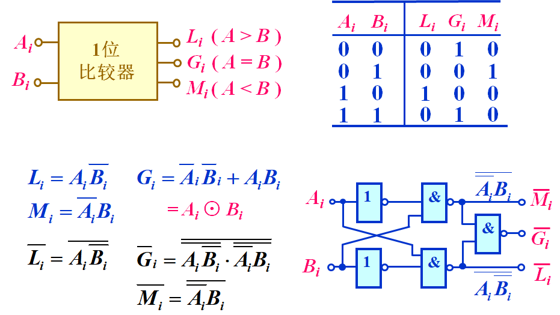

  - 4 位数值比较器

      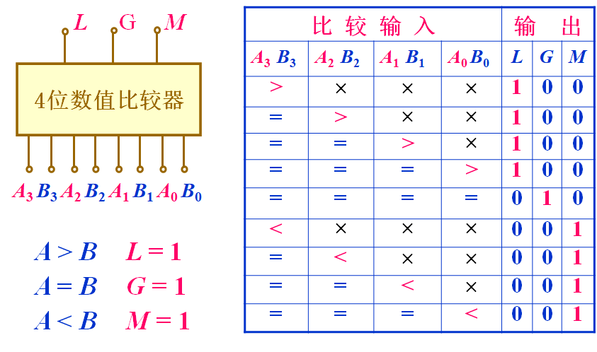
      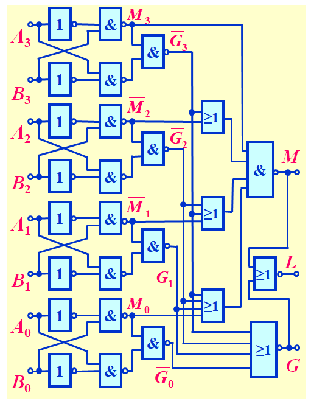

## **编码器和译码器**
> <big> 编码器 </big>
  - 编码：用文字、符号或者数字表示特定对象的过程（用二进制代码表示不同事物）
  - 分类
    - 二进制编码器 ($2^{n}\rarr n$)
    - 二-十进制编码器 (10 &rarr; 4)
    - 普通编码器
    - 优先编码器
  - 二进制编码器
    - 用 n 位二进制代码对 $N=2^{n}$ 个信号进行编码的电路
    - 符号

      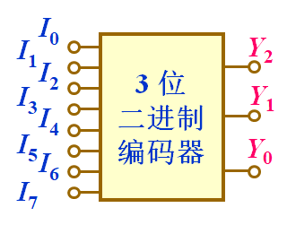
      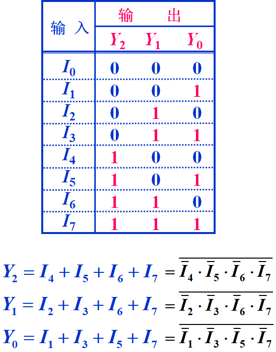

      - $I_{0}-I_{7}$ 是一组互相排斥的输入变量，任何时刻只能有一个端输入有效信号
    - 逻辑图
  
      
    
  - 三位二进制优先编码器
    - 优先编码：允许几个信号同时输入，但只对优先级别最高的进行编码。优先顺序：$I_{7}\rarr I_{0}$

      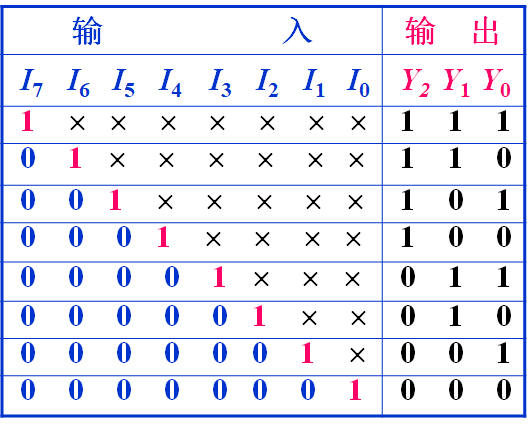
    
  - 二-十进制编码器
    - 符号
  
      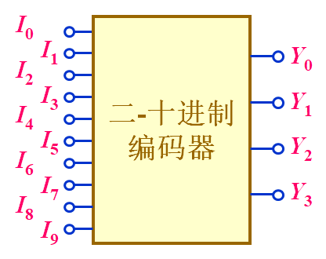

> <big> 译码器 </big>
  - 含义: 编码的逆过程，将二进制代码翻译为原来的含义
  - 三位二进制译码器

      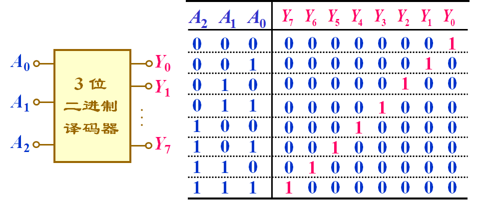

  - 集成3线-8线译码器
  
      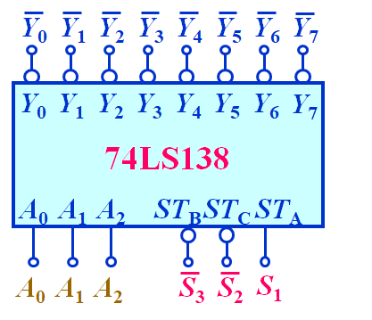

    - 控制端
      - 禁止工作：$S_{1}=0　or　\overline{S}_{2}+\overline{S}_{3}=1$
      - 正常工作：$S_{1}=1　and　\overline{S}_{2}+\overline{S}_{3}=0$
  - 二进制译码器级联

      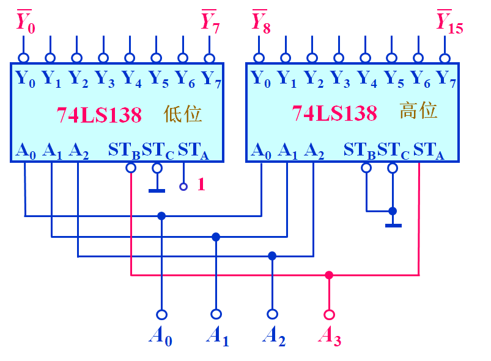

  - 二进制译码器的主要特点
    - 功能特点：输出端提供全部最小项
    - 电路特点：与门(原变量输出)  与非门(反变量输出)

## **数据选择器和分配器**
> <big> 数据选择器 </big>
  - 能够从多路数据输入中选择一路作为输出的电路
  - 4选1数据选择器 

    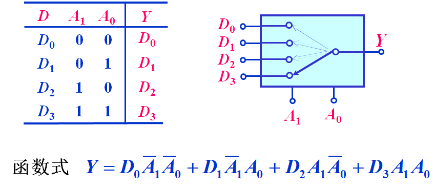
    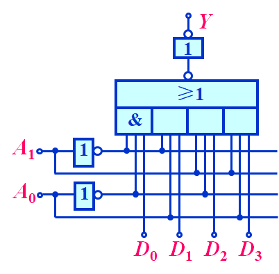

  - 集成数据选择器  
    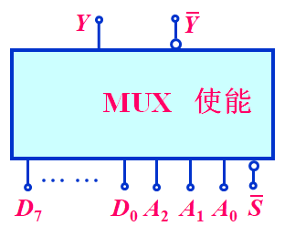
    - $\overline{S}: 选通控制端$
    - $A_{2}-A_{0}$: 地址端
    - $D_{7}-D_{0}$: 数据输入端
    - $Y-\overline{Y}$: 数据输出端
> <big> 数据分配器  </big>
  - 将 1 路输入数据，根据需要分别传送到 m 个输出端

    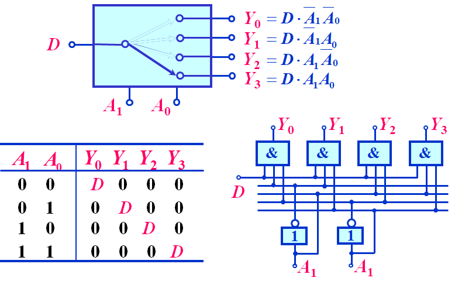

## **用MSI实现组合逻辑电路**
> <big> 用数据选择器实现组合逻辑函数 </big>
  - 基本原理
    - 选择器输出为标准与或式，含地址变量的全部最小项
  - 步骤
    - 根据 $n=k-1$ 确定数据选择器的规模和型号
      - n: 选择器地址码
      - k: 函数的变量个数
    - 写出函数的标准与或式和选择器输出信号表达式
    - 对照比较确定选择器各个输入变量的表达式
    - 根据采用的数据选择器和求出的表达式画出连线图
  - 型号
    - 四选一：74LS153  
    
    - 八选一：74LS151  
    

> <big> 用二进制译码器实现组合逻辑函数 </big>
  - 基本原理
    - 二进制译码器又叫变量译码器或最小项译码器,它的输出端提供了其输入变量的全部最小项
  - 步骤
    - 选择集成二进制译码器
    - 写函数的标准与非-与非式
    - 确认变量和输入关系
    - 画连线图
  - 型号
    - 三线八线译码器：74SL138  
    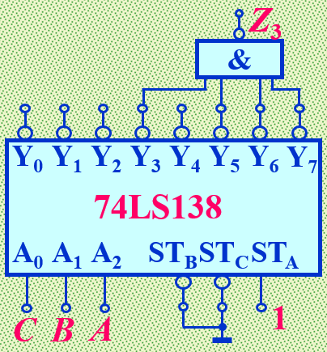  
## **ROM**
- 不考

## **组合电路中的竞争冒险**
- 不考