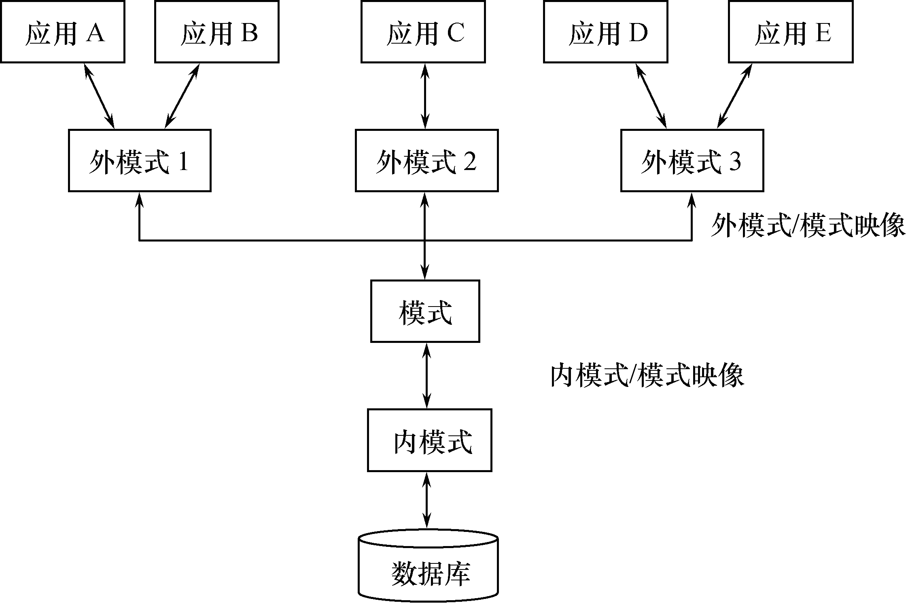

<link rel=stylesheet href=style.css>

<h1> 数据库概览 </h1>
<h2> 1 数据管理技术的发展 </h2>
<h3> 1.1 数据，数据处理和数据管理 </h3>

  - 数据：描述客观事物的符号
  - 数据处理：采集，转换，组织，存储.....
  - 数据管理：对数据进行采集，整理，组织，存储等操作

<h3> 1.2 人工管理阶段 </h3>
<h4> 人工管理阶段的特点 </h4>

  - 数据不能长期保存在计算机中
  - 数据与程序不具有独立性
  - 数据是面向应用的，数据不共享

<h3> 1.3 文件系统阶段 </h3>
<h4> 文件系统的优点 </h4>

  - 数据能够长期保存
  - 软件对数据进行管理

<h4> 文件系统的缺点 </h4>

  - 数据`共享性差`,`冗余度大`
  - 数据`独立性差`

<h3> 1.4 数据库系统阶段 </h3>
<h4> 数据库系统的特点 </h4>

  - 数据结构化
  - 数据共享性高，冗余度低，易于扩充
  - 数据独立性高
  - 数据统一管理与控制
    - 数据库中的数据由 DBMS 统一管理与控制，DBMS 必须提供以下 4 个方面的数据控制功能
      - 并发访问控制
      - 数据完整性检查
      - 数据安全性保护
      - 数据库恢复

<h4> 数据库系统的发展 </h4>

  - 第一代数据库系统
    - `层次模型`或`网状模型`
    - 格式化模型
  - 第二代数据库系统
    - 支持`关系数据模型`的关系数据库系统
    - 第二代数据库系统的特点  
      1. 概念单一，实体与实体之间的联系都用关系来表示
      2. 以关系代数为基础，形式化基础好
      3. 数据独立性强，数据的物理存取路径对用户屏蔽
      4. 关系数据语言实现了标准化
  - 第三代数据库系统
    - 基本特征 
      1. 应支持数据管理，对象管理和知识管理
      2. 必须保持或继承第二代数据库系统的技术
      3. 必须对其他系统开放

<h2> 2 理解数据库系统 </h2>
<h3> 2.1 数据库系统的概念 </h3>

  - 数据库系统 (DataBase System，DBS) 是指带有数据库并利用数据库技术进行数据管理的计算机系统

<h3> 2.2 数据库系统的组成 </h3>
<h4> 数据库系统 (DBS) 的组成 </h4>

  - `数据库，数据库管理系统(DBS)，数据库管理员`

<h4> 数据库 </h4>

  - 数据库是构成数据库系统的基础
  - 特点：`集成性，共享性`

<h4> 数据库的软件系统 </h4>

  - 数据库的软件系统包括 操作系统，数据库管理系统(及其应用开发程序)，数据库应用系统
  - `数据库管理系统 (DBMS)` 是数据库系统的核心软件

<h4> 数据库系统的人员 </h4>

  - 数据库管理员 (DBA：DataBase Administrator)
  - 系统分析人员和数据库设计人员
  - 应用程序员
  - 最终用户 (End User)

<h2> 3 数据库系统的体系结构 </h2>
<h3> 3.1 数据库系统的三级模式结构 </h3>
<h4> 概述 </h4>

  - 数据库系统的三级模式结构是指数据库系统是由外模式，模式和内模式三级构成的
  - 数据库三级结构
    <br>

<h4> 模式 </h4>

  - 逻辑模式/概念模式
  - 面向所有用户
  - 一个数据库只有一个模式
<h4> 外模式 </h4>

  - 子模式/用户模式
  - 面向应用
  - 一个数据库可以有多个外模式
<h4> 内模式 </h4>

  - 存储模式
  - 在存储介质上的存储结构

<h3> 3.2 数据库的二级映像 </h3>
<h4> 二级映像 </h4>

  - 外模式/模式映像
  - 模式/内模式映像

<h4> 数据库系统的三级模式与二级映像的优点 </h4>

  - 保证数据的逻辑和物理独立性
  - 有利于数据共享，减少数据冗余
  - 有利于数据的安全性
  - 简化用户接口

<h3> 3.3 数据库管理系统 </h3>
<h4> 数据库管理系统功能 </h4>

  - 有效组织，存取和维护数据
  - 数据定义功能
  - 数据操纵功能
  - 数据库的事务管理和运行功能
  - 其他功能

<h4> 数据库管理人员 </h4>

  - 数据库管理员（DBA）
  - 系统分析员和数据库设计人员
  - 应用程序员
  - 最终用户


<h2> 4 数据模型 </h2>
<h3> 4.1 数据模型的概念 </h3>
<h4> 数据抽象过程 </h4>

  - 数据抽象 <br>
    ```plantuml
    partition 信息世界 {
        :现实世界;
        :认识抽象;
        :概念模型;
    }
    partition 机器世界 {
        :逻辑模型;
        :物理模型;
    }
    ```
  - `概念数据模型`（用户对信息）
    - 它是面向用户的模型，是`现实世界到机器世界的一个中间层次`。
    - 其基本特征是按用户观点对信息进行建模，与具体DBMS无关。
  - `逻辑数据模型`（结构化，数据建模）
    - 其特征是按计算机系统的观点对数据建模，服务于DBMS的应用实现。
    - 结构化数据模型包括：层次模型、网状模型、关系模型等。
  - `物理数据模型`（操作系统与硬件）
    - 用于描述数据在存储介质上的组织结构，它与具体DBMS有关，也与操作系统和硬件有关，是物理层次上的数据模型。


<h3> 4.2 概念数据模型 </h3>
<h4> ER 模型三要素 </h4>

  - 实体(Entity)[矩形]：客观存在并可相互区别的事物。
  - 属性(Attribute)[椭圆]：实体通常有若干特征，每个特征称为实体的一个属性。属性刻画了实体在某方面的特性。
  - 联系(Relationship)[棱形与线]：现实世界中事物之间的联系反映在E-R模型中就是实体间的联系。

<h4> 实体型，实体值和实体集 </h4>

  - 实体型：对某类数据结构和特征的描述
    - 例：`商品(商品编号，商品类别，商品名称，生产商，单价，库存量，保质期)`
  - 实体值：实体的内容，描述实体的各个属性值组成
    - 例：`(50020005，体育用品，足球，美好体育用品公司，120，20，2012-1-1)`
  - 实体集：具有相同实体型的若干实体构成的集合

<h4> 联系的分类 </h4>

  - 一对一联系 (1:1)
  - 一对多联系 (1:n)
  - 多对多联系 (m:n)

<h4> ER 模型 </h4>

  - 实例
    <br>

<h3> 4.3 逻辑数据模型 </h3>
<h4> 逻辑模型三要素 </h4>

  - `数据结构，数据操作，数据完整性约束`

<h4> 数据模型的类型 </h4>

  - 自数据库技术产生以来，先后出现了 层次模型，网状模型，关系数据模型，面向对象模型，对象关系数据模型
  - 格式化模型(淘汰)：层次模型，网状模型

<h4> 关系数据模型 </h4>

  - 关系数据模型的特点
    1. 建立在严格的数学理论基础上
    2. 数据结构简单清晰
    3. 数据物理存取路径对用户是透明的，有更高的数据独立性，更好的数据安全性