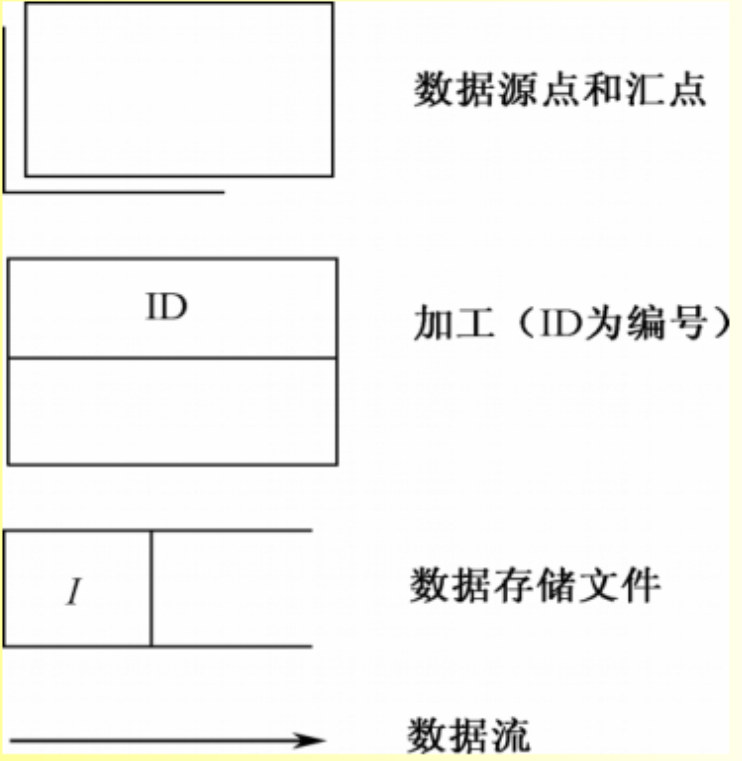
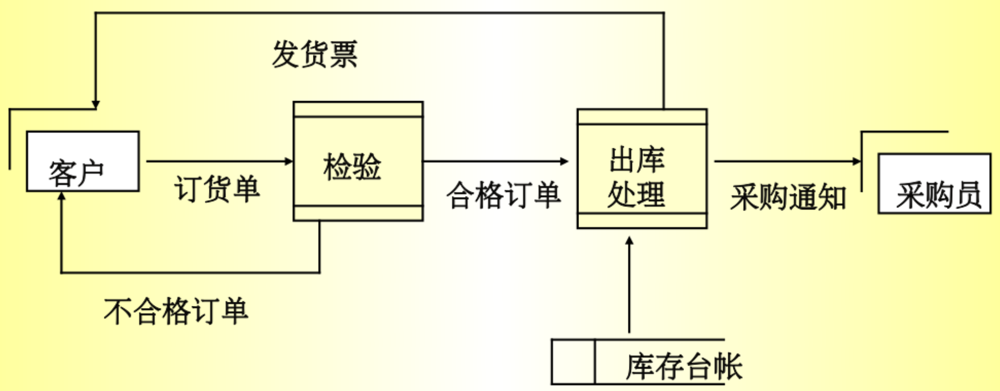
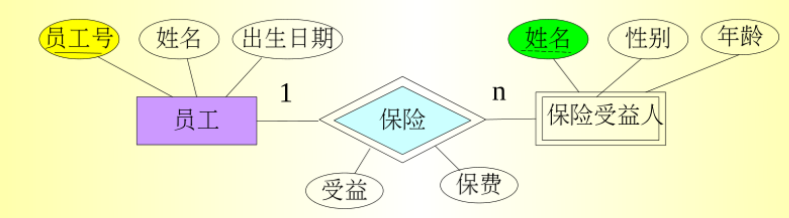
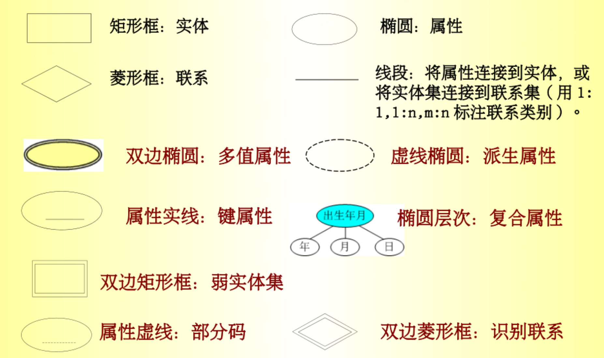
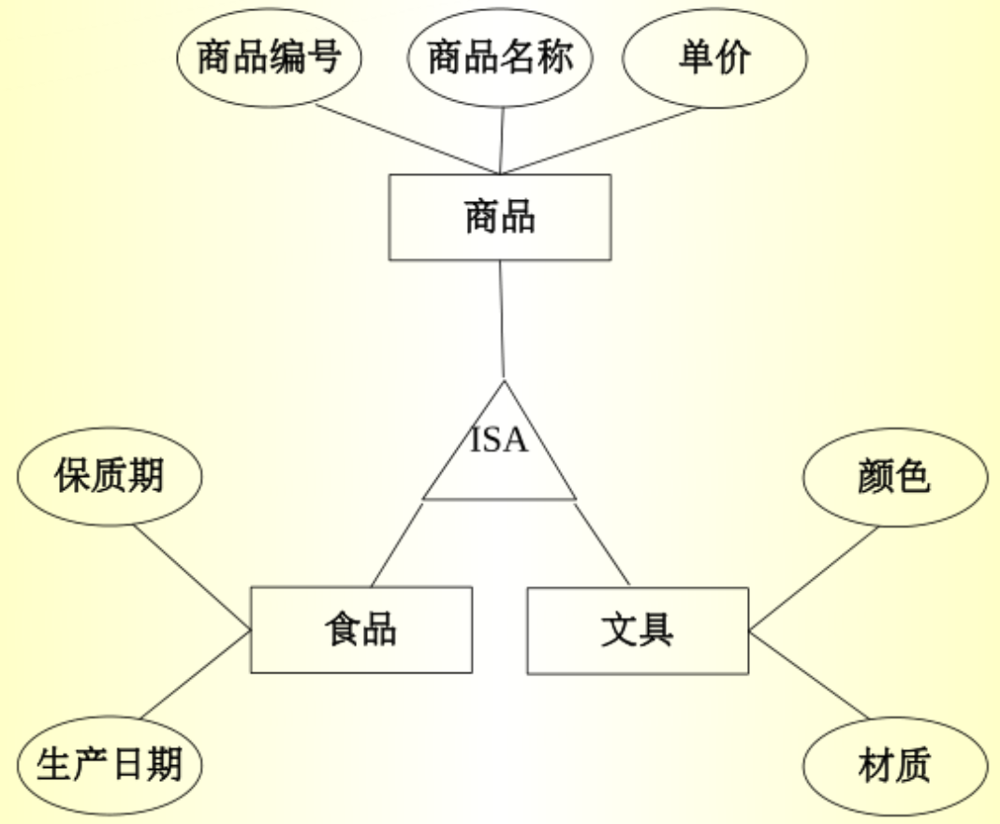

<link rel=stylesheet href=style.css>

# 数据库设计
## 1 数据库设计概述
### 1.1 数据库设计的含义
#### 数据库设计的概念
- 广义：数据库及其应用系统的设计
- 侠义：数据库本身
#### 数据库设计目标
- 数据的存储效率
- 存储空间利用率
- 系统运行管理效率
### 1.2 数据库设计的特点
#### 数据库兼备是硬件，软件和干件的结合
- 技术与管理的界面称之为“干件”
#### 数据库设计应一应用系统相结合
- 结构(数据)设计：设计数据库框架或数据库结构
- 行为(物理)设计：设计应用程序，事务处理等
#### 数据库设计的特点
- 反复性
- 试探性
- 多阶段
- 数据库建设需将 `技术，管理和基础数据` 相结合
- 数据库设计需将 `结构设计` 与 `行为设计` 相结合
- 数据库设计涉及多学科领域
### 1.3 数据库设计的步骤
#### 准备工作(4类人员)
- 数据库分析设计人员
- 用户
- 程序员（编制程序）
- 操作员（准备软硬件环境）
#### 数据库设计的六阶段
- 需求分析
- 概念结构设计
- 逻辑结构设计
- 数据库物理设计
- 数据库实施
- 数据库运行和维护
## 2 需求分析
### 2.1 需求分析的步骤
#### 需求分析的任务
- 充分了解原系统工作概况，明确用户的各种需求
- 在此基础上确定新系统的功能
#### 需求分析的重点
- 需求分析的重点是调查，收集与分析用户在数据管理中的`信息需求，处理需求，安全性与完整性需求`
### 2.2 需求分析的步骤
#### 调查步骤
- 现系统调查
  - 调查组织机构情况
  - 调查各部门的业务活动情况
  - 协助用户明确对新系统的各种要求
  - 确定新系统边界
- 业务及需求分析
- 综合，调整
- 编写需求分析报告
#### 常用调查方法
- 跟班调查
- 开调查会
- 请专家
- 询问
- ........
### 2.3 需求分析的描述
#### 分析和表达用户的需求的常用方法
- `结构化分析法(SA)`
  - 从`上层`的系统组织机构入手，采用`逐层分解`的方式分析系统，并用`数据流图`和`数据字典`描述系统
  - 数据流图 (DFD)
    - 图形化系统模型，展示信息系统的主要需求：`输入，输出，过程和数据存储`、描述了`数据流动，存储，处理`的逻辑关系     
       
    - DFD 只描述数据的流动
    - DFD 分多层表示，逐步展开数据流和功能细节
      - 先画顶层 DFD
      - 自顶向下画出各层 DFD
  - 数据字典 (DD) 
    - 数据字典是各类数据描述的集合
    - [CSDN 文献](https://blog.csdn.net/weixin_43645287/article/details/109380467)
## 3 概念设计
### 3.1 概念设计的方法
#### 概念设计模型
- 常用策略
  - 自顶向下：进行需求分析
  - 自底向上：设计概念结构
- 自底向上设计概念结构步骤
  - 抽象数据并设计局部视图
  - 继承局部视图，得到全局概念结构
### 3.2 E-R 方法
- 数据抽象
  - 找出 ER 图中三个组成：实体，实体属性，联系类型
- 局部视图设计
  - 选择局部应用
  - 逐一设计分 ER 图
  - 集成局部视图
  - 消除冗余
### 3.3 基本 E-R 模型的扩充
#### 多元联系
- 两个以上实体集的各实体之间可以存在一对一，一对多，多对多联系
#### 属性的类型
- 键属性：候选码中的属性
- 简单属性：不可再分的属性
- 复合属性：可以划分为更多小属性
- 多值属性：可以取多个值的属性
- 派生属性：由基本属性导出的属性
#### 实体
- 实体的基数
  - 最大最小数：再连接线旁边用 (min,max) 表示
- 弱实体集
  - 弱实体集：没有键属性的实体集
  - 强实体集：属性可以形成键的实体集
  - 弱实体集的识别
    - 识别实体：弱实体集缺乏键属性，需利用其依赖的强实体集的属性进行识别，将其依赖的强实体集称为识别实体
    - 识别联系：识别实体与弱实体集之间的联系`(1:n)`
    - 弱实体集的识别：识别实体的主码 + 弱实体集的部分码
  - 弱实体集的 ER 图表示
    - 弱实体集：双边矩形框
    - 识别联系：双边菱形框
    - 属性：下面加个虚线  
    
    
### 3.4 扩展 E-R 模型
#### 类层次
- 将实体型中的实体分成子类，分类后体现为一种类层次，上层为超类，下层为子类。
- 子类除可继承超类属性外，还可以有自己独特的属性  
    
#### 演绎，归纳与聚集
- 演绎：以一个实体型为基础，定义该实体型子类的过程
- 归纳：演绎的逆过程，抽象出公共属性
- 聚类：把联系型以及联系所关联的实体型一并作为高层实体型来对待的抽象处理办法
## 4 其他部分
### 4.1 逻辑设计
#### 逻辑设计的任务
- 把 `E-R 图`转换为与选用 DBMS 产品所支持的数据模型相符合的`逻辑结构`
#### 逻辑结构设计的步骤
- 将`概念结构`转化为`关系模型`
- 将关系模型向特定 DBMS 支持下的数据模型转换
- 对数据模型进行优化

### 4.2 物理设计
#### 确定数据库物理结构
- 数据库的物理设计
  - 数据库在物理设备上的存储结构与存取方法称为数据库的物理结构，`依赖于选定的数据库管理系统`
  - 为一个给定的逻辑数据模型选取一个最适应环境的物理结构的过程，就是数据库的物理设计
- 数据库物理设计的步骤
  - 确定存储方法和存储结构
  - 对时间和空间效率进行评价
#### 性能评价
- 时间和空间上测试

### 4.3 数据库的运行与维护
#### 如何进行数据库的转储和恢复
- 利用 DBMS 提供的恢复功能