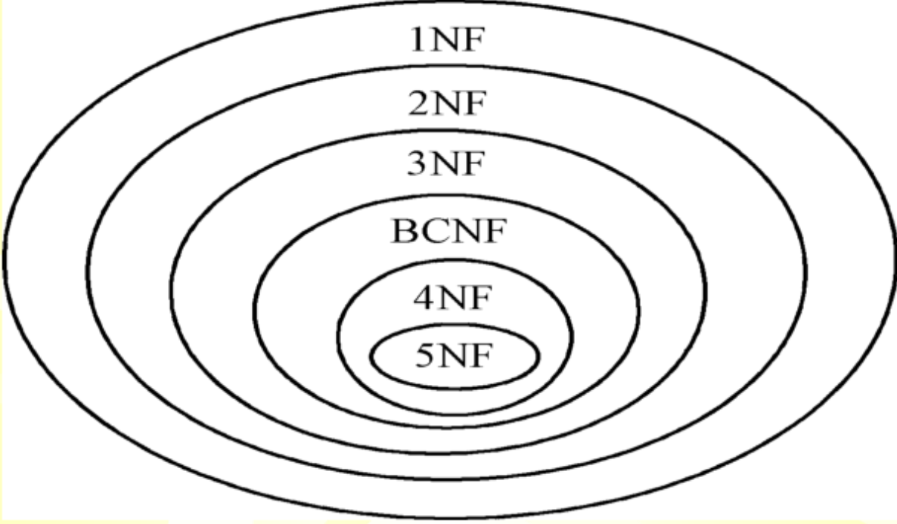

<link rel=stylesheet href=style.css>

# 关系规范化理论
## 1 数据冗余与操作异常问题
### 1.1 数据冗余
#### 数据冗余
- 数据冗余指同一数据在一个或多个数据文件中重复存储
- 数据冗余会带来很多问题
- `数据冗余`会导致更新等`异常`
#### 数据冗余的原因
- 数据结构角度
  - 对多个文件之间联系的处理：DBMS 以及能较好地解决
  - 同一个文件中数据之间的联系处理：依赖于关系数据模式的设计
## 2 函数依赖
### 2.1 函数依赖的概念
#### 数据依赖
- 客观世界的`实体集内部`或`实体集之间`属性相互联系的抽象
- 数据依赖实际上反映了属性之间的相互约束关系
### 2.2 函数依赖
#### 函数依赖的定义
- 定义：设 R(U) 是属性 U 上的关系模式，X 和 Y 是 U 的子集，r 是 R(U) 中任意给定的关系实例，若对于 r 中的任意两个元组 s 和 t，当 s[X]=t[X] 时有 s[Y]=t[Y] 则称属性子集 X 函数决定属性子集 Y，或 Y 函数依赖于 X，记为 X &rarr; Y
  - 若 X &rarr; Y 则称 X 为决定因素
  - 如果 X &rarr; Y 且 Y &rarr; X，则记为 X &larr;&rarr; Y
#### 函数依赖的分类
- 平凡与非平凡函数依赖
  - 平凡函数依赖：X &rarr; Y 且 $Y\subseteq X$
  - 非平凡函数依赖：X &rarr; Y 且 $Y\not\subseteq X$
- 部分与完全函数依赖 
  - 完全函数依赖：X &rarr; Y 且 X 的任何一个真子集 $X^{'}$ 都有 $X^{'} \not\rarr Y$ 记作 $X\stackrel{F}{\longrightarrow}Y$
  - 部分函数依赖：X &rarr; Y 且 X 存在一个真子集 $X^{'}$ 有 $X^{'} \rarr Y$ 记作 $X\stackrel{P}{\longrightarrow}Y$
  - 如果部份依赖，X 中存在冗余属性
- 传递函数依赖
  - Z 传递函数依赖于 X：$X\rarr Y \qquad Y\rarr Z \qquad Y\not\subset X \qquad  Y\not\rarr X$
  - X 不依赖于 Y，意味着 XY 不是一一对应，否则 Z 就是直接函数依赖于 X，而不是传递依赖
    
- 函数依赖与数据冗余
  - 部分函数依赖存在冗余属性
  - 传递依赖反映处属性间的间接依赖，是一种弱依赖
## 3 范式
### 3.1 范式的概念
- 将属性间的数据依赖关系满足给定约束条件的关系模式称为范式  
  
### 3.2 关系模式和码
#### 码
- 如果关系模式 R<U,F> 的一个或多个属性 A1, A2, ..., An 的组合满足如下条件，则该组合为关系模式 R 的码：
  - 这些属性函数决定该关系模式的所有属性，即 U
  - A1, A2, ..., An 的任何真子集都不能函数决定 R 的所有属性
  - 这不就是候选码
#### 超码
- 设 X 是关系模式R<U，F>的属性集，即，若 X 包含R<U，F>的码，则称X为超码。
### 3.3 基于函数依赖的范式
#### 第一范式(1NF)
- 如果关系模式 R<U,F> 中的每一个属性都是`不可再分`的，那么该关系模式属于第一范式，记作 $R\in 1NF$
  - 即每个属性都是原子属性, `不能嵌套表`
- 第二范式，第三范式，BC范式均与函数依赖有关
#### 第二范式(2NF)
- 关系模式 R<U,F> 满足第一范式，且每一个非主属性`完全函数依赖`于码，则为第二范式 ，记作 $R\in 2NF$
  - 2NF要求`非主属性完全依赖于码`
#### 第三范式(3NF)
- 在关系模式R<U，F >中，若不存在这样的码X、属性组Y和非主属性Z（Z不包含于Y），使得X→Y，Y→Z（这里X $\not\rarr$ Y）成立，则称R<U，F>是第三范式的，记为R∈3NF。
  - 即不存在`传递函数依赖`
#### BD范式(BCNF)
- 设关系模式 R<U，F>∈1NF，若 $X→Y，Y\not\subset X$ 时，X必含有码，则R<U，F >是BC范式的，记为R<U，F >∈BCNF。
  - 即关系模式 R<U，F >中，若每一个决定因素都包含码，则 R<U，F>∈BCNF。
- BCNF是`基于函数依赖的最高范式`，但不是数据库模式设计的最高范式。
- 如果一个数据库模式中的每个关系模式都属于BCNF，那么在`函数依赖`范畴内，它已实现了`彻底的分离`，`消除了插入和删除异常`；
- 但`属性之间`可能还存在`多值依赖`，多值依赖会导致不必要的数据冗余和操作异常

### 3.4 多值依赖
#### 多值依赖的定义
- 设R(U)是属性集U上的一个关系模式，X、Y、Z是U的子集，且Z=U-X-Y。对于R的任何关系r，如果存在两个元组s、t，则必然存在两个元组u、v，使得
  - u[X]=v[X] s[X]=t[X]
  - u[Y]=t[Y] 且 u[Z]=s[Z]
  - u[Y]=v[Y] s[Z]=t[Z]
- 即交换元组s、t在属性组Y上的值，得到的两个新元组u、v必在关系r中，则称Y多值依赖于X，记 X&rarr;&rarr;Y
#### 平凡多值依赖
- 设R(U)是属性集U上的一个关系模式，X、Y、Z是U的子集，如果或 X∪Y = U，则称X→→Y为平凡多值依赖。 
#### 多值依赖的性质
- 传递性，对称性，扩展列表
- 函数依赖是多值依赖的特例
#### 第四范式(4NF)
- 设FD、MVD分别为定义在关系模式R<U，D>上的函数依赖集和多值依赖集，D = FD∪MVD，若R<U，D>∈1NF，且所有非平凡的多值依赖X→→Y，其决定因素X都含有码，则称R<U，D>是第四范式的，记为R<U，D>∈4NF。 

## 4 数据依赖公理系统
### 4.1 逻辑蕴含
#### 逻辑蕴含的定义
- 设有满足函数依赖集 F 的关系模式 R<U，F>，对于R的任一关系r，若函数依赖 X→Y 都成立（即对于r中任意两元组t、s，若t[X]=s[X]，则t[Y]=s[Y]），则称 F 逻辑蕴含X→Y，记为 $F\rArr X\rarr Y$。
### 4.2 Armstrong 公理系统
#### Armstrong 公理系统用途
- 求给定关系模式的码
- 从一组函数依赖求得蕴含的函数依赖
#### 关系模式的推理规则
- 关系模式 R<U,F> 有以下的推理规则
  - A1 自反律：若 $Y\subseteq X\subseteq U$，则 $X →Y$ 为F所蕴含。
  - A2 增广律：若 $X →Y$ 为F所蕴含，且 $Z\subseteq U$，则 $XZ → YZ$ 为所蕴含。
  - A3 传递律：若 X→Y 及 Y→Z 为F所蕴含，则 X→Z 为F所蕴含。
#### Armstrong 公理导出规则
- 三条推理规则
  |            | 条件                   | 结论        | 使用推理规则 |
  | ---------- | ---------------------- | ----------- | ------------ |
  | 合并规则   | X&rarr;Y，X&rarr;Z     | X &rarr; YZ | A2,A3        |
  | 伪传递规则 | X&rarr;Y，WY&rarr;Z    | XW &rarr; Z | A2,A3        |
  | 分解规则   | X&rarr;Y，Z&subseteq;Y | X&rarr;Z    | A1,A3        |
### 4.3 函数依赖集的闭包
#### 闭包的定义
- 设有关系模式R(U，F)，F逻辑蕴涵的函数依赖的全体称为F的闭包，记为F+。F+即从F出发，根据Armstrong公理系统可导出的函数依赖的全体。
- 设F为属性集U上的一组函数依赖，X&subseteq;U， XF+ ={ A|X→A能由F 根据Armstrong公理导出}，XF+称为属性集X关于函数依赖集F 的闭包 
#### 求解闭包
- 逻辑蕴含的函数依赖的全体称为F的闭包
- 一级级推下去，直到为全集或与上一集合相同
#### 闭包的作用
- 判断X是否是R的超码
  - 若X的闭包包含了R的所有属性，则X是R的超码
- 若X的闭包包含了R的所有属性，则X是R的超码
  - 若X是超码，可检验X的所有子集的闭包是否包含R的所有属性。若不存在这样的子集，则X是R的候选码
  - 超码的任意一个子集不是超码，那么该超码为候选码
#### 候选码的求解
- 属性分类
  - L类：仅出现在F的函数依赖左边的属性
  - R类：仅出现在F的函数依赖右边的属性
  - N类：在F的函数依赖左边右边均未出现的属性
  - LR类：在F的函数依赖左右两边均出现的熟悉
- 快速求解候选码的充分条件
  - L类
      - X若为L类属性，则其一定是R的某一候选码的成员
      - X若为L类属性，且X的闭包包含了R的全部属性，则X必为R唯一候选码
        - 在左边，且为超码，则一定是唯一的候选码
  - R类
    - X若为R类属性，则X比不可能是候选码成员
  - N类
    - 若X是N类属性，则X一定是R的某一候选码的成员
  - 若X是N类属性和L类属性组成的属性集，且X的闭包包含了R的所有属性，则X是R的唯一候选码
- 候选码求解的一般方法
  - 步骤
    - 1.将属性分为L、R、LR、N类，令X代表L类和N类。令Y代表LR类。
    - 2.求X的闭包，若其包含了R的所有属性，则X是R的唯一候选码，结束
    - 3.否则从Y中取出一个属性A，求XA的闭包，若其包含了R的所有属性，则X是R的一个候选码
    - 4.否则重复3，直到取完为止
    - 5.从Y中去除所有已经成为主属性的属性
    - 6.在剩余的属性中依次取出两个属性、三个属性……将其记为集合B，求XB的闭包，若XB的闭包包含了R的全部属性，且自身不包含已经求出的候选码，则XB为R的一个候选码。
    - 7.重复6，直到所有组合依次取完
    - 8.输出候选码
#### 最小依赖集求解
- 步骤
   1. 右切: 有边化为单个属性
   2. 除本求包：求除了本身函数关系的闭包
   3. 逐一判断是否多余
   4. 左部最小化
### 4.4 最小依赖集
#### 最小依赖集概念
- （两个函数依赖集等价）设有函数依赖集F、G，如果G+= F+，则称函数依赖集F与G互为覆盖，或称F与G等价。
- （最小依赖集）如果函数依赖集F满足如下条件： 
  - F中任一函数依赖的右部仅含有单一属性；
  - F中不存在这样的函数依赖X→A，使得F与F{X→A}等价；
  - F中不存在这样的函数依赖X→A，X有真子集Z使得F与F{X→A}∪{Z→A}等价。则称F为最小依赖集或最小覆盖，记为Fmin。
#### 极小化过程
- 每一个函数依赖集 F 均等价于一个极小函数依赖集 Fm 。此 Fm 称为 F 的最小依赖集

## 5 模式分解
### 5.1 无损分解
> 这一节不讲人话，不再写定义式
### 5.2 函数依赖保持

