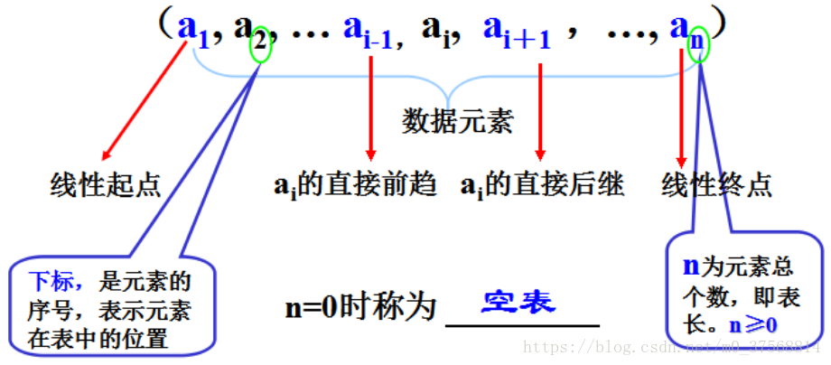
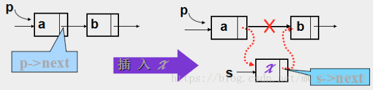
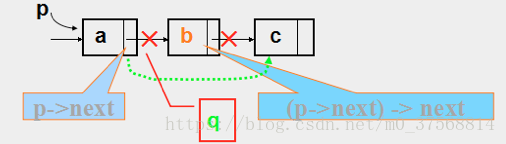
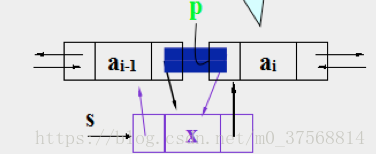
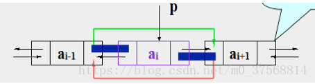

<link rel="stylesheet" href="style.css">

# **线性表**

参考文章 [ZhangAnmy](https://blog.csdn.net/m0_37568814/article/details/81288756?)

## **线性表的类型定义**
> <big> 线性结构特点 </big>
  1. 存在唯一的一个被称做“第一个”的数据元素
  2. 存在唯一的一个被称做“最后一个”的数据元素
  3. 除第一个之外，集合中的每个数据元素均只有一个前驱
  4. 除最后一个之外，集合中每个数据元素均只有一个后继
> <big> 线性表定义 </big>
   - 有限个性质相同的<span class=imp>数据元素</span>组成的序列  
     
> <big> 线性表的存储结构 </big>
  - 顺序存储结构  
    把逻辑上相邻的数据元素存储在物理上相邻的存储单元中的存储结构。通常用数组来描述数据结构中的顺序存储结构
  - 链式存储结构  
    其结点在存储器中的位置是随意的，即逻辑上相邻的数据元素在物理上不一定相邻。通过指针来实现
  - 基本运算  
    修改、插入、删除、查找、排序

<br>

## **线性表的顺序表示和实现**
> <big> 顺序表的创建 </big>
  - 静态分配
    ```C++
    #define MaxSize 10
    typedef struct{
        ElementType data[MaxSize];  //静态数组存放
        int length;
    }SqList
    ```
  - 动态分配
    ```C++
    #define InitSize 10
    typedef struct{
        ElementType *data;    //动态分配头指针
        int Maxsize;          //最大容量
        int length            //当前长度
    } SeqList;
    ```
  - C 语言动态申请和分配空间
    ```C++
    #include <stdlib.h>
    L.data=(ElemType*)malloc(sizeof(ElementType) * InitSize)
    ```
> <big> 顺序表的修改 </big>
  - 通过数组的下标便可访问某个特定元素并修改  
  - 时间复杂度：$O(1)$
> <big> 顺序表的插入 </big>
  - 插入: 在线性表的第i个位置前插入一个元素  
  - 实现步骤
      1. 将第n至第i 位的元素逐一向后移动一个位置
      2. 将要插入的元素写到第i个位置
      3. 表长加1  
      注意：事先应判断: 插入位置i 是否合法?表是否已满?  
      应当符合条件： 1≤i≤n+1  或  i=[1, n+1]
  - 核心语句
      ```C++
      for(j=n;j>=i;j--)
          a[j+1]=a[j]; 
      a[i]=x;   
      n++;
      ```
  - 插入时的平均移动次数为：
    - 时间复杂度：$n(n+1)/2÷(n+1)＝n/2≈O(n)$
    - 空间复杂度：$O(1)$
> <big> 顺序表的删除 </big>
  - 删除：删除线性表的第i个位置上的元素
  - 实现步骤：
      1. 将第i+1 至第n 位的元素向前移动一个位置；
      2. 表长减1。  
        注意：事先需要判断，删除位置i 是否合法?  
        应当符合条件：1≤i≤n  或  i=[1, n]
  - 核心语句
      ```C++
      for(j=i+1;j<=n;j++)
        a[j-1]=a[j]; 
      n--;
      ```
  - 插入时的平均移动次数为：
    - 时间按复杂度：$(n-1)/2 ≈O(n)$
    - 空间复杂度：$O(1)$

<br>

## **线性表的链式表示和实现**
> <big>线性链表概念</big>
  - 用一组任意的存储单元存储线性表的数据元素（这组存储单元可以是连续的，也可以是不连续的）
  - 一个数据元素称为一个结点，包括两个域：存储数据元素信息的域称为数据域；存储直接后继存储位置的域称为指针域。指针域中存储的信息称作指针或链
  - 由于链表的每个结点中只包含一个指针域，故线性链表又称为单链表
> <big>单链表</big>
  - 单链表的定义  
    - 节点定义
      ```C++
      typedef struct LNode{     //定义节点
          ElemType data;        //数据域
          struct LNode *next;   //指针域
      }LNode,*LinkList;
      ```
    - 带头结点的单链表
      ```C++
      bool InitList(LinkList &L){
          L=(LNode *) malloc (sizeof(LNode));  //分配一个头节点
          if(L == NULL)         //内存不足，分配失败
              return false;
          L->next = NULL;       //头节点之后没有节点
          return true;
      }
      ```
  - 单链表的修改(或读取）
    - 思路：要修改第i个数据元素，必须从头指针起一直找到该结点的指针p，return p;  然后才能：p->data=new_value
    - 伪代码
      ```C++
      Linklist *find(Linklist *head ,int i){ 
          int j=1;
          Linklist *p;
          P=head->next;
          While((p!=NULL)&&(j<i)){
              p=p->next;
              j++;
          }
      }
      ```
  - 单链表的插入
    - 图解  
      
    - 核心语句
      ```C++
      Step 1：s->next=p->next;
      Step 2：p->next=s；
      ```
  - 单链表的删除
    - 思路：要借助辅助指针变量q
    - 图解  
      
    - 核心语句
      ```C++
      Step 1：q = p->next;  //首先保存b的指针，靠它才能找到c；
      Step 2：p->next=q->next;  //将a、c两结点相连，淘汰b结点；
      Step 3: free(q);  //彻底释放b结点空间
      ```
> <big> 双链表 </big>
  - 双向链表的插入
    - 要求：设p已指向第i元素，请在第i元素前插入元素x
    - 图解  
      
    - 核心语句
      ```C++
      Step 1：s->next=p;  p->prior->next=s;  //ai-1的后继从ai(指针是p) 变为x(指针是s)
      Step 2：s->prior=p->prior;  p->prior=s;  //ai的前驱从ai-1(指针是p->prior)变为x(指针是s)
      ```
  - 双向链表的删除
    - 要求：设p指向第i个元素，删除第i个元素
    - 图解  
      
    - 核心语句
      ```C++
      Step 1：p->prior->next = p->next;  //ai-1的后继由ai(指针p)变为ai+1(指针 p->next)
      Step 2：p->next->prior=p->prior;  //ai+1的前驱由ai (指针p)变为ai-1(指针 p->prior)
      ```
> <big> 循环链表 </big>
  - 循环链表的概念
    - 循环链表是另一种形式的链式存储结构。它的特点是表中最后一个结点的指针域指向头结点，整个链表形成一个环。
    - 循环链表的操作和线性链表基本一致，差别仅在于算法中的循环条件不是p或p->next是否为空，而是它们是否等于头指针。

## **小结**
> <big>头节点 </big>
  - 头结点即在链表的首元结点之前附设的一个结点，该结点的数据域可以为空，也可存放表长度等附加信息，其作用是为了对链表进行操作时，可以对空表、非空表的情况以及对首元结点进行统一处理，编程更方便。
  - 表示空表
    - 无头结点时，当头指针的值为空时表示空表：<span class=imp>head==NULL</span>
    - 有头结点时，当头结点的指针域为空时表示空表:<span class=imp>head->next==NULL</span>
> <big>效率分析</big>
  - 顺序表的运算效率分析  
    | 运算类型  | 时间复杂度 |
    | :-------: | :--------: |
    | 查找/修改 |    O(1)    |
    | 插入/删除 |    O(n)    |
    |           |            |
  - 链表的运算效率分析  
    |       运算类型       | 时间复杂度 |
    | :------------------: | :--------: |
    |         查找         |    O(n)    |
    |  已知位置插入和删除  |    O(1)    |
    | 需要查找的插入和删除 |    O(n)    |
    |                      |            |
> <big> 顺序存储和链式存储的优缺点 </big>
- 顺序存储
  - 优点是存储密度大，存储空间利用率高
  - 缺点是插入或删除元素时不方便
  - <span class=imp>顺序表适宜于做查找这样的静态操作</span>
- 链式存储
  - 优点是插入或删除元素时很方便，使用灵活
  - 缺点是存储密度小，存储空间利用率低
  - <span class=imp>链表宜于做插入、删除这样的动态操作</span>