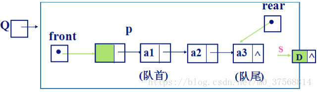
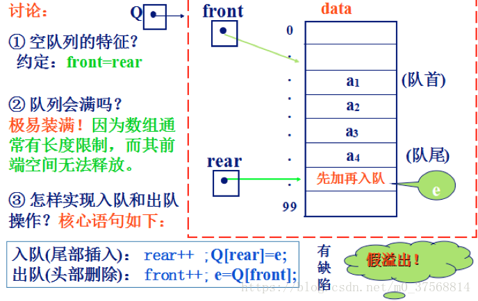

<link rel=stylesheet href=style.css>

# **栈和队列**

参考文章 [ZhangAnmy](https://blog.csdn.net/m0_37568814/article/details/81288756?)

## **栈**
> <big>栈的类型定义</big>
- 栈的定义
  - 栈：限定仅在表尾进行插入或删除操作的线性表 <span class=imp>限制存取点</span>
  - 栈顶/表尾端：允许插入和删除的一端
  - 栈底/表头端：不允许插入和删除的另一端
  - 栈和队列的区别：<spna class=imp> 限定插入和删除的位置不同 </span>
- 栈的特点
  - 入栈口诀：堆栈指针top “先压后加”
  - 出栈口诀：堆栈指针top “先减后弹”
  - top==0 表示空栈
  - 后进先出

> <big>栈的表示和实现</big>
- 顺序栈：依次存放自栈底到栈顶
  - <span class=imp>base==NULL: 栈不存在</span>
  - <span class=imp>base==top: 空栈</imp>
  - 插入元素
    - 逻辑顺序
      - 先 top 指针加1：```S.top = S.top + 1```
      - 再插入元素：```S.data[S.top] = x```
    - 代码
      - ```S.data[++S.top] = x```
  - 删除元素
    - 逻辑顺序
      - 先取出元素：```x = S.data[S.top]```
      - 再 top 指针减1：```S.top = S.top - 1```
    - 代码
      - ```x = S.data[S.top--]```
- 链栈
  - 初始化不需要事先分配空间
  - 入栈：top指针指向上一个元素
  - 出栈：删除元素，top指针更新
    - <span class=imp>退栈必须判断栈是否为空</span>
- 构造一个空栈
  ```c++
    Status InitStack(SqStack &S)
    {
        S.base = (SElemType *) malloc(STACK_INIT_SIZE * sizeof(SElemType));
        if(!S.base) exit (OVERFLOW); //存储分配失败
            S.top = S.base;
            S.stacksize = STACK_INIT_SIZE;
            return OK;
    } 
  ```
- 返回栈顶元素
  ```c++
    Status GetTop(SqStack S, SElemType e) 
      {//若栈不空，则用e返回S的栈顶元素，并返回OK，否则返回ERROR
        if(S.top == S.base) return ERROR;
        e = *(S.top-1);
        return OK; 
      }//GetTop
  ```
- 顺序栈入栈函数PUSH()
  ``` c++
  Status Push(SqStack &S, SElemType e)
  { //插入元素e为新的栈顶元素
    if(S.top-S.base>=S.stacksize)//栈满，追加存储空间
    {
      s.base = (SElemType*)realloc(S.base,(S.stacksize+STACKINCREMENT)*sizeof(SElemType));
      if(!S.base) exit(OVERFLOW);//存储分配失败
      S.top = S.base + S.stacksize;
      S.stacksize += STACKINCREMENT;
    }
    *S.top++ =e;
    return OK:
  }//PUSH
  ```
- 顺序栈出栈函数POP()
  ```c++
  status Pop( SqStack &S,SElemType &e)
  { //若栈不空，则删除S的栈顶元素，用e返回其值，并返回OK,否则返回ERROR
      if(S.top == S.base) return ERROR; 
      e=* —S.top;
      return OK;
  }
  ```
> <big> 表达式的运算 </big>
  - 三种表达式
    - 中缀表达式：a+b
    - 后缀表达式：ab+  (操作数顺序不改变)
    - 前缀表达式：+ab  (操作数顺序不改变)
  - 中缀表达式转后缀表达式
    - 遇到操作数，直接加入后缀表达式
    - 遇到界限符（界限符不加入后缀运算）
      - “(”：入栈
      - “)”：弹出栈内运算符，直到"("为止
    - 遇到运算符
      - 栈非空：依次弹出优先级等于或高于当前运算符的所有运算符，并加入后缀表达式。再把运算符入栈
      - 若碰到 "(" 或栈空则停止，入栈
  - 用栈求值
    - 后缀表达式：先左后右
    - 前缀表达式：先右后左


<br>

## **队列**
> <big> 抽象数据类型队列的定义 </big>
- 队列的定义
  - 队列：先进先出的线性表, 限定只能在表的一端插入，在另一端进行删除线性表
  - 队头 front ：允许删除的一端
  - 队尾 rear ：允许插入的一端
  - 除了栈和队列外，还有一种限定性数据结构是双端队列。双端队列是限定插入和删除操作在表的两端进行的线性表。
> <big>链队列</big>
- 链队列结点类型定义
  ```c++
  typedef Struct QNode{
      QElemType      data;     //元素
      Struct QNode   *next;    //指向下一结点的指针
  }Qnode , *QueuePtr ;
  ```
- 链队列类型定义
  ```c++
  typedef  struct {
    QueuePtr front ; //队首指针
    QueuePtr rear ;  //队尾指针
  }LinkQueue;
  ```
- 链队列示意图  
  
  - 空链队的特征：front == rear
  - 链队会满吗？一般不会，因为删除时有free动作。除非内存不足！
  - 入队（尾部插入）：<span class=imp>rear->next=S; rear=S;</span>
  - 出队（头部删除）：<sapn class=imp>front->next=p->next;</span>
> <big> 顺序队 </big>
  - 顺序队类型定义
    ```c++
    #define    QUEUE-MAXSIZE  100  //最大队列长度
      typedef    struct {
        QElemType     *base;    //队列的基址
        int front;              //队首指针,不是指针类型，是下标值
        int rear;               //队尾指针
      }SqQueue
    ```
  - 建队核心语句
    ```c++
    q.base=(QElemType *)malloc(sizeof (QElemType)* QUEUE_MAXSIZE);       //分配空间
    ```
  - 入队与出队
    ```C++
    Q.data[Q.rear] = x
    Q.rear = (Q.rear + 1) % MaxSize
    ```
  - 顺序队示意图  
    
> <big>循环队列</big>
- 队空条件：<span class=imp>front == rear</span>　(初始化时：front = rear )
- 队满条件：<span class=imp>front == (rear+1)%N　(N=maxsize)</span>
- 队列长度：<span class=imp>L=(N＋rear－front)%N</span>
- 初始化一个空队列
  ```c++
  Status InitQueue (SqQueue &q) {//初始化空循环队列 q
      q.base=(QElemType *)malloc(sizeof(QElemType）* QUEUE_MAXSIZE);   //分配空间
      if (!q.base)  exit(OVERFLOW);//内存分配失败，退出程序
      q.front =q.rear=0; //置空队列
      return OK;
  } //InitQueue;
  ```
- 入队操作
  ```c++
  Status   EnQueue(SqQueue  &q,  QElemType e)
  {//向循环队列 q 的队尾加入一个元素 e
    if ( (q.rear+1) %  QUEUE_MAXSIZE ==  q.front)
      return  ERROR ; //队满则上溢，无法再入队
    q.rear = ( q.rear + 1 ) %  QUEUE_MAXSIZE;
    q.base [q.rear] = e;    //新元素e入队
    return  OK;
  }// EnQueue;
  ```
- 出队操作
  ```c++
  Status DeQueue( SqQueue  &q,    QElemType &e)
  {//若队列不空，删除循环队列q的队头元素，
        //由 e 返回其值，并返回OK
    if ( q.front == q.rear )   return ERROR;//队列空
    q.front=(q.front+1) % QUEUE_MAXSIZE; 
    e = q.base [ q.front ] ;
    return OK;
  }// DeQueue
  ```
  - 链队列空的条件是首尾指针相等，而循环队列满的条件的判定，则有队尾加1等于队头和设标记两种方法。