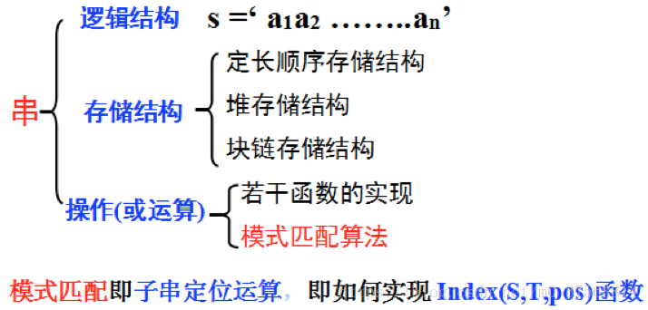

# **串**

## **串的类型定义**
> <big> 串类型的定义 </big>
  - 串即字符串，是由零个或多个字符组成的有限序列，是数据元素为单个字符的特殊线性表
> <big> 基本术语 </big>
  - 子串：串中任意个连续的字符组成的子序列
  - 主串：包含子串的串
  - 字符在串中的位置：字符在序列中的序号
  - 子串在串中的位置：子串的第一个字符在主串中的位置
  - 空串：零个字符的串，记做 $\Phi$

<br>

## **串的表示和实现**
> <big> 机内表示方法 </big>
  - 顺序存储
    - 定长顺序存储表示
      - 用一组地址连读的存储单元存储串值的字符序列，属静态存储方式
    - 堆分配存储表示
      - 用一组地址连读的存储单元存储串值的字符序列，但存储空间是在程序执行过程中动态分配得到的
  - 链式存储
    - 串的块链存储表示
      - 链式方式存储

<br>

## **串的模式匹配算法**
> <big> 模式匹配算法的概念 </big>
  - 算法目的：确定主串中所含子串第一次出现的位置（定位）
  - 定位问题称为串的模式匹配，典型函数为Index(S,T,pos)
> <big> BF算法 </big>
  - BF算法的实现—即编写Index(S, T, pos)函数
  - BF算法设计思想：
    - 将主串S的第pos个字符和模式T的第1个字符比较
      - 若相等，继续逐个比较后续字符
      - 若不等，从主串S的下一字符（pos+1）起，重新与T第一个字符比较
    - 直到主串S的一个连续子串字符序列与模式T相等。返回值为S中与T匹配的子序列第一个字符的序号，即匹配成功
    - 否则，匹配失败，返回值 0
    - 伪代码
      ```c++
      Int Index_BP(SString S, SString T, int pos)
      { //返回子串T在主串S中第pos个字符之后的位置。若不存在，则函数值为0.
      // 其中，T非空，1≤pos≤StrLength(S)
        i=pos; j=1;
        while ( i<=S[0] && j<=T[0] ){ //如果i,j二指针在正常长度范围，
            if (S[i] == T[j] ) {++i, ++j;}   //则继续比较后续字符
            else {i=i-j+2; j=1;} //若不相等，指针后退重新开始匹配
        }
        if(j>T[0]) return i-T[0];  //T子串指针j正常到尾，说明匹配成功，else return 0;  否则属于i>S[0]情况，i先到尾就不正常
      } //Index_BP
      ```

## **补充重点**
> <big> 空串和空白串 </big>
  - 空串(Null String)是指长度为零的串
  - 空白串(Blank String),是指包含一个或多个空白字符‘  ’(空格键)的字符串
> <big> 小结 </big>  
  - 知识结构图  
  
  