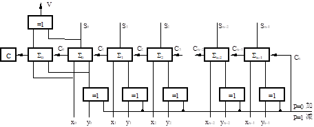
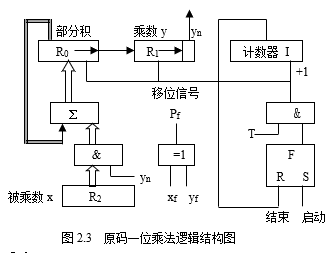
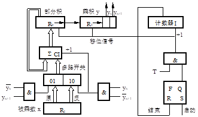

<link rel=stylesheet href=style.css>

<h1> 2 运算方法和运算器 </h1>
<h2> 2.1 数据信息的表示方法 </h2>
<h3> 2.1.1 数值数据的表示 </h3>
<h4> 真值与机器数 </h4>

  - 机器数的概念
    - 数值前的正号用“0”表示，负号用“1”表示，这种形式的数称为机器数

<h4> 数的机器码表示 </h4>

  - 原码，反码，补码和移码
    - 正数：原码 = 反码 = 补码
    - 负数：反码：符号位不变，数值位取反
      - 补码：反码末尾加1
    - 移码：补码符号位取反，数值位不变
  - 机器码性质
    1. 正数的 3 种表示法有相同的形式。
    2. 负数的原码比较直观。符号位为“1”，其数值部分与真值相同。
    3. 负数的补码中，符号位为“1”，数值部分为原码的数值部分求反后末位加1。
    4. 负数的反码中，符号位为“1”，数值部分为原码的数值部分各位求反的值。
  - 原码，反码，补码和移码转换关系
    - 补码与反码之间的关系为
      $$[x]_{补}=[x]_{反}+2^{-n}$$
    - 补码与移码之间的关系
      - 将补码符号位求反即得该数的移码

<h4> 定点数与浮点数 </h4>

  - 定点数
    - 小数点位置固定不变的数即为定点数，通常表示成定点小数或定点整数。
    - 小数点位置确定后，在运算中不再考虑小数点问题，因而小数点不占用存储空间。定点数表示简单。但是数的取值范围小、精度低。
    - 定点数的表示范围
      - 定点小数: $2^{-n} \leq |x| \leq 1-2^{-n}$
      - 定点整数：$1\leq|x|\leq2^{-n}-1$
  - 浮点数
    - 小数点的位置不固定，可以浮动变化的数即为浮点数
    - 浮点数表示形式：$N=2^E\cdot M$
    - 阶码 E 和尾数 M 均为有符号数
    - 阶码为整数，指明小数点的位置，表示数据的取值范围。
    - 尾数通常表示成纯小数，它指明数据中有效数字的位数，表示数据的精度，尾数的符号位表示数的正负
    - 浮点数的规格化
      - 规定尾数小数点后第一位，即尾数值部分的最高有效位必须是有效数字

<h4> 移位与舍入规则 </h4>

  - 算数移位规则
      - 原码
        - 左移：符号不变，末位补0。
    	- 右移：符号不变，最高有效位补0。
      - 补码	
        - 左移：符号不变，末位补0。
    	- 右移：符号不变，最高有效位补1。
      - 反码	
        - 左移：符号不变，负数时，末位补1；正数时，末位补0。
    	- 右移：符号不变，最高有效位补1

<h4> 十进制数的二进制编码(BCD码) </h4>

  - 见数字电路

<h3> 2.1.2 非数值数据的表示法 </h3>
<h4> 字符编码 </h4>

  - ASCII 码
<h4> 汉字表示法 </h4>

  - 汉字用数字和符号的组合来表示称为汉字编码。一个汉字的编码通常用内码、字模码、外码来描述，内码（也称机内码）是用于汉字的存储、交换等操作的计算机内部代码，一个汉字内码通常用两个字节表示，且这两个字节的最高位均为1 ，以区别英文的ASCII码。字模码是汉字的输出编码，字库中存放的就是字模码。外码（输入码）是用来输入汉字的编码，常用的输入方法有键盘输入法、手写输入法、语音输入法等。内码与汉字字符是一一对应的。内码与外码是一对多的关系，表明一个汉字的输入方法有多种。内码与字模码是一对多的关系，表明一个汉字的输出形式有多种。

<h4> 数据信息的校验 </h4>

  - 奇偶效验
    - 奇校验规则：待校验数据中1的个数为奇数时，其校验位为0，否则为1
  - 循环冗余效验码
    - 见计算机网络

<h2> 2.2 定点运算方法 </h2>
<h3> 2.2.1 定点补码加减法运算 </h3>
<h4> 运算公式和规则 </h4>

  - 运算公式
    - 补码加法：$[x]_{补}+[y]_{补}=[x+y]_{补}$
    - 补码减法：$[x]_{补}-[y]_{补}=[x]_{补}+[-y]_{补}$
  - 运算规则
    1. 参加运算的数均用补码表示
    2. 符号位作为数的一部分一起参加运算，结果的符号由位运算得出
    3. 运算的结果为补码
    4. 符号位运算产生的进位丢掉，产生的和即为结果的符号位

<h4> 溢出判断 </h4>

  - 双符号位法（变形补码检测法）
    - 在定点小数机器中，数的表示范围为｜x｜<1，在运算过程中如果出现｜x｜>1的现象，就称为溢出。为了判断运算中是否产生了溢出，引出了变形补码概念，其定义为
      $$ [x]_{补} = \begin{cases}  
      &x & 0 \leq x < 2 \\
      &x+4 & -2 \leq x < 0 \\
      \end{cases}$$
    - 在形式上表现为双符号位补码：正数的符号为“00”，负数的符号为“11”
    - 当运算结果的二符号位相同时，不产生溢出；不同时，产生溢出。溢出时，若运算结果的符号为“01”，则表示发生正溢出；为“10”时，表示发生负溢出。
  - 符号位溢出检测法
    - 当最高有效位产生进位而符号位无进位时，产生正溢出；当最高有效位无进位而符号位有进位时，产生负溢出。因此，又将溢出的逻辑表达式写为
    $$V = C_f⊕C_0$$
    - $C_{f}$为符号位产生的进位，$C_{0}$为最高有效位产生的进位
  - 补码加（减）法器
    - 设字长为n位，两个操作数分别为 ($x_0,y_0$ 为符号位)
      - $[x]_补 = x_0 x_1 x_2 \cdots x_{n-1}$
      - $[y]_补 = y_0 y_1 y_2 \cdots y_{n-1}$
    - 补码加减法器逻辑图  
      

<h3> 2.2.2 定点乘法运算 </h3>
<h4> 原码一位乘法 </h4>

  - 与加、减法不同，乘法采用原码较为简单，其乘积的符号为两数符号按位加之和。乘积为被乘数与乘数的绝对值的积。
  - 运算规则
    - 设：$x=x_f x_1 x_2 \dots x_n \qquad y=y_t y_1 y_2 \dots y_n$
    - 则 乘积 $P=|x||y|\quad$ 乘积的符号 $P_f = x_f \oplus y_f$
    1. 被乘数和乘数均取绝对值参加运算，符号位单独考虑
    2. 被乘数取双符号，部分积的长度与被乘数的长度相同，初值为0
    3. 从乘数的最低位的yn位开始对乘数进行判断
       - 若$y_n=1$，则部分积加上被乘数|x|，然后右移一位
       - 若$y_n=0$，则部分积加上0，然后右移一位
    4. 重复上述步骤
  - 原码一位乘法器逻辑图    
    

<h4> 补码一位乘法 </h4>

  - 因机器中的数均以补码传送、存储，若进行原码乘法，还需将补码换成原码，增加了麻烦与处理时间，故现在计算机中又多直接采用补码乘法
  - 运算规则
    1. 符号位参与运算，运算的数均以补码表示
    2. 被乘数一般取双符号位参加运算，部分积初值为0
    3. 乘数可取单符号位，以决定最后一步是否需要校正，即是否要加 $[–x]_补$
    4. 乘数末位增设附加位 $y_{n+1}$，且初值为0
    5. 从低到高依次判断相邻两位ynyn-1的状态，按（00：部分积右移一位；01：部分积加 $[x]_补$，右移一位；10：部分积加 $[-x]_补$，右移一位；11：部分积右移一位）的规则进行操作
    6. 按照上述算法进行n+1步操作，第n+1步不移位，根据 $y_0$与 $y_1$ 的比较结果作相应的运算即可
    7. 补码移位规则，部分积为正，右移时有效位最高位补0；为负时最高位补1
  - 补码一位乘法器  
    

<h4> 原码二位乘法 </h4>

  - 为了提高乘法的执行速度，可以考虑每次对乘数的两位进行判断以确定相应的操作，这就是两位乘法
  - 运算规则
    1. 符号位不参加运算，最后的符号 $P_f= x_f \oplus y_f$
    2. 部分积与被乘数均采用三位符号，乘数末位增加一位C，其初值为0
    3. 按表所示的操作
    - 原码两位乘法运算
      | $Y_{n-1}$ | $Y_n$ |   C   |        操作         |
      | :-------: | :---: | :---: | :-----------------: |
      |     0     |   0   |   0   | 加0，右移两位，0→C  |
      |           |   0   |   0   | 加x，右移两位，0→C  |
      |           |   1   |       | 加x，右移两位，0→C  |
      |     0     |   1   |   0   | 加2x，右移两位，0→C |
      |     0     |   1   |   1   | 加2x，右移两位，0→C |
      |     1     |   0   |   0   | 减x，右移两位，1→C  |
      |     1     |   0   |   1   | 减x，右移两位，1→C  |
      |     1     |   1   |   0   | 加0，右移两位，1→C  |
      |     1     |   1   |   1   |                     |
    4. 若尾数n为偶数，则乘数用双符号，最后一步不移位；若尾数n为奇数，则乘数用单符号，最后一步移一位

<h4> 补码二位乘法 </h4>

  - 补码两位乘法的算法是在补码一位乘法的算法基础上拓展来，目的是为了减少运算步骤，提高运算速度
  - 运算规则
    1. 符号位参加运算，两数均用补码表示
    2. 部分积与被乘数均采用三位符号表示，乘数末位增加一位$Y_{n+1}$，其初值为0
    3. 按表所示的操作
    - 补码两位乘法运算
      | $Y_{n-1}$ | $Y_n$ | $Y_{n+1}$ |          操作           |
      | :-------: | :---: | :-------: | :---------------------: |
      |     0     |   0   |     0     |      加0，右移两位      |
      |     0     |   0   |     1     |  加 $[x]_补$，右移两位  |
      |     0     |   1   |     0     |  加 $[x]_补$，右移两位  |
      |     0     |   1   |     1     | 加 $2[x]_补$，右移两位  |
      |     1     |   0   |     0     | 加 $2[-x]_补$，右移两位 |
      |     1     |   0   |     1     | 加 $[-x]_补$，右移两位  |
      |     1     |   1   |     0     | 加 $[-x]_补$，右移两位  |
      |     1     |   1   |     1     |      加0，右移两位      |

<h2> 2.3 定点运算器的组成和结构 </h2>
<h3> 2.3.1 多功能算术逻辑运算单元 </h3>