<link rel=stylesheet href=style.css>

# 计算机组成原理
> [Github 笔记开源地址](https://github.com/Pionpill/Notes/blob/Pionpill/Lessons/%E8%AE%A1%E7%AE%97%E6%9C%BA%E7%BB%84%E6%88%90%E5%8E%9F%E7%90%86/%E6%9C%9F%E6%9C%AB%E5%A4%8D%E4%B9%A0.md)  
> [计算机组成原理课后答案](https://wenku.baidu.com/view/7b69f962fbd6195f312b3169a45177232e60e44f.html)  
> 由于觉得没什么实战用处，正常笔记不再更新  
> 使用 VSCode 编写,其他打开方式可能导致 latex，plantuml，css 等语法失效

## 1 概述
### 1.1 冯诺依曼原理，组成
#### 冯诺依曼体系的基本思想 <span class=hint> 书P4，P15 </span>
  - 冯诺依曼计算机体系结构的基本思想是`存储程序`，也就是将用`指令序列`描述的`解题程序与原始数据`一起存储到计算机中。计算机只要一启动，就能`自动地`取出`一条条指令`并执行之，直至程序执行完毕，得到计算结果为止。
#### 计算机硬件系统组成
  - 按此思想设计的计算机硬件系统包含：`运算器、控制器、存储器、输入设备、输出设备`。  
    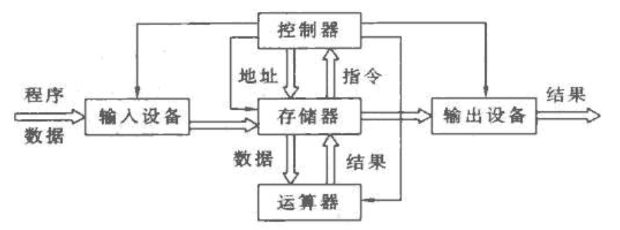

### 1.2 计算机层次结构
#### 计算机系统层级结构 <span class=hint> 书P4，P12 </span>
  - 计算机系统层级结构  
    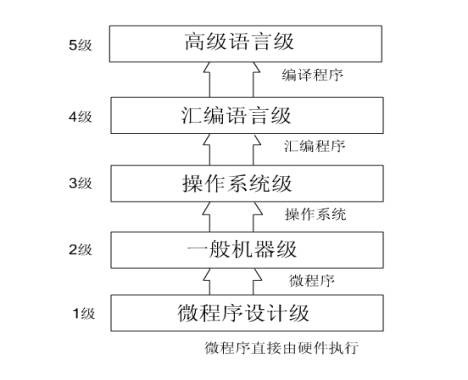

## 2 运算方法与运算器
### 2.0 概念
#### 机器码转换
- 原码，反码，补码和移码
  - 正数：原码 = 反码 = 补码
  - 负数：反码：符号位不变，数值位取反
    - 补码：反码末尾加1
  - 移码：补码符号位取反，数值位不变
- 双符号位
  | 符号 | 说明     |
  | ---- | -------- |
  | 00   | 正号     |
  | 11   | 负号     |
  | 01   | 正向溢出 |
  | 10   | 负项溢出 |
### 2.1 一位加法器逻辑结构
#### 补码一位加减法 <span class=hint> 书P31 </span>
- 补码一位加法运算法则
    - 补码加法：$[x]_{补}+[y]_{补}=[x+y]_{补}$
    - 补码减法：$[x]_{补}-[y]_{补}=[x]_{补}+[-y]_{补}$
- 补码一位加减法运算器逻辑框图  
  

### 2.2 一位乘法器逻辑结构
#### 原码一位乘法 <span class=hint> 书P32 </span>
- 原码一位乘法运算规则
  - 设：$x=x_f x_1 x_2 \dots x_n \qquad y=y_t y_1 y_2 \dots y_n$
  - 则 乘积 $P=|x||y|\quad$ 乘积的符号 $P_f = x_f \oplus y_f$
    1. 被乘数和乘数均`取绝对值`参加运算，符号位`单独考虑`
    2. 被乘数取双符号，部分积的长度与被乘数的`长度相同`，`初值为0`
    3. 从乘数的最低位的yn位开始对乘数进行判断
       - 若$y_n=1$，则部分积加上被乘数|x|，然后右移一位
       - 若$y_n=0$，则部分积加上0，然后右移一位
    4. 重复上述步骤
- 原码一位乘法运算器逻辑框图  
  
#### 补码一位乘法 <span class=hint> 书P35 </span>
- 补码一位乘法运算规则
  1. `符号位参与运算`，运算的数均以补码表示
  2. 被乘数一般取双符号位参加运算，部分积初值为0
  3. 乘数可取单符号位，以决定最后一步是否需要校正，即是否要加 $[–x]_补$
  4. 乘数末位增设附加位 $y_{n+1}$，且初值为0
  5. 从低到高依次判断相邻两位 ynyn-1 的状态，按下表操作
      | $y_n$ | $y_{n+1}$ | 操作                         |
      | ----- | --------- | ---------------------------- |
      | 0     | 0         | 部分积右移一位               |
      | 0     | 1         | 部分积加$[x]_{补}$,右移一位  |
      | 1     | 0         | 部分积加$[-x]_{补}$,右移一位 |
      | 1     | 1         | 部分积右移一位               |
  6. 按照上述算法进行n+1步操作，第n+1步不移位，根据 $y_0$与 $y_1$ 的比较结果作相  的运算即可
  7. 补码移位规则，部分积为正，右移时有效位最高位补0；为负时最高位补1
- 补码一位乘法运算器逻辑框图  
  
### 2.3 浮点数运算，规格化表示
#### 浮点数运算方式
- 十进制转二进制运算 <span class=hint> 书P20 </span>
  - 将十进制转为二进制，其中符号位放在尾数表示
  - 再进行规格化表示
- 机器码的浮点数运算 <span class=hint> 书P65 </span>
  - 均采用双符号位
  - 小阶向大阶看齐
  - 采用补码运算
  - 规格化表示
#### 两种规格化表示方式
- 第一种浮点表示格式: 均采用补码
  - 规格化方式：阶符+阶码值+数符+尾数值
  - 具体表现：阶码，尾数
  - 例：0001001，1.011111111100000000000000
- 第一种浮点表示格式: 阶码采用移码，尾数仍采用补码
  - 规格化方式：数符+阶符+阶码值+尾数值
  - 具体表现：尾数符号位，阶码，尾数值
  - 例：1，10001001，011111111100000000000000
    

## 3 存储器及存储系统
### 3.1 存储器 CPU 相连
#### 串联理论
- 两种串联方式 <span class=hint> 书P86 </span>
  - 位并联：增加位数 8K&times;1b &rarr; 8K&times;8b 
  - 位串联：增加字数 8K&times;8b &rarr; 64K&times;8b 
- 地址空间分配 <span class=hint> 书P87 </span>
  1. 最大字数转换为位数，获得地址数 64K &rarr; $A_{0} - A_{15}$
  2. 填写地址空间：高位作为识别部分
  3. 注意题中给出的地址空间位置，是否在最后
#### 画图
- 各组件的接口 (64K&times;8b )
  - CPU：
    - 数据总线：位数决定个数 $D_{0}-D_{7}$ 可以合成大箭头一起接
    - 读写 $\overline{WE}$：与 RAM 相连
    - 地址线：字数决定个数 $A_{0}-A_{15}$ 公有的可以合成大箭头一起接
    - $\overline{MREQ}$ 与译码器相连：`非连接`
  - 译码器：
    - 使能端 $\overline{EN}$： 与 CPU 相连：`非连接`
    - 3 线：与 CPU 地址线高位相连
    - 8 线：与存储器芯片的 $\overline{CE}$ 相连：`非连接`
  - 存储器芯片
    - 地址线：直接与地位地址线先练，非公共地址线再考虑
    - $\overline{CE}$：与译码器相连 `非连接`
    - 读写 $\overline{WE}$：RAM 才有，与对应 CPU 相连
    - 数据总线：直接相连
- 举例
  - dragon PPT  
    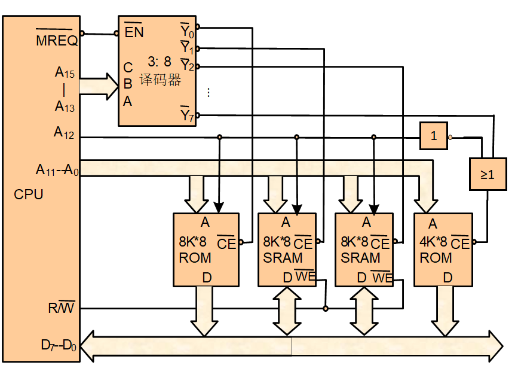

### 3.2 组相连问题
#### 全相连映像方式 <span class=hint> 书P91 </span>
- 地址结构  
  - 主存地址 <span class=box> 存块号 </span><span class=box> 块内地址 </span>  
  - cache 地址 <span class=box> cache 块号 </span><span class=box> 块内地址 </span>   
    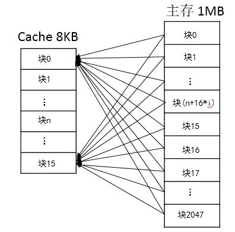 
- 特点
  - 主存中的一个地址可被映射进任意cache line
  - 当寻找一个地址是否已经被cache时，需要遍历每一个cache line来寻找，这个代价很高。
- 优缺点
  - 全相联映射方式比较灵活，主存的各块可以映射到Cache的任一块中，Cache的利用率高，块冲突概率低
  - 由于Cache比较电路的设计和实现比较困难，这种方式只适合于小容量Cache采用。电路复杂
#### 直接相连 <span class=hint> 书P91 </span>
- 地址结构
  - 主存地址 <span class=box> 区号 </span><span class=box> 块号 </span><span class=box> 块内地址 </span>  
  - cache地址 <span class=box> 块号 </span><span class=box> 块内地址 </span>  
  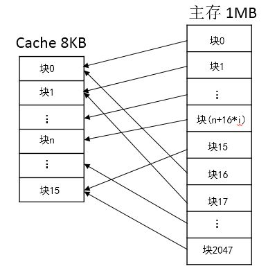
- 特点
  - 一个内存地址能被映射到的Cache line是`固定`的。
  - 主存中的一个块只能映射到Cache的某一特定块中去。  
- 优缺点
  - 它的硬件简单，成本低，地址变换速度快，而且不涉及替换算法问题。
  - `Cache的存储空间得不到充分利用`


#### 组相连映射 <span class=hint> 书P93 </span>
- 地址结构
  - 主存地址 <span class=box> 区号 </span><span class=box> 组号 </span><span class=box> 组内块号 </span><span class=box> 块内地址 </span>  
  - cache地址 <span class=box> 组号 </span><span class=box> 组内块号 </span><span class=box> 块内地址 </span>  
  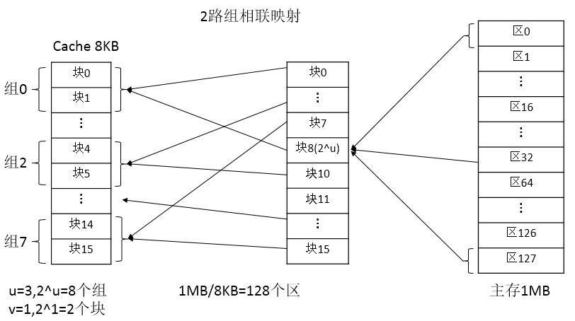
- 特点
  - 组相联映射实际上是直接映射和全相联映射的折中方案
- 优缺点
  - 全相连和组相连的优点，没有缺点

### 3.3 虚拟存储器，页式，段页式...
> [参考操作系统笔记](https://github.com/Pionpill/Notes/blob/Pionpill/Lessons/%E6%93%8D%E4%BD%9C%E7%B3%BB%E7%BB%9F/4.%E5%AD%98%E5%82%A8%E5%99%A8%E7%AE%A1%E7%90%86.md)  
> 下面只写地址计算方式
#### 页式存储器
- 地址划分
  - 逻辑空间等分为页；并从0开始编号
  - 内存空间等分为块，与页面大小相同；从0开始编号
  - 地址结构
    <span class=box> 页号P </span><span class=box> 位移量W </span>
- 地址计算方式
  - 逻辑地址 = 页号 & 位移量 (&号是连接符号，是将页号作为逻辑地址的最高位)
  - 物理地址 = 块号 & 块内地址
  - 给定一个逻辑地址和页面大小，计算物理地址
    1. 根据`页面大小`可计算出`页内地址的位数`
    2.` 页内地址位数`结合`逻辑地址`计算出`页内地址`（即，块内地址）和`页号`
    1. 页号结合`页表`，即可得出`块号`
    2. `块号&块内地址`即可得出物理地址
- 快慢表 <span class=hint> 书P97 </span>
  - 块表由硬件组成，比页表小得多，只是慢表的小副本
  - 查表时，同时查快表和慢表，若快表查到了，很快就能得到物理页号。同时慢表查找作废
    - 查不到则取慢表中查，并将结果送入快表，使用[替换算法](https://github.com/Pionpill/Notes/blob/Pionpill/Lessons/%E6%93%8D%E4%BD%9C%E7%B3%BB%E7%BB%9F/5.%E8%99%9A%E6%8B%9F%E5%AD%98%E5%82%A8%E5%99%A8.md)

#### 段式存储器
- 地址划分
  - 逻辑空间分为若干个段，每个段定义了一组有完整逻辑意义的信息
  - 内存空间为每个段分配一个连续的分区
  - 地址结构
    <span class=box> 段号 </span><span class=box> 段内地址 </span>
- 地址计算方式
  - 段内地址的位数可以决定段的大小
  - 逻辑地址 = 段号 & 段内地址
  - 物理地址 = 基址 + 段内地址
#### 段页式存储器
- 地址划分
  - 用户程序先分段，每个段内部再分页
  - 地址结构
    <span class=box> 段号S </span><span class=box> 段内页号P </span><span class=box> 页内地址Y </span>
- 地址计算方式
  - 逻辑地址 ----> 段号、段内页号、业内地址
  - 段号+段表始址 ----> 页表始址
  - 页表始址+段内页号 ----> 存储块号
  - 块号+页内地址 ----> 物理地址

### 3.4 存储校验技术
#### CRC 循环冗余检验
- 参考[计算机网络笔记](https://github.com/Pionpill/Notes/blob/Pionpill/Lessons/%E8%AE%A1%E7%AE%97%E6%9C%BA%E7%BD%91%E7%BB%9C/3.%E6%95%B0%E6%8D%AE%E9%93%BE%E8%B7%AF%E5%B1%82.md)
#### 海明码
- 实现效果
  - 侦测并更正单一比特错误，CRC 只能检测，不能更正
  - 只能校验一位出错，否则失效
- 校验原理
  - 海明码通过在数据流指定位置插入校验位来进行检测
    |          | 数据为 | 校验位    | 海明码 |
    | -------- | ------ | --------- | ------ |
    | 表示     | D      | P         | H      |
    | 所在位置 |        | $2^{n-1}$ |        |
  - 举例
    | H1     | H2     | H3  | H3     | H5  | H6  | H7  | H8     | H9  | H10 | H11 | H12 |
    | ------ | ------ | --- | ------ | --- | --- | --- | ------ | --- | --- | --- | --- |
    | **P1** | **P2** | D0  | **P3** | D1  | D2  | D3  | **P4** | D4  | D5  | D6  | D7  |
  - 找到校验位数 $r+k+1\leq2^r$
    - r:校验位数
    - k:有效信息位数
- 写出汉明码
  1. 根据 $r+k+1\leq2^r$ 算出 r
  2. 根据 $k+r$ 算出汉明码位数
  3. 写出每个位数对应的 r 位 2 进制数 
     - 有效信息的 2 进制数 1 所在位置被对应校验位检验
     - 如 101 被校验位位 100 001 的检验
  4. 填入有效位数据
  5. 根奇校验/偶校验填入校验位
      - 奇校验：校验位 + 被校验数 1 个数位奇数
      - 偶校验：校验位 + 被校验数 1 个数位偶数
  - 举例：0011 的偶校验海明码
    1. $3+4+1\leq2^3$  
    2. 汉明码位数：7
    3. 画表：依次填入 3,4,5 步数据
       | 海明码       | H1     | H2     | H3  | H4     | H5  | H6  | H7  |
       | ------------ | ------ | ------ | --- | ------ | --- | --- | --- |
       | 二进制数     | 001    | 010    | 011 | 100    | 101 | 110 | 111 |
       | 海明码       | **P1** | **P2** | D0  | **P3** | D1  | D2  | D3  |
       | 数据         |        |        | 0   |        | 0   | 1   | 1   |
       | 偶校验(默认) | 1      | 0      | 0   | 0      | 0   | 1   | 1   |
       | 奇校验       | 0      | 1      | 0   | 1      | 0   | 1   | 1   |
- 检验汉明码
  - 同样画表，得出校验位与被校验位数字
  - 偶校验：1个数为偶数 (正式要用异或运算假装写一下)

## 4 指令系统
### 4.1 寻址方式
#### 最多多少个指令问题 <span class=hint> 书P114 </span>
- 从高地址指令开始，每次留一个给低地址指令，最后一个用完
#### 数据寻址方式 <span class=hint> 书P116 </span>
- 立即寻址
  - 操作数由指令地址码字段`直接给出`
  - <span class=box> OPCODE </span><span class=box> 立即寻址方式 </span><span class=box> 操作数 Data </span>
  - 非常快速的寻址方式，但是数据不能修改
  - $EA = (PC)$
- 寄存器寻址方式：
  - 给出一个 $R_i$ 指定`寄存器`中存放的操作数
  - <span class=box> OPCODE </span><span class=box> $R_i$ </span> --&rarr; <span class=box> 操作数 </span>
  - 寄存器中比主存中快得多
  - 寄存器数量少，地址码字段端
- 直接寻址(绝对寻址)
  - 指令中地址码字段给出的地址 A 就是操作数的有效地址，即形式地址等于有效地址。
  - $EA=A$
  - <span class=box> OPCODE </span><span class=box> 直接寻址方式 </span> <span class=box> 操作数直接地址 A </span>
  - 寄存器直接寻址方式
    - <span class=box> OPCODE </span><span class=box> 直接寻址方式 </span> <span class=box> 寄存器地址编号 R_i </span>
    - $EA=R_i$
  - 存储器直接寻址方式
    - <span class=box> OPCODE </span><span class=box> MOD </span> <span class=box> A </span>--&rarr; <span class=box> Data </span>
    - $EA=A$
- 间接寻址方式
  - 指令中地址码字段给出的地址是存放操作数地址的地址，即形式地址等于有效地址(EA=A)。
  - 一次寻址：形式地址A式操作数地址的地址 EA=(A)
  - 多次寻址：形式地址A式操作数地址的n套娃地址 EA=(...(A)...)
  - 大多数计算机只允许一次寻址
  1. 寄存器间接寻址
     - 访问寄存器 &rarr; 读出操作数地址 &rarr; 访问存储器
     - 有效地址 $EA = (R) Data= (EA) = ((R))$
  2. 寄存器间接寻址
     - 访问两次存储器
     - 有效地址 $EA = (A) Data= (EA) = ((A))$
- 基址寻址方式
  - 计算机中专门设置一个寄存器来存放基准地址，称为基址寄存器(RB)
  - 将指令地址码给出的地址 A(Disp) 与基址寄存器 RB 的内容相加，得到有效地址，再从存储器中读取
  - $EA = (RB) + Disp$
- 变址寻址方式
  - 将某个变址寄存器的内容家伙是那个指令格式中的形式地址形成操作数有效地址
  - $EA = (RI) + Disp$
- 相对寻址方式
  - 根据一个基准地址及其相对量来寻找操作数地址的方式
  - $EA = (PC) + Disp$ (PC：当前执行指令的地址)
- 页面寻址方式
  - 将整个主存空间分成若干个大小相同的区。每个区称为一页，每页有若干个主存单元
  - 基页寻址： EA = 0//A  (//:简单拼接)
  - 当前页寻址： EA = ($PC_H$)//A  ($PC_H$:程序计数器PC的高位部分)
  - 页寄存器寻址：页寄存器与形式地址相拼接形成
- 总结
  - 设指令总长 k ， 操作法位数 m，操作数位数 n ,机器字长 a
    | 寻址方式    | EA               | 个数       | 备注           |
    | ----------- | ---------------- | ---------- | -------------- |
    | 立即寻址    | ($PC$)           | 指令字本身 | 一般没法算出来 |
    | 寄存器寻址  | $R_i$            | 寄存器中   | 一般没法算出来 |
    | 直接寻址    | $A/R_i$          | $2^n$      |
    | 间接寻址    | $((A))$          | $2^a$      |
    | 基/变址寻址 | $(RB/RI) + Disp$ | $2^a$      |
    | 相对寻址    | $(PC) + Disp$    | $2^m$      |                |
    | 页面寻址    | 未知             | 未知       |

## 5 中央处理器
### 5.1 指令周期
#### 指令周期
- 指令周期：CPU 从主存中取出并执行一条指令所需的全部时间
- CPU周期(机器周期)：指令周期常常用若干机器周期来表示
- 时钟周期(T周期)：一个机器周期包含若干时钟周期，是 CPU 周期的最基本单位  
  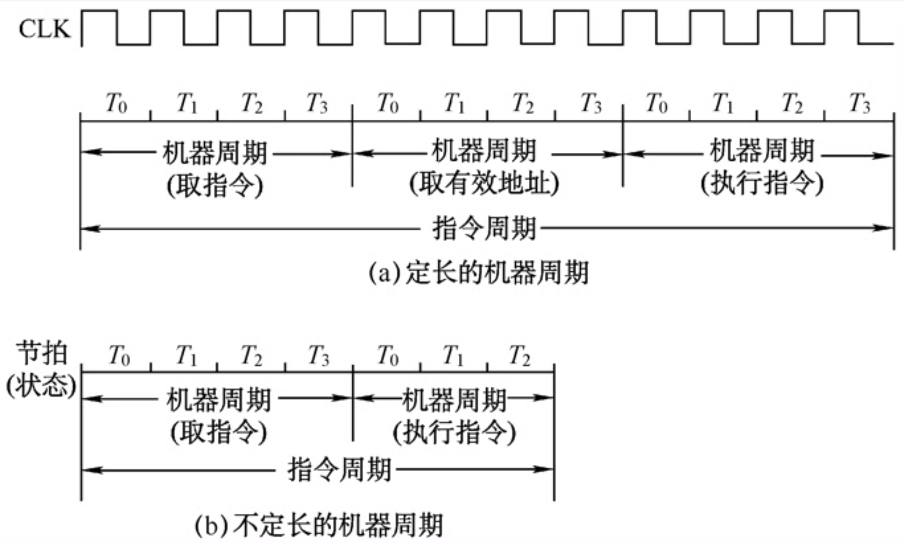
  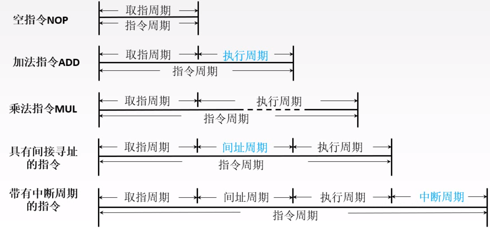
#### 指令执行方案
- 单指令周期
  - 串行方案，一个个执行
  - 所有指令都选用相同的执行时间来完成
  - 指令周期取决于执行时间最长的指令的执行时间
- 多指令周期
  - 串行方案，一个个执行
  - 指令选用不同的执行时间来完成
  - 需要更为复杂的硬件设计
- 流水线方案
  - 在每一个时钟周期启动一条指令，尽量让多条指令同时运行，但各自处在不同的执行步骤中。
  
### 5.2 微指令与微程序
#### 微程序的相关概念
- 微指令
  - 在 CPU 周期中使计算机实现一定操作功能的一组微命令的集合
  - 微命令：微操作的控制信号，微操作是微命令的执行过程
- 微程序
  - 微指令序列的集合
- 控制存储器
  - 存放微程序的存储器
#### 微指令的基本结构
- 微指令的基本格式  
  <span class=box> 操作控制部分 </span><span class=box> 顺序控制部分 </span>
  - 操作控制部分：发出指挥计算机工作的控制信号
    - 1：发出微命令，0：不发出微命令
  - 顺序控制部分
    - 决定产生下一条微指令的地址
#### 微指令的编码译码控制方法 <span class=hint> 书P160 </span>
- 编码译码的概念：微命令编码译码控制方法就是对微指令中的操作控制字段进行编码表示，并给出操作控制信号的方法
- 位直接控制法
  - 在微命令控制字段中，`每一位表示一个微命令`，在设计微命令时，将微命令`控制字段`中相应位置成`1或0`，即可发出或禁止某个微命令
  - 简单，但有时候微命令几百个，不适合
- 字段直接译码控制法
  - 如果在若干个（一组）微命令中，在选择使用它们的微周期内，每次只能有一个微命令有效，则这一组微命令是互相排斥的。
  - 字段直接译码控制法就是把一组相斥性的微命令信号组成一个字段（一个小组），然后通过字段译码器对每一个微命令信号进行译码，译码输出作为操作控制信号。  
  - 保留一个状态表示不操作  
    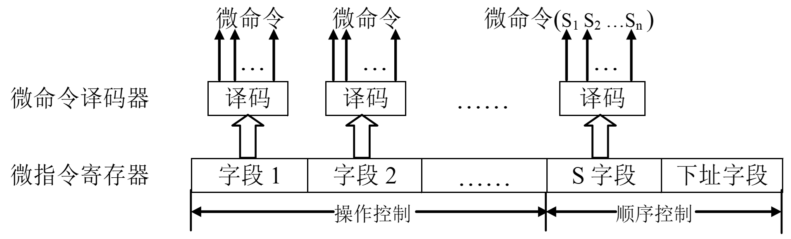
- 字段间接译码控制法
  - 是在字段直接译码控制法的基础上，进一步缩短微指令字长的方法。
  - 若在字段直接译码控制法中规定一个字段的某些命令由另一个字段中的某些微命令来解释，则这种方法称为字段间接译码控制法  
    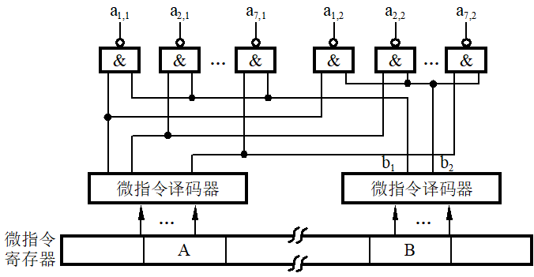
- 混合编码译码控制法
  - 这种方法是将位直接控制法与字段译码控制法混合使用的方法
- 常数字段控制法
  - 附设一个常数字段，就象指令中的立即数一样，用它来给某些执行部件直接发送常数。该常数有时作为操作数送入 ALU参加运算，有时也作为计数器的初值来控制微程序循环次数。
#### 微地址的产生及微程序流的控制
- 产生后继微地址的方法(后继微指令所在的控制存储器单元地址)
- 计数器方式
  - 在`顺序执行`微指令时，后继微地址由现行微地址`加上一个增量`来产生；
  - 在`非顺序执行`微指令时，必须通过`转移方式`，使现行微指令执行后，转去执行指定的后继微地址的下一条微指令。
  - 在这种方法中，微地址寄存器通常改为计数器，`顺序执行的微指令序列`必须安排在控制`存储器的连续单元`中。
- 增量方式与断定方式相结合
  - 将微指令顺序控制部分分成两部分：条件选择字段和转移地址字段。
  - 当微程序转移时，将转移地址送微程序计数器(μPC)，否则顺序执行下一条微指令(μPC加 l)。  
    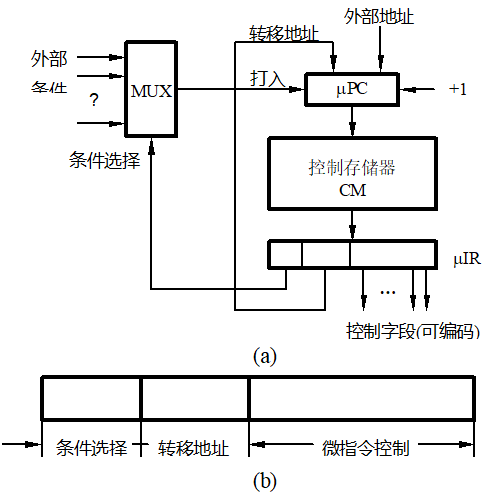
- 多路转移方式
  - 一条微指令具有多个转移分支功能的情况称为多路转移。

#### 微指令的格式
- `水平型微指令`
  - 一次能定义并执行多个并行操作微命令的微指令。
    - 采用直接控制法进行编码的，属于水平型微指令的典型例子。
    - <span class=box> 操作控制 </span> <span class=box> 顺序控制 </span> 
  - 优缺点
    - 优点：微程序短，执行速度快
    - 缺点：微指令长，编写微程序较麻烦
- 垂直微指令
  - 类似机器指令操作码的方式，由微操作码字段规定微指令的功能。
    - <span class=box> 微操作码 </span> <span class=box> 目的地址 </span> <span class=box> 源地址 </span>
  - 优缺点
    - 优点：微指令短，简单，规整，便于便携微程序
    - 缺点：微程序长，执行速度慢，工作效率低
- 混合型微指令
  - 在垂直型的基础上增加一些不太复杂的并行操作

#### 微指令的编码方式
- 水平型微指令
  - 直接编码(直接控制)方式，字段直接等方法
  - 每位代表一个微操作命令：1 表示有效，执行
    - <span class=box> 1 </span><span class=box> 0 </span><span class=box> 0 </span><span class=box> 1 </span><span class=box> 下地址 </span>
- 例题：某计算机的控制器采用微程序控制方式，微指令中的操作控制字段采用字段直接编码法，共有33
个微命令，构成5个互斥类，分别包含7、3、12、5和6个微命令，则操作控制字段至少有多少位？
   1. 需要保留一个不操作，工业5个互斥类需要包含 8,4,13,6,7 个微指令
   2. 对应二进制位需要 3，2，4，3，3 个二进制位
   3. 总共需要 15 位

### 5.3 流水线技术
#### 流水线原理
- 指令执行过程
  - 基本指令执行过程：<span class=box> 取指 </span><span class=box> 分析 </span><span class=box> 执行 </span>
  - 不同阶段用到的硬件不同
- 顺序执行方式 (设各时间为t。执行n条指令)  
    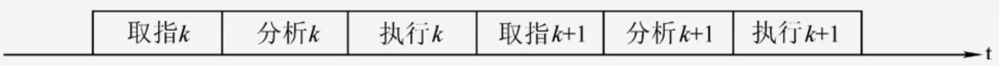
    - 耗时：T = n&times;3t = 3nt
- 一次重叠执行方式  
    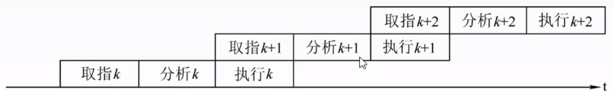
    - 耗时：T = 3t + (n-1)&times;2t = (1+2n)t
- 两种图像
  - 指令执行过程图：主要用于分析指令执行过程以及影响流水线的因素  
    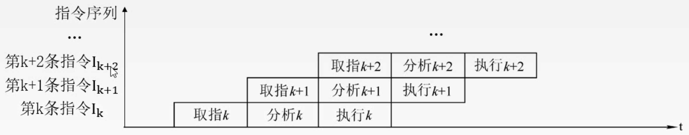
  - 时空图：主要用于分析流水线的性能  
    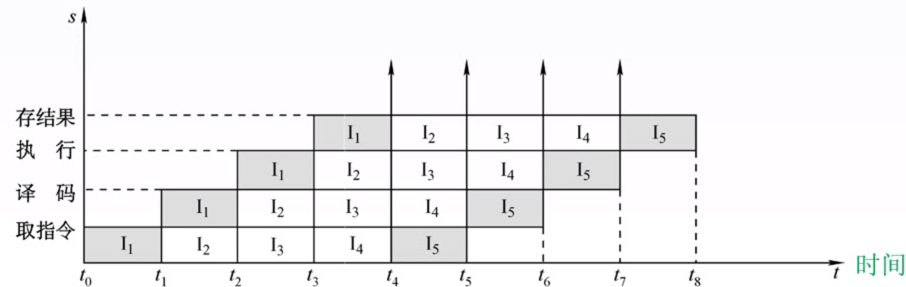

- 流水线性能指标
  - 吞吐量：
    - 定义：在单位时间内流水线所完成的任务数量，或输出结果的数量
    - $$\text{定义式：}TP=\frac{n}{T_{k}}=\frac{任务数}{完成任务需要时间}$$
    - $$\text{过程图：}TP=\frac{n}{(k+n-1)\Delta t}$$
  - 加速比：
    - 定义：不使用流水线所用的时间与使用流水线所用的时间比
    - $$\text{定义式：}S=\frac{T_0}{T_k} = \frac{不使用流水线所用的时间}{使用流水线所用的时间比}$$
    - $$\text{过程图：}TP=\frac{kn\Delta t}{(k+n-1)\Delta t}=\frac{kn}{k+n-1}$$
  - 效率: n个任务所用的时间与k个流水段所围成的时空区总面积之比
    - $$\text{定义式：}E=\frac{ n个任务所用的时间}{k个流水段所围成的时空区总面积之比}=\frac{T_0}{kT_k}$$
    - $$\text{时空图：}E=\frac{方格面积}{方格所占整个矩形面积}$$
## 6 系统总线
### 6.1 总线对比
#### 总线的特性
- 机械特性：尺寸，形状，管脚数，排列顺序
- 电气特性：传输方向和有效的电平范围
- 功能特性：每根传输线的功能
- 时间特性：信号的时序关系
#### 总线分类
- 总线的三种分类方式 <br>
  ```plantuml
  @startwbs
  * 总线分类
  ** 按数据传输格式
  *** 串行总线
  *** 并行总线
  ** 按总线功能
  *** 内部总线
  *** 系统总线
  **** 数据总线
  **** 地址总线
  **** 控制总线
  *** 多机系统总线
  ** 按时序控制方式
  *** 同步总线
  *** 异步总线 
  @endwbs
  ```
- 系统总线的分类
  - 地址线：用于选择信息传送的设备
    - 地址线通常是`单向线`，地址信息由源部件发送到目的部件
  - 数据线：用于总线上的设备之间传送数据信息。
    - 数据线通常是`双向线`
  - 控制线：用于实现对设备的控制和监视功能
    - 控制线通常都是`单向线`，有从CPU 发送出去的，也有从设备发送出去的。
### 6.2 DMA
#### DMA 操作
- 单总线 DMA
  - 某些外围设备也可以指定地址。 
  - 如果一个由外围设备指定的地址对应于一个主存单元，则主存予以响应，于是在`主存`和`外设`间将进行直接存储器传送(DMA)  
    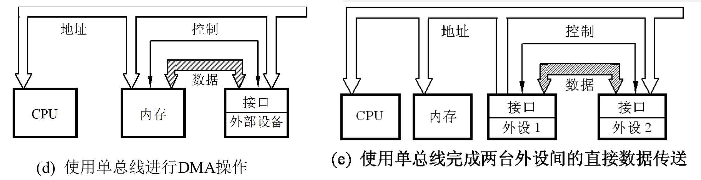
- 双总线 DMA
  - 双总线结构保持了单总线系统简单、易于扩充的优点，但又在CPU和主存之间专门设置了一组高速的存储总线，使CPU可通过专用总线与存储器交换信息，并减轻了系统总线的负担，同时主存仍可通过系统总线与外设之间实现DMA操作，而不必经过CPU。  
    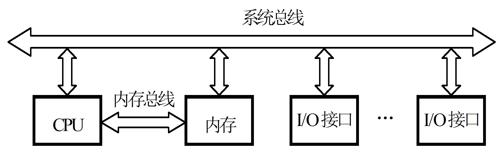
- 三总线 DMA
  - 在DMA方式中，外设与存储器间直接交换数据而不经过CPU，从而减轻了CPU对数据输入输出的控制，而“通道”方式进一步提高了CPU的效率。
    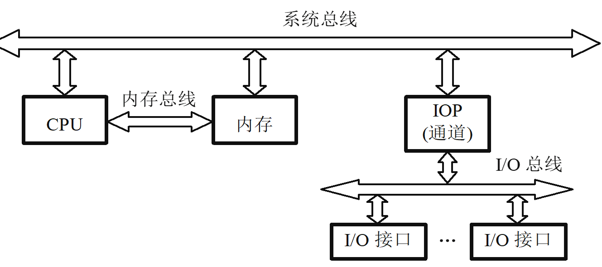

## 7 外部设备
### 7.1 中断
#### 中断的概念
- 中断的定义
  - 所谓中断是指计算机由任何非寻常的或非预期的急需处理的事件引起`CPU暂时中断现行程序`的执行，而转向运行另一服务程序，去处理这些事件，等处理完后又返回原程序，这一整个执行过程。
- 程序中断方式工作原理
  - 在外设准备数据时，CPU执行与传送数据无关的工作，外设在准备好数据后，主动向CPU发送一个中断请求，当CPU执行完当前指令后，停止当前程序的执行，自动转向中断服务程序，在中断服务程序中，完成一个数据的传送，之后中断返回至原来的断点处，继续执行。
  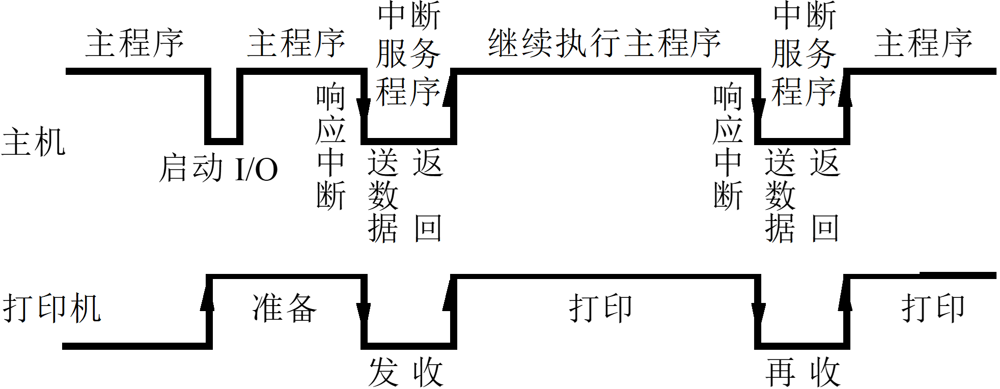
- 特点
  - 在外设准备数据时，CPU与外设并行工作，CPU效率有所提高，并且CPU可以同时被多个外设占用。
- 要求：接口中需要中断控制逻辑支持
- 应用：适用于中低速设备

#### CPU 响应中断的条件
- CPU 响应中断的三个条件
  - 中断源有中断请求
  - CPU允许接受中断请求
  - 一般情况下，都要等到一条指令执行完毕后才能响应中断，除非遇到特殊的长指令才允许中途打断它们。
- 中断相关概念
  - 中断源：发出中断请求的来源
  - 中断响应：CPU 停止执行现行程序，转去处理中断请求
  - 开中断：CPU 进入可中断方式，允许接受中断
  - 关中断：CPU 处于不可中断状态
#### 中断处理
- 程序中断：主机在响应中断请求后，是通过执行一段服务程序来处理有关事项的，则称为程序中断，简称为中断。
- 简单中断(`DMA`)：在DMA方式的 I/O过程中，主机响应中断后不要执行服务程序，而是让出一个或几个存取周期供I/O设备与主存直接交换数据。
  - 这种中断只是暂停一个或几个存取周期，不破坏被中断的程序现场，因此，不需要进行现场保护工作。这种中断称为简单中断，一般称为`DMA`。
#### 单级中断与多级中断
- 单级中断
  - 所有的中断源都属于同一级，所有中断源触发器排成一行，其优先次序是离CPU近的优先权高。  
    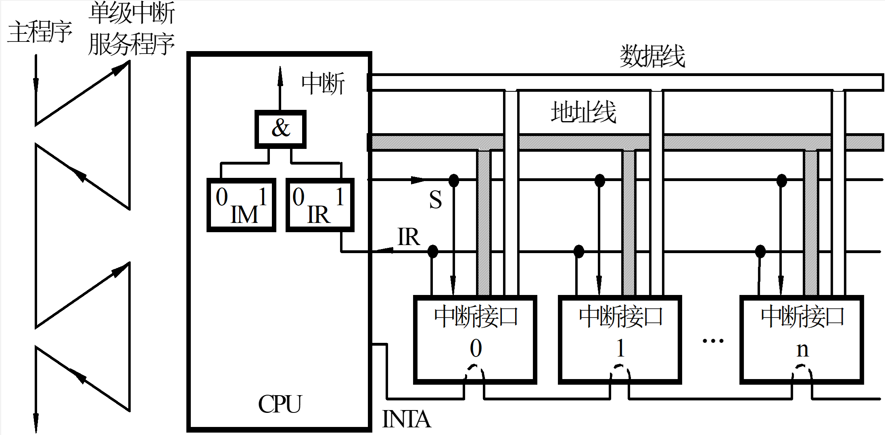
- `多级中断`
  - 计算机系统中有相当多的中断源，根据各中断事件的轻重缓急程度不同而分成若干级别，每一中断级分配给一个优先权
  - 优先权高的中断级可以打断优先权低的中断服务程序，以程序嵌套方式进行工作  
    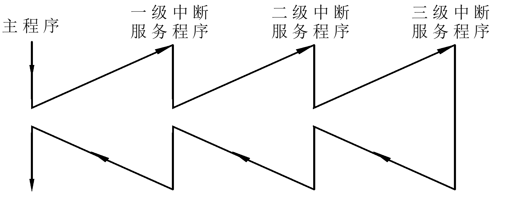 <br>
    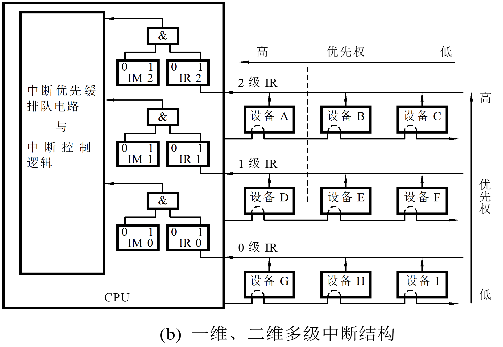
  - 例题：在中断情况下，CPU和设备的优先级如何考虑？
    - 解：A &rarr; B &rarr; C &rarr; D &rarr; E &rarr; ... &rarr; I &rarr; CPU
  - 例题：若CPU现正执行设备B的中断服务程序，则IM2、IM1、IM0的状态是什么？如果CPU正执行设备D的中断服务程序，则IM2、IM1、IM0的状态又是什么？
    - 解：111 011
  - 例题：每一级的IM能否对某个优先级的个别设备单独进行屏蔽？如果不能，则采取什么办法才能达到目的
    - 解：每一级的IM标志`不能`对某个优先级的个别设备进行单独屏蔽，可将接口中的EI(中断允许)标志清“0”，它禁止设备发出中断请求。
  - 例题：假如要求设备C一提出中断请求，CPU就立即进行响应，如何调整才能满足此要求？
    - 解：要使设备C的中断请求及时得到响应，可将设备C从第2级取出来，单独放在第3级上，使第3级的优先级最高，即令IM3=0。