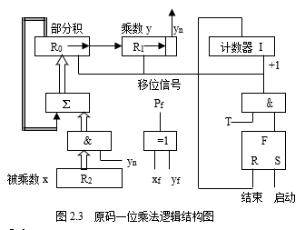

<link rel=stylesheet href=style.css>

# 计算机组成原理
> [Github 笔记开源地址](https://github.com/Pionpill/Notes/tree/Pionpill/Lessons/%E8%AE%A1%E7%AE%97%E6%9C%BA%E7%BB%84%E6%88%90%E5%8E%9F%E7%90%86)  
> [计算机组成原理课后答案](https://wenku.baidu.com/view/7b69f962fbd6195f312b3169a45177232e60e44f.html)  
> 由于觉得没什么实战用处，正常笔记不再更新

## 1 概述
### 1.1 冯诺依曼原理，组成
#### 冯诺依曼体系的基本思想  书P4，P15 
  - 冯诺依曼计算机体系结构的基本思想是`存储程序`，也就是将用`指令序列`描述的`解题程序与原始数据`一起存储到计算机中。计算机只要一启动，就能`自动地`取出`一条条指令`并执行之，直至程序执行完毕，得到计算结果为止。
#### 计算机硬件系统组成``
  - 按此思想设计的计算机硬件系统包含：`运算器、控制器、存储器、输入设备、输出设备`。  
    

### 1.2 计算机层次结构
#### 计算机系统层级结构  书P4，P12 
  - 计算机系统层级结构  
    

## 2 运算方法与运算器
### 2.0 概念
#### 机器码转换
- 原码，反码，补码和移码
  - 正数：原码 = 反码 = 补码
  - 负数：反码：符号位不变，数值位取反
    - 补码：反码末尾加1
  - 移码：补码符号位取反，数值位不变
- 双符号位
  | 符号 | 说明     |
  | ---- | -------- |
  | 00   | 正号     |
  | 11   | 负号     |
  | 01   | 正向溢出 |
  | 10   | 负项溢出 |
### 2.1 一位加法器逻辑结构
#### 补码一位加减法  书P31 
- 补码一位加法运算法则
    - 补码加法：$[x]_{补}+[y]_{补}=[x+y]_{补}$
    - 补码减法：$[x]_{补}-[y]_{补}=[x]_{补}+[-y]_{补}$
- 补码一位加减法运算器逻辑框图  
  

### 2.2 一位乘法器逻辑结构
#### 原码一位乘法  书P32 
- 原码一位乘法运算规则
  - 设：$x=x_f x_1 x_2 \dots x_n \qquad y=y_t y_1 y_2 \dots y_n$
  - 则 乘积 $P=|x||y|\quad$ 乘积的符号 $P_f = x_f \oplus y_f$
    1. 被乘数和乘数均`取绝对值`参加运算，符号位`单独考虑`
    2. 被乘数取双符号，部分积的长度与被乘数的`长度相同`，`初值为0`
    3. 从乘数的最低位的yn位开始对乘数进行判断
       - 若$y_n=1$，则部分积加上被乘数|x|，然后右移一位
       - 若$y_n=0$，则部分积加上0，然后右移一位
    4. 重复上述步骤
- 原码一位乘法运算器逻辑框图  
  
#### 补码一位乘法  书P35 
- 补码一位乘法运算规则
  1. `符号位参与运算`，运算的数均以补码表示
  2. 被乘数一般取双符号位参加运算，部分积初值为0
  3. 乘数可取单符号位，以决定最后一步是否需要校正，即是否要加 $[–x]_补$
  4. 乘数末位增设附加位 $y_{n+1}$，且初值为0
  5. 从低到高依次判断相邻两位 ynyn-1 的状态，按下表操作
      | $y_n$ | $y_{n+1}$ | 操作                         |
      | ----- | --------- | ---------------------------- |
      | 0     | 0         | 部分积右移一位               |
      | 0     | 1         | 部分积加$[x]_{补}$,右移一位  |
      | 1     | 0         | 部分积加$[-x]_{补}$,右移一位 |
      | 1     | 1         | 部分积右移一位               |
  6. 按照上述算法进行n+1步操作，第n+1步不移位，根据 $y_0$与 $y_1$ 的比较结果作相  的运算即可
  7. 补码移位规则，部分积为正，右移时有效位最高位补0；为负时最高位补1
- 补码一位乘法运算器逻辑框图  
  
### 2.3 浮点数运算，规格化表示
#### 浮点数运算方式
- 十进制转二进制运算  书P20 
  - 将十进制转为二进制，其中符号位放在尾数表示
  - 再进行规格化表示
- 机器码的浮点数运算  书P65 
  - 均采用双符号位
  - 小阶向大阶看齐
  - 采用补码运算
  - 规格化表示
#### 两种规格化表示方式
- 第一种浮点表示格式: 均采用补码
  - 规格化方式：阶符+阶码值+数符+尾数值
  - 具体表现：阶码，尾数
  - 例：0001001，1.011111111100000000000000
- 第一种浮点表示格式: 阶码采用移码，尾数仍采用补码
  - 规格化方式：数符+阶符+阶码值+尾数值
  - 具体表现：尾数符号位，阶码，尾数值
  - 例：1，10001001，011111111100000000000000
    

## 3 存储器及存储系统
### 3.1 存储器 CPU 相连
#### 串联理论
- 两种串联方式  书P86 
  - 位并联：增加位数 8K&times;1b &rarr; 8K&times;8b 
  - 位串联：增加字数 8K&times;8b &rarr; 64K&times;8b 
- 地址空间分配  书P87 
  1. 最大字数转换为位数，获得地址数 64K &rarr; $A_{0} - A_{15}$
  2. 填写地址空间：高位作为识别部分
  3. 注意题中给出的地址空间位置，是否在最后
#### 画图
- 各组件的接口 (64K&times;8b )
  - CPU：
    - 数据总线：位数决定个数 $D_{0}-D_{7}$ 可以合成大箭头一起接
    - 读写 $\overline{WE}$：与 RAM 相连
    - 地址线：字数决定个数 $A_{0}-A_{15}$ 公有的可以合成大箭头一起接
    - $\overline{MREQ}$ 与译码器相连：`非连接`
  - 译码器：
    - 使能端 $\overline{EN}$： 与 CPU 相连：`非连接`
    - 3 线：与 CPU 地址线高位相连
    - 8 线：与存储器芯片的 $\overline{CE}$ 相连：`非连接`
  - 存储器芯片
    - 地址线：直接与地位地址线先练，非公共地址线再考虑
    - $\overline{CE}$：与译码器相连 `非连接`
    - 读写 $\overline{WE}$：RAM 才有，与对应 CPU 相连
    - 数据总线：直接相连
- 举例
  - dragon PPT  
    

### 3.2 组相连问题
#### 全相连映像方式  书P91 
- 地址结构  
  - 主存地址  存块号  块内地址   
  - cache 地址  cache 块号  块内地址    
     
- 特点
  - 主存中的一个地址可被映射进任意cache line
  - 当寻找一个地址是否已经被cache时，需要遍历每一个cache line来寻找，这个代价很高。
- 优缺点
  - 全相联映射方式比较灵活，主存的各块可以映射到Cache的任一块中，Cache的利用率高，块冲突概率低
  - 由于Cache比较电路的设计和实现比较困难，这种方式只适合于小容量Cache采用。电路复杂
#### 直接相连  书P91 
- 地址结构
  - 主存地址  区号  块号  块内地址   
  - cache地址  块号  块内地址   
  
- 特点
  - 一个内存地址能被映射到的Cache line是`固定`的。
  - 主存中的一个块只能映射到Cache的某一特定块中去。  
- 优缺点
  - 它的硬件简单，成本低，地址变换速度快，而且不涉及替换算法问题。
  - `Cache的存储空间得不到充分利用`

#### 组相连映射  书P93 
- 地址结构
  - 主存地址  区号  组号  组内块号  块内地址   
  - cache地址  组号  组内块号  块内地址   
  
- 特点
  - 组相联映射实际上是直接映射和全相联映射的折中方案
- 优缺点
  - 全相连和组相连的优点，没有缺点

### 3.3 虚拟存储器，页式，段页式...
> [参考操作系统笔记](https://github.com/Pionpill/Notes/blob/Pionpill/Lessons/%E6%93%8D%E4%BD%9C%E7%B3%BB%E7%BB%9F/4.%E5%AD%98%E5%82%A8%E5%99%A8%E7%AE%A1%E7%90%86.md)  
> 下面只写地址计算方式
#### 页式存储器
- 地址划分
  - 逻辑空间等分为页；并从0开始编号
  - 内存空间等分为块，与页面大小相同；从0开始编号
  - 地址结构
     页号P  位移量W 
- 地址计算方式
  - 逻辑地址 = 页号 & 位移量 (&号是连接符号，是将页号作为逻辑地址的最高位)
  - 物理地址 = 块号 & 块内地址
  - 给定一个逻辑地址和页面大小，计算物理地址
    1. 根据`页面大小`可计算出`页内地址的位数`
    2.` 页内地址位数`结合`逻辑地址`计算出`页内地址`（即，块内地址）和`页号`
    1. 页号结合`页表`，即可得出`块号`
    2. `块号&块内地址`即可得出物理地址
- 快慢表  书P97 
  - 块表由硬件组成，比页表小得多，只是慢表的小副本
  - 查表时，同时查快表和慢表，若快表查到了，很快就能得到物理页号。同时慢表查找作废
    - 查不到则取慢表中查，并将结果送入快表，使用[替换算法](https://github.com/Pionpill/Notes/blob/Pionpill/Lessons/%E6%93%8D%E4%BD%9C%E7%B3%BB%E7%BB%9F/5.%E8%99%9A%E6%8B%9F%E5%AD%98%E5%82%A8%E5%99%A8.md)

#### 段式存储器
- 地址划分
  - 逻辑空间分为若干个段，每个段定义了一组有完整逻辑意义的信息
  - 内存空间为每个段分配一个连续的分区
  - 地址结构
     段号  段内地址 
- 地址计算方式
  - 段内地址的位数可以决定段的大小
  - 逻辑地址 = 段号 & 段内地址
  - 物理地址 = 基址 + 段内地址
#### 段页式存储器
- 地址划分
  - 用户程序先分段，每个段内部再分页
  - 地址结构
     段号S  段内页号P  页内地址Y 
- 地址计算方式
  - 逻辑地址 ----> 段号、段内页号、业内地址
  - 段号+段表始址 ----> 页表始址
  - 页表始址+段内页号 ----> 存储块号
  - 块号+页内地址 ----> 物理地址

### 3.4 存储校验技术
#### CRC 循环冗余检验
- 据说不考，参考[计算机网络笔记](https://github.com/Pionpill/Notes/blob/Pionpill/Lessons/%E8%AE%A1%E7%AE%97%E6%9C%BA%E7%BD%91%E7%BB%9C/3.%E6%95%B0%E6%8D%AE%E9%93%BE%E8%B7%AF%E5%B1%82.md)
#### 海明码
- 实现效果
  - 侦测并更正单一比特错误，CRC 只能检测，不能更正
  - 只能校验一位出错，否则失效
- 校验原理
  - 海明码通过在数据流指定位置插入校验位来进行检测
    |          | 数据为 | 校验位    | 海明码 |
    | -------- | ------ | --------- | ------ |
    | 表示     | D      | P         | H      |
    | 所在位置 |        | $2^{n-1}$ |        |
  - 举例
    | H1     | H2     | H3  | H3     | H5  | H6  | H7  | H8     | H9  | H10 | H11 | H12 |
    | ------ | ------ | --- | ------ | --- | --- | --- | ------ | --- | --- | --- | --- |
    | **P1** | **P2** | D0  | **P3** | D1  | D2  | D3  | **P4** | D4  | D5  | D6  | D7  |
  - 找到校验位数 $r+k+1\leq2^r$
    - r:校验位数
    - k:有效信息位数
- 写出汉明码
  1. 根据 $r+k+1\leq2^r$ 算出 r
  2. 根据 $k+r$ 算出汉明码位数
  3. 写出每个位数对应的 r 位 2 进制数 
     - 有效信息的 2 进制数 1 所在位置被对应校验位检验
     - 如 101 被校验位位 100 001 的检验
  4. 填入有效位数据
  5. 根奇校验/偶校验填入校验位
      - 奇校验：校验位 + 被校验数 1 个数位奇数
      - 偶校验：校验位 + 被校验数 1 个数位偶数
  - 举例：0011 的偶校验海明码
    1. $3+4+1\leq2^3$  
    2. 汉明码位数：7
    3. 画表：依次填入 3,4,5 步数据
       | 海明码       | H1     | H2     | H3  | H4     | H5  | H6  | H7  |
       | ------------ | ------ | ------ | --- | ------ | --- | --- | --- |
       | 二进制数     | 001    | 010    | 011 | 100    | 101 | 110 | 111 |
       | 海明码       | **P1** | **P2** | D0  | **P3** | D1  | D2  | D3  |
       | 数据         |        |        | 0   |        | 0   | 1   | 1   |
       | 偶校验(默认) | 1      | 0      | 0   | 0      | 0   | 1   | 1   |
       | 奇校验       | 0      | 1      | 0   | 1      | 0   | 1   | 1   |
- 检验汉明码
  - 同样画表，得出校验位与被校验位数字
  - 偶校验：1个数为偶数 (正式要用异或运算假装写一下)

## 4 指令系统
### 4.1 寻址方式
### 4.2 指令周期

## 5 中央处理器
### 5.1 流水线
### 5.2 中央处理器，指令译码
### 5.3 微程序控制器，微指令
### 5.4 水平型微指令（给已知条件算字段）

## 6,7 系统总线 I/O系统
### 占比极小