<link rel=stylesheet href=style.css>
<h1> 1 软件工程学概述 </h1>
<h2> 1.1 软件危机 </h2>
<h3> 1.1.1 软件危机介绍 </h3>
<h4> 软件危机 </h4>

  - 软件危机：计算机软件开发维护过程中所遇到得一系列严重的问题

<h3> 1.1.2 产生软件危机的原因 </h3>

<h4> 软件危机的原因 </h4>

  - 与软件本身特点有关
    - 软件不同于硬件，管理和控制软件开发过程相当困难。
    - 软件在运行过程中不会因为使用时间过长而被“用坏“如果运行中发现了错误,很可能是遇到了一个在开发时期引入的在测试阶段没能检测出来的错误。
    - 软件不同于一般程序，它的一个显著特点是规模庞大，而且程序复杂性将随着程序规模的增加而呈指数上升。
    - 事实上，对用户要求没有完整准确的认识就匆忙着手编写程序是许多软件开发工程失败的主要原因之一。
    - 目前相当多的软件专业人员对软件开发和维护还有不少糊涂观念。
    - 错误的认识和做法主要表现为忽视软件需求分析的重要性，认为软件开发就是写程序并设法使之运行,轻视软件维护等
  - 软件开发与维护的方法不正确有关
    - 只重视程序而忽视软件配置其余成分的糊涂观念
    - 软件开发人员在定义时期没有正确全面地理解用户需求，直到测试阶段或软件交付使用后才发现“已完成的”软件不完全符合用户的需要
    - 严重的问题是在软件开发的不同阶段进行修改需要付出的代价是很不相同的

<h4> 软件危机的典型表现 </h4>

  1. 对软件开发成本和进度的估计常常很不准确
  2. 用户对以完成的软件系统不满意的现象经常发生
  3. 软件产品质量靠不住
  4. 软件常常是不可维护的
  5. 软件常常没有适当的文档资料
  6. 软件成本在计算机系统总成本所占比例逐年上升
  7. 软件开发生产率提高的速度，远远跟不上计算机应用迅速普及深入的趋势

<h2> 1.2 软件工程 </h2>
<h3> 1.2.1 软件工程介绍 </h3>
<h4> 软件的概念 </h4>

  - 软件=程序+数据+相关文档
    - 程序：按事先设计的功能和性能需求执行的指令序列
    - 数据：用于程序正常操纵信息的数据结构
    - 文档：与程序开发、使用、维护相关的图文资料

<h4> 软件工程的概念 </h4>

  1. 应用系统化的、学科化的定量的方法，来开发维护软件，将工程应用到软件
  2. 对1中各种方法的研究
  3.  要素：方法（包含：结构化方法、面向对象的方法）、工具、过程

<h3> 1.2.2 软件工程方法学 </h3>
<h4> 传统方法学 </h4>

  - 概念
    - 传统方法学也称为生命周期方法学或结构化范型。它采用结构化技术(结构化分析、结构化设计和结构化实现)来完成软件开发的各项任务，并使用适当的软件工具或软件工程环境来支持结构化技术的运用。
  - 特点
    - 把软件生命周期的全过程依次划分为若干个阶段，然后顺序地完成每个阶段的任务
    - 每个阶段的开始和结束都有严格标准，对于任何两个相邻的阶段而言，前一阶段的结束标准就是后一阶段的开始标准。

<h4> 面向对象方法学 </h4>

  - 概念
    - 面向对象方法把数据和行为看成是同等重要的，它是一种以数据为主线，把数据和对数据的操作紧密地结合起来的方法。
  - 要点
    - 把对象(object)作为融合了数据及在数据上的操作行为的统一的软件构件。
    - 把所有对象都划分成类(class)。
    - 按照父类与子类的关系，把若干个相关类组成一个层次结构的系统。
    - 对象彼此间仅能通过发送消息互相联系。
  - 优点
    - 降低了软件产品的复杂性，提高了软件的可理解性，简化了软件的开发和维护工作。面向对象方法特有的继承性和多态性，进一步提高了面向对象软件的可重用性。

<h2> 1.3 软件生命周期 </h2>
<h3> 1.3.1 软件生命周期概述 </h3>
<h4> 软件生命周期 </h4>

  - 软件生命周期由软件定义、软件开发和运行维护(也称为软件维护)3个时期组成，每个时期又进一步划分成若干个阶段。

<h4> 软件生命周期每个阶段的基本任务 </h4>

  - 问题定义
  - 可行性研究
  - 需求分析
  - 总体设计
  - 详细设计
  - 编码和单元测试
  - 综合测试
  - 软件维护

<h2> 1.4 软件过程 </h2>
<h3> 1.4.1 瀑布模型 </h3>
<h4> 瀑布模型结构 </h4>

  - 带"反馈环"瀑布模型结构图  
    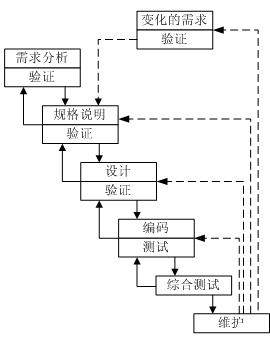
  - 瀑布模型的阶段
     1. 需求分析：获取`客户需求与定义的信息`，以及对需要解决的问题所能达到的最清晰的描述。分析包含了理解客户的商业环境与约束，`产品必需实现的功能`，`产品必需达到的性能水平`，以及必需实现兼容的外部系统。
     2. 可行性研究：从技术和业务方面进行研究，以确定对公司(或组织)而言，`构建特定软件是否有利`，`消费者是否会满意它`？以及该软件能够`为我们提供多少利润`。
     3. 设计：创建整个软件的蓝图。 在最终设计阶段，将决定软件作为最终产品的外观。 因此，软件的设计向开发人员提供了软件的概述，以便他们可以相应地进行工作。 这样做是为了`将所有需求转换为结构化方式`，这现在使开发人员更容易实现。
     4. 编程测试：开发人员可以使用任何合适的`编程语言对程序进行编码`。 在开发该软件的任何功能时，开发人员还必须在其级别上测试该功能，以检查该功能是否正常运行。 因此，此阶段涉及的测试称为单元测试。
     5. 综合测试：独立的组件和集成后的组件都将进行`系统性验证`以确保没有错误并且完全符合第一阶段所制定的需求。一个独立的质量保证小组将定义`“测试实例”来评估产品是完全实现了需求还是只有部分满足`。
     6. 维护：这一阶段发生在安装之后，包括了对整个系统或某个组件`进行修改以改变属性或者提升性能`，这些修改可能源于客户的需求变化或者系统使用中没有覆盖到的缺陷，通常，在维护阶段对产品的修改都会被记录下来并产生新的发布版本（称作“维护版本”并伴随升级了的版本号）以确保客户可以从升级中获益。
  - 传统瀑布模型特点
    - 阶段间具有顺序性和依赖性
      1. 必须等前一阶段的工作完成后，才能开始后一阶段的工作
      2. 前一阶段的输出文档就是后一阶段的输入文档
    - 推迟实现的观点
      - 瀑布模型在编码之前设置了系统分析与系统设计的各个阶段，分析与设计阶段的基本任务规定，在这两个阶段主要考虑目标系统的逻辑模型，不涉及软件的物理实现。
    - 质量保证的观点
      - 每个阶段都必须完成规定的文档
      - 每个阶段结束前都要对所完成的文档进行评审
  - 实际瀑布模型的特点
    - 带反馈环，在后面阶段发现前面阶段的错误需要按反馈线返回前面的阶段
  - 瀑布模型的优点
    - 可强迫开发人员采用规范的方法
    - 严格地规定了每个阶段必须提交的文档
    - 要求每个阶段交出的所有产品都必须经过质量保证小组的仔细验证

<h3> 1.4.2 快速原型模型 </h3>
<h4> 快速原型模型概要 </h4>

  - 快速原型模型是快速建立起来可以在计算机上运行的程序，它所能完成的功能往往是最终产品能完成的功能的一个子集
  - 快速原型模型第一步是快速建立一个能反映用户主要需求的原型系统。

<h4> 快速原型模型的主要优点及其主要原因 </h4>

  - 快速原型模型  
    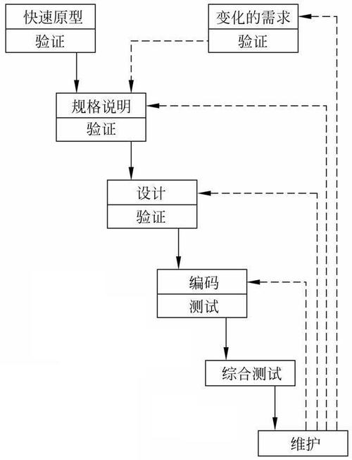
    - 实线表示开发过程，虚线表示维护过程
  - 主要优点
    - 软件产品的开发基本上是线性顺序进行的
  - 主要原因
    - 原型系统已经通过与用户交互而得到验证，据此产生的规格说明文档正确地描述了用户需求
    - 开发人员通过建立原型系统已经学到了许多东西，在设计和编码时期发生错误可能性较小

<h3> 1.4.3 增量模型 </h3>
<h4> 增量模型概述 </h4>

  - 把软件作为一系列的增量构件来设计，编码，集成和测试。每个构建由多个相互作用的模块构成，并且能够完成特定的功能
  - 增量模型第一个增量构建往往实现软件的基本需求，提供最核心的功能
  - 把软件分产品解成增量构建时，唯一必须遵守的约束条件是，当把新构建集成到现有软件中时，所形成的产品必须是可测试的

<h4> 增量模型的特点及优缺点 </h4>

  - 增量模型  
    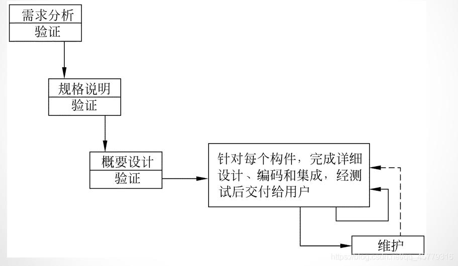
  - 增量模型的特点
    - 快速原型模型目标是一次把一个满足所有需求的产品提交给用户，而增量模型与之相反，分批地逐步向用户提交产品
  - 增量模型的优点
    - 能在较短时间内向用户提交可完成部分工作的产品
    - 逐步增加产品功能可以使用户由较充裕时间学习和适应新产品
  - 增量模型的困难
    - 在把每个新的增量构件集成到现有软件体系结构中时，必须不破坏原来已经开发出的产品。
    - 必须把软件的体系结构设计得便于按这种方式进行扩充，向现有产品中加入新构件的过程必须简单、方便，也就是说，软件体系结构必须是开放的。
  - 风险更大的增量模型  
    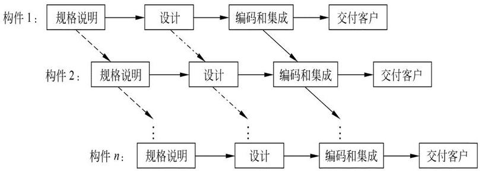

<h3> 1.4.4 螺旋模型 </h3>
<h4> 概念 </h4>

  - 螺旋模型的基本思想是，使用原型及其他方法来尽量降低风险。理解这种模型的一个简便方法，是把它看作在每个阶段之前都增加了风险分析过程的快速原型模型。  
    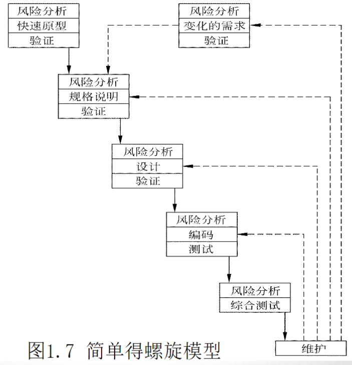
    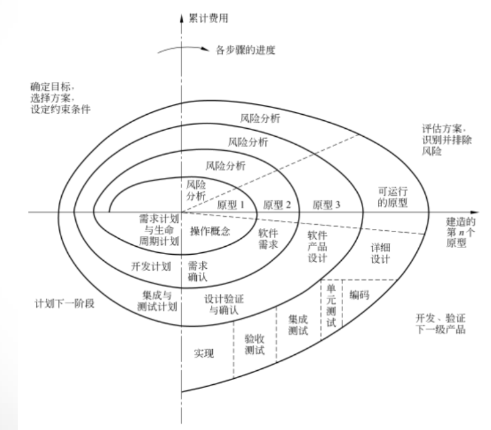

<h3> 1.4.5 喷泉模型 </h3>
<h4> 概念 </h4>

  - “喷泉”这个词体现了面向对象软件开发过程迭代和无缝的特性。迭代是软件开发过程中普遍存在的一种内在属性。用面向对象方法学开发软件时，工作重点应该放在生命周期中的分析阶段。  
    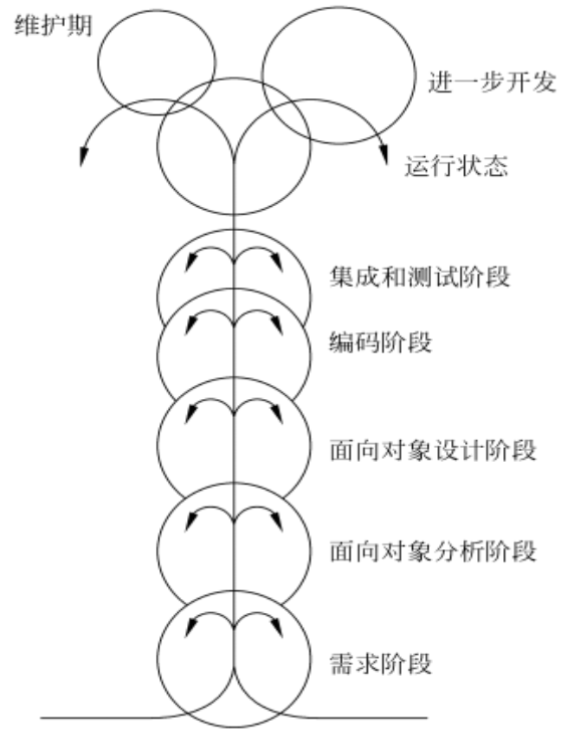
    - 图中代表不同阶段的圆圈相互重叠，这明确表示两个活动之间存在交迭
    - 图中在一个阶段内的向下箭头代表该阶段内的迭代（或求精）。
    - 图中较小的圆圈代表维护，圆圈较小象征着采用了面向对象范型之后维护时间缩短了。

<h3> 1.4.6 Rational统一过程 </h3>
<h4> 基本概念 </h4>

  - Rational统一过程（Rational Unified Process,RUP）是由Rational软件公司推出的一种完整而且完美的软件过程。
  - 最佳实践
    - 迭代式开发
      - 迭代式开发允许在每次迭代过程中需求都可以有变化，这种开发方法通过一系列细化来加深对问题的理解，因此能更容易地容纳需求的变更。
    - 管理需求
      - RUP描述了如何提取、组织系统的功能性需求和约束条件并把它们文档化。
    - 使用基于构件的体系结构
      - UP提供了使用现有的或新开发的构件定义体系结构的系统化方法，从而有助于降低软件开发的复杂性，提高软件重用率。
    - 可视化建模
      - 可视化建模语言UML紧密地联系在一起，在开发过程中建立起软件系统的可视化模型，可以帮助人们提高管理软件复杂性的能力。
  - RUP 软件开发生命周期
    - 核心工作流
      - RUP中有9个核心工作流，其中前6个为核心过程工作流程，后3个为核心支持工作流程  
      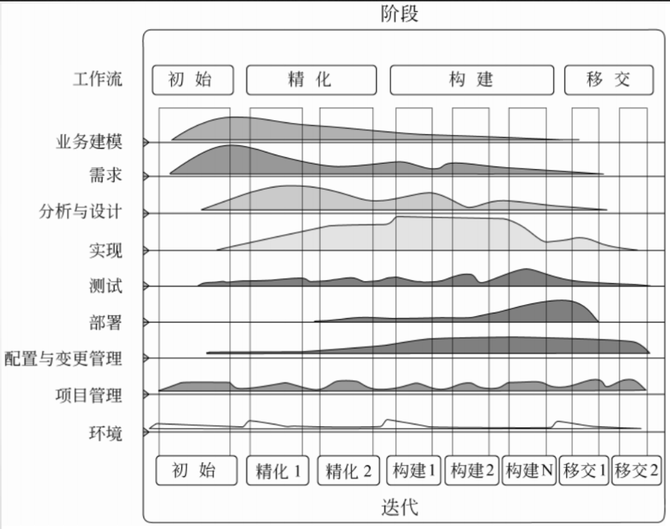
      - RUP软件开发生命周期
        - 初始阶段：建立业务模型，定义最终产品视图，并且确定项目的范围。
        - 精化阶段：设计并确定系统的体系结构，制定项目计划，确定资源需求。
        - 构建阶段：开发出所有构件和应用程序，把它们集成为客户需要的产品，并且详尽地测试所有功能。
        - 移交阶段：把开发出的产品提交给用户使用。
  - RUP迭代式开发
    - RUP重复一系列组成软件生命周期的循环。每次循环都经历一个完整的生命周期，每次循环结束都向用户交付产品的一个可运行的版本。
    - 每个阶段又进一步细分为一次或多次迭代过程

<h3> 1.4.7 敏捷过程与极限编程 </h3>
<h4> 敏捷软件开发 </h4>

  - 价值观
    - 个体和交互胜过过程和工具
    - 可以工作的软件胜过面面俱到的文档
    - 客户合作胜过合同谈判
    - 响应变化胜过遵循计划

<h4> 极限编程 </h4>

  - 极限编程概念
    - 极限编程（eXtremeProgramming,XP）是敏捷过程中最富盛名的一个，其名称中“极限”二字的含义是指把好的开发实践运用到极致。  
      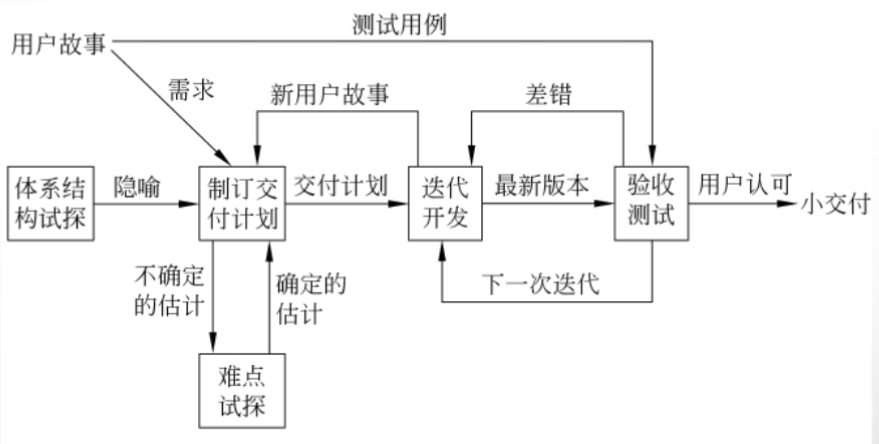  
  - 极限编程的迭代过程
    - 首先，项目组针对客户代表提出的“用户故事”进行讨论，提出隐喻，在此项活动中可能需要对体系结构进行“试探”。
    - 然后，项目组在隐喻和用户故事的基础上，根据客户设定的优先级制订交付计划。接下来开始多个迭代过程（通常每个迭代历时1~3周），在迭代期内产生的新用户故事不在本次迭代内解决，以保证本次开发过程不受干扰。
    - 开发出的新版本软件通过验收测试之后交付用户使用  
      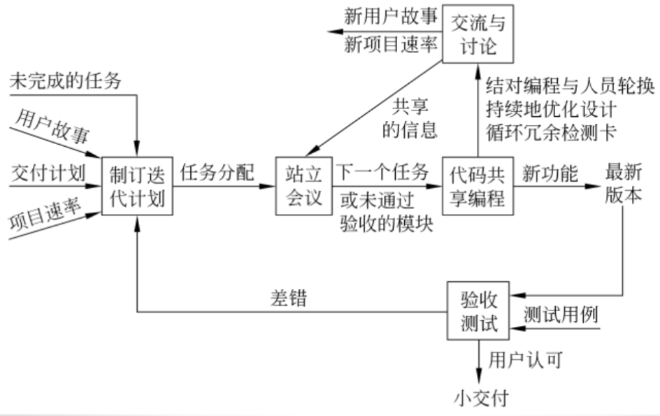  

<h3> 1.4.8 微软过程 </h3>
<h4> 微软过程准则 </h4>

  - 项目计划应该兼顾未来的不确定因素。
  - 用有效的风险管理来减少不确定因素的影响。
  - 经常生成并快速地测试软件的过渡版本，从而提高产品的稳定性和可预测性。
  - 采用快速循环、递进的开发过程。
  - 用创造性的工作来平衡产品特性和产品成本。
  - 项目进度表应该具有较高稳定性和权威性。
  - 使用小型项目组并发地完成开发工作。
  - 在项目早期把软件配置项基线化，项目后期则冻结产品。
  - 使用原型验证概念，对项目进行早期论证。
  - 把零缺陷作为追求的目标。里程碑评审会的目的是改进工作，切忌相互指责。

<h4> 微软软件生命周期 </h4>

  - 规划阶段 设计阶段 开发阶段 稳定阶段 发布阶段
    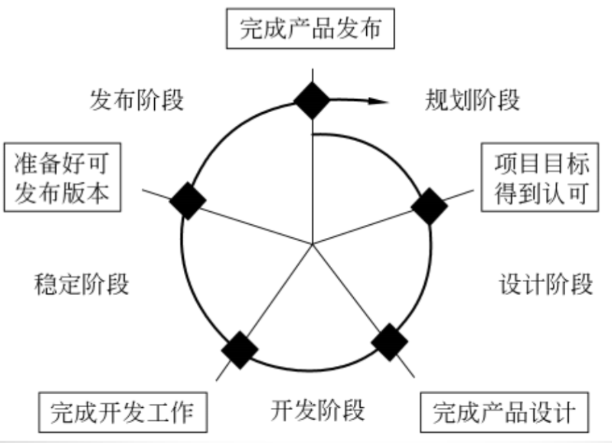
<h4> 微软过程模型 </h4>

  - 微软过程的每一个生命周期发布一个递进的软件版本，各个生命周期持续、快速地迭代循环。  
    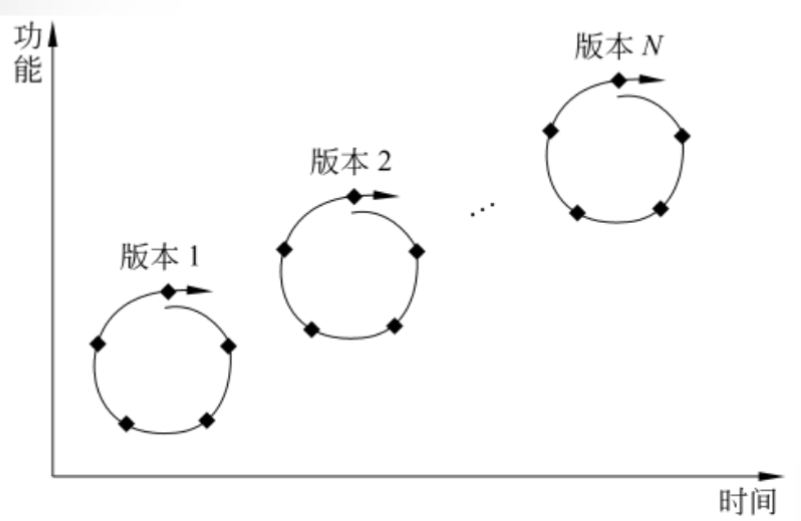