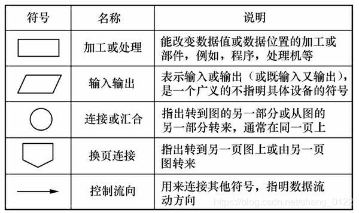
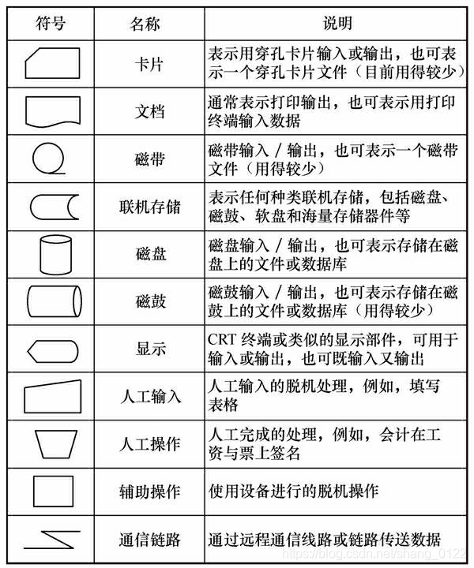
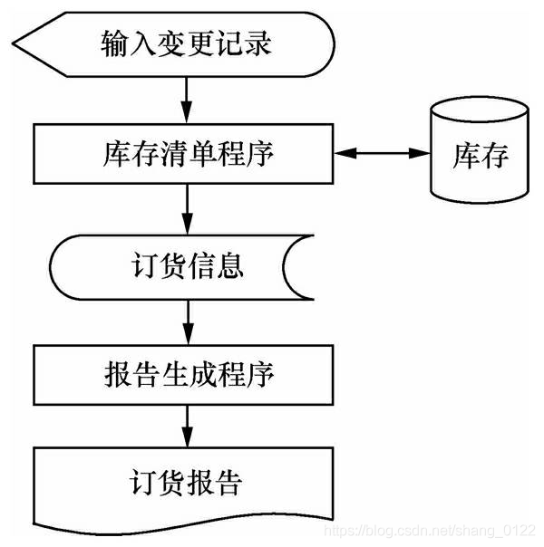
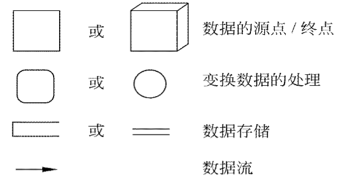
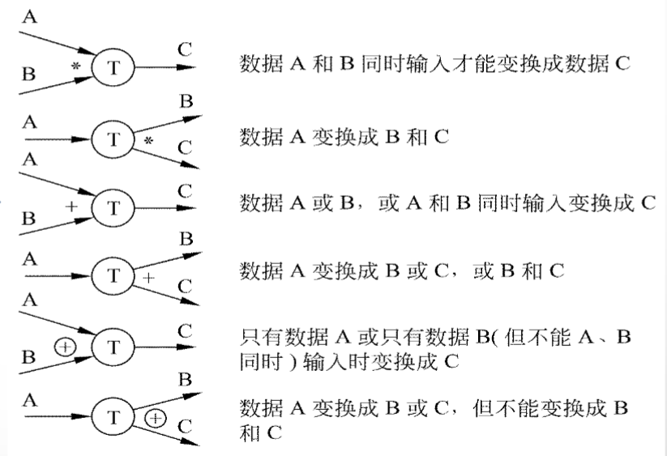

<link rel=stylesheet href=style.css>
<h1> 2 可行性研究 </h1>
<h2> 2.1 可行性研究的任务 </h2>
<h3> 2.1.1 可行性研究概述 </h3>
<h4> 可行性研究的目的 </h4>

  - 可行性研究的目的不是解决问题，而是确定问题是否值得去解决。

<h4> 可行性研究分析过程 </h4>

  - 首先，进一步分析和澄清问题定义
  - 然后，分析员应该导出系统的逻辑模型
  - 最后，探索若干种可供选择的主要解法

<h4> 可行性研究分析研究方面 </h4>

  - 至少应该从下述3个方面研究每种解法的可行性
    - 技术可行性使用现有的技术能实现这个系统吗?
    - 经济可行性这个系统的经济效益能超过它的开发成本吗?
    - 操作可行性系统的操作方式在这个用户组织内行得通吗?

<h2> 2.2 可行性研究过程 </h2>
<h3> 2.2.1 典型的可行性研究过程的步骤 </h3>
<h4> 8个步骤 </h4>

  - 典型的可行性研究过程有下述8个步骤
    1. 复查系统规模和目标
       - 这个步骤的工作，实质上是为了确保分析员正在解决的问题确实是要求他解决的问题。
    2. 研究目前正在使用的系统
    3. 导出新系统的高层逻辑模型
    4. 进一步定义问题
    5. 导出和评价供选择的解法
    6. 推荐行动方针
    7. 草拟开发计划书
    8. 写文档提交审查

<h2> 2.3 系统流程图 </h2>
<h3> 2.3.1 基本概念 </h3>
<h4> 基本思想 </h4>

  - 系统流程图是概括地描绘物理系统的传统工具
  - 用图形符号以黑盒子形式描绘组成系统的每个部件(程序、文档、数据库、人工过程等)
  - 系统流程图表达的是数据在系统各部件之间流动的情况，而不是对数据进行加工处理的控制过程，因此尽管系统流程图的某些符号和程序流程图的符号形式相同，但是它却是物理数据流图而不是程序流程图。

<h3> 2.3.2 符号 </h3>
<h4> 系统流程图符号 </h4>

  - 基本的系统流程图符号  
    
  - 进阶的系统流程图符号  
    
  - 例子：  
    

<h3> 2.3.3 分层 </h3>

  - 面对复杂的系统时，一个比较好的方法是分层次地描绘这个系统。首先用一张高层次的系统流程图描绘系统总体概貌，表明系统的关键功能。然后分别把每个关键功能扩展到适当的详细程度，画在单独的一页纸上。这种分层次的描绘方法便于阅读者按从抽象到具体的过程逐步深入地了解一个复杂的系统。

<h2> 2.4 数据流图  </h2>
<h3> 2.4.1 概念 </h3>

  - 数据流图(DFD)是一种图形化技术，它描绘信息流和数据从输入移动到输出的过程中所经受的变换。
<h3> 2.4.2 符号 </h3>

- 四种基本符号
  | 图形     | 描述                         |
  | -------- | ---------------------------- |
  | 正方形   | 数据的源点或终点             |
  | 圆角矩形 | 交换数据的处理               |
  | 开口矩形 | 数据存储                     |
  | 箭头     | 数据流，即特定数据的流动方向 |
  
  

- 附加符号
  | 符号    | 描述   |
  | ------- | ------ |
  | *       | 且     |
  | +       | 或     |
  | &oplus; | 仅一个 |

  

<h3> 2.4.3 命名 </h3>
<h4> 数据流命名时应注意的问题 </h4>

  1. 名字应代表整个数据流的内容，而不是仅仅反映它的某些成分
  2. 不要使用空洞的、缺乏具体含义的名字
  3. 在为某个数据流(或数据存储)起名字时遇到了困难，则很可能是因为对数据流图分解不恰当造成的，应该试试重新分解

<h3> 2.4.4 用途 </h3>

  - 画数据流图的基本目的是利用它作为交流信息的工具
  - 数据流图的另一个主要用途是作为分析和设计的工具
  - 数据流图辅助物理系统的设计时，以图中不同处理的定时要求为指南，能够在数据流图上画出许多组自动化边界，每组自动化边界可能意味着一个不同的物理系统

<h2> 2.5 数据字典 </h2>
<h3> 2.5.1 内容 </h3>
<h4> 概念 </h4>

  - 数据字典是关于数据的信息的集合，也就是对数据流图中包含的所有元素的定义的集合。
<h4> 数据字典的组成 </h4>

  - 数据流，数据流分量，数据存储，处理

<h4> 数据流别名 </h4>

  - 数据元素的别名就是该元素的其他等价的名字，出现别名主要有下述3个原因：
    - 对于同样的数据，不同的用户使用了不同的名字。
    - 一个分析员在不同时期对同一个数据使用了不同的名字。
    - 两个分析员分别分析同一个数据流时，使用了不同的名字。

<h3> 2.5.2 定义数据的方法 </h3>

  - 由数据元素组成数据的方式只有下述3种基本类型
    - 顺序: 以确定次序连接两个或多个分量。
    - 选择: 从两个或多个可能的元素中选取一个。
    - 重复: 把指定的分量重复零次或多次。
  - 四种关系运算符
    | 符号 | 描述                             |
    | ---- | -------------------------------- |
    | =    | 等价于，定义为                   |
    | +    | 和，连接两个分量                 |
    | []   | 或，从中选择一个，通常以"\|"隔开 |
    | {}   | 重复                             |
    | ()   | 可选                             |

<h3> 2.5.3 数据字典的用途 </h3>

  - 数据字典最重要的用途是作为分析阶段的工具
  - 数据字典中包含的每个数据元素的控制信息是很有价值的
  - 数据字典是开发数据库的第一步，而且是很有价值的一步

<h3> 2.5.4 数据字典的实现 </h3>

  - 目前，数据字典几乎总是作为CASE“结构化分析与设计工具”的一部分实现的。在开发大型软件系统的过程中，数据字典的规模和复杂程度迅速增加，人工维护数据字典几乎是不可能的。
  - 在开发小型软件系统时暂时没有数据字典处理程序，建议采用卡片形式书写数据字典，每张卡片上保存描述一个数据的信息。

<h2> 2.6 成本/效益分析 </h2>
<h3> 2.6.1 成本估计 </h3>

  - 软件开发成本主要表现为人力消耗(乘以平均工资则得到开发费用)。成本估计不是精确的科学，因此应该使用几种不同的估计技术以便相互校验。
  - 3种估算技术
    - 代码行技术
    - 任务分解技术
    - 自动估计成本技术
  - 任务分解技术最常用的办法是按开发阶段划分任务。典型环境下各个开发阶段需要使用的人力的百分比

<h3> 2.6.2 成本/效益分析的方法 </h3>

  - 成本/效益分析方法主要从四个方面考虑
    - 货币的时间价值
    - 投资回收期
    - 纯收入
    - 投资回收率第2章可行性研究