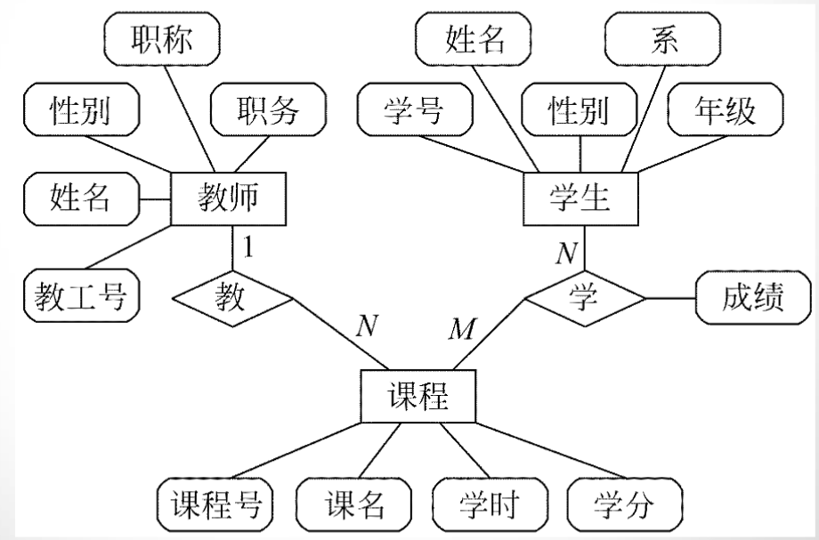

<link rel=stylesheet href=style.css>
<h1>3 需求分析 </h1>
<h2> 3.1 需求分析的任务 </h2>
<h3> 3.1.1 确定对系统的综合要求 </h3>

  - 虽然功能需求是对软件系统的一项基本需求，但却并不是唯一的需求。
  - 通常对软件系统有下述几方面的综合要求
    - 功能需求  性能需求  可靠性和可用性需求  出错处理需求
    - 接口需求  约束  逆向需求  将来可能提出的要求

<h4> 功能需求 </h4>

  - 这方面的需求指定系统必须提供的服务。通过需求分析应该划分出系统必须完成的所有功能

<h4> 性能需求 </h4>

  - 性能需求指定系统必须满足的定时约束或容量约束，通常包括速度(响应时间)、信息量速率、主存容量、磁盘容量、安全性等方面的需求。

<h4> 可靠性和可用性需求 </h4>

  - 可靠性需求定量地指定系统的可靠性，可用性与可靠性密切相关，它量化了用户可以使用系统的程度

<h4> 出错处理需求 </h4>

  - 这类需求说明系统对环境错误应该怎样响应。

<h4> 接口需求 </h4>

  - 接口需求描述应用系统与它的环境通信的格式。常见的接口需求有：用户接口需求；硬件接口需求；软件接口需求；通信接口需求。

<h4> 约束 </h4>

  - 设计约束或实现约束描述在设计或实现应用系统时应遵守的限制条件。常见的约束有：精度；工具和语言约束；设计约束；应该使用的标准；应该使用的硬件平台。

<h4> 逆向需求 </h4>

  - 逆向需求说明软件系统不应该做什么。理论上有无限多个逆向需求，人们应该仅选取能澄清真实需求且可消除可能发生的误解的那些逆向需求。

<h4> 将来可能提出的要求 </h4>

  - 应该明确地列出那些虽然不属于当前系统开发范畴，但是据分析将来很可能会提出来的要求。这样做的目的是，在设计过程中对系统将来可能的扩充和修改预做准备，以便一旦确实需要时能比较容易地进行这种扩充和修改。

<h3> 3.1.2 分析系统的数据要求 </h3>

  - 必须分析系统的数据要求，这是软件需求分析的一个重要任务
  - 复杂的数据由许多基本的数据元素组成，数据结构表示数据元素之间的逻辑关系。利用数据字典可以全面准确地定义数据，但是数据字典的缺点是不够形象直观。为了提高可理解性，常常利用图形工具辅助描绘数据结构

<h3> 3.1.3 导出系统的逻辑模型 </h3>

  - 综合上述两项分析的结果可以导出系统的详细的逻辑模型，通常用数据流图、实体联系图、状态转换图、数据字典和主要的处理算法描述这个逻辑模型

<h3> 3.1.4 修正系统开发计划第3章需求分析 </h3>

  - 根据在分析过程中获得的对系统的更深入更具体的了解，可以比较准确地估计系统的成本和进度，修正以前制定的开发计划

<h2> 3.2 与用户沟通获取需求的方法 </h2>
<h3> 3.2.1 访谈 </h3>

  - 访谈有两种基本形式，分别是正式的和非正式的访谈

<h2> 3.3 分析建模与规格说明 </h2>
<h3> 3.3.1 分析建模 </h3>

  - 模型，就是为了理解事物而对事物作出的一种抽象，是对事物的一种无歧义的书面描述。
  - 为了开发复杂的系统，应从不同角度（模型）抽象出目标系统的特性（数据模型、功能模型、行为模型）第3章需求分析
  - 实体联系图: 描绘数据对象及数据对象之间的关系，是用于建立数据模型的图形。
  - 数据流图: 建立功能模型的基础。
  - 状态转换图: 描绘了系统的各种行为模式和在不同状态间转换的方式。

<h3> 3.3.2 软件需求规格说明 </h3>

  - 软件需求规格说明是需求分析阶段得出的最主要的文档
  - 通常用自然语言完整、准确、具体地描述系统的数据要求、功能需求、性能需求、可靠性和可用性要求、出错处理需求、接口需求、约束、逆向需求以及将来可能提出的要求

<h2> 3.4 实体联系图 </h2>
<h3> 3.4.1 3种相互关联的信息 </h3>
<h4> 数据对象 </h4>

  - 数据对象是对软件必须理解的复合信息的抽象
  - 数据对象可以是外部实体、事物、行为、事件、角色、单位、地点或结构等。总之，可以由一组属性来定义的实体都可以被认为是数据对象

<h4> 属性 </h4>

  - 属性定义了数据对象的性质

<h4> 联系 </h4>

  - 客观世界中的事物彼此间往往是有联系的
  - 数据对象彼此之间相互连接的方式称为联系，也称为关系。联系可分为以下3种类型
    - 一对一联系(1∶1)
    - 一对多联系(1∶N)
    - 多对多联系(M∶N)

<h3> 3.4.2 实体，联系图 </h3>
<h4> ER 图 </h4>

  - ER图中包含了实体(即数据对象)、关系和属性3种基本成分，通常用矩形框代表实体，用连接相关实体的菱形框表示关系，用椭圆形或圆角矩形表示实体(或关系)的属性，并用直线把实体(或关系)与其属性连接起来。  
  

<h2> 3.5 数据规范化 </h2>
<h3> 3.5.1 数据规范化 </h3>

  - 软件系统经常使用各种长期保存的信息，这些信息通常以一定方式组织并存储在数据库或文件中，为减少数据冗余，避免出现插入异常或删除异常，简化修改数据的过程，通常需要把数据结构规范化

<h2> 3.6 状态转换图 </h2>

  - 略