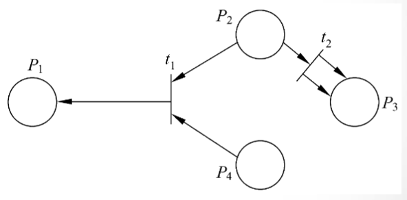
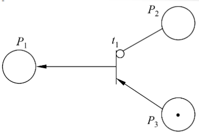

<link rel=stylesheet href=style.css>
<h1> 4 形式化说明 </h1>
<h2> 4.1 概述 </h2>
<h3> 4.1.1 形式化说明与非形式化说明 </h3>
<h4> 非形式化方法的缺点 </h4>

  - 用自然语言书写的系统规格说明书，可能存在矛盾、二义性、含糊性、不完整性及抽象层次混乱等问题
<h4> 形式化方法的优点 </h4>

  - 为了克服非形式化方法的缺点，人们把数学引入软件开发过程，创造了基于数学的形式化方法
    - 数学能够简洁准确地描述物理现象、对象或动作的结果，因此是理想的建模工具
    - 数学以在不同的软件工程活动之间平滑地过渡
    - 数学提供了高层确认的手段

<h3> 4.1.2 应用形式化方法的准则 </h3>

  - 略

<h2> 4.2 有穷状态机 </h2>
<h3> 4.2.1 概念 </h3>
<h4> 有穷状态机的组成 </h4>

  - 一个有穷状态机可以表示为一个5元组 (J，K，T，S，F)
  - 状态集J、输入集K、由当前状态和当前输入确定下一个状态(次态)的转换函数T、初始态S和终态集F
    | 符号 | 意义     | 描述                   |
    | ---- | -------- | ---------------------- |
    | J    | 状态集   | 有穷的非空状态集       |
    | K    | 输入集   | 一个有穷的非空输入集   |
    | T    | 转换函数 | 从(J-F)×K到J的转换函数 |
    | S    | 初始态   | S∈J，是一个初始状态    |
    | F    | 终态集   |                        |
  - 状态转换形式
    - 当前状态〔菜单〕+事件〔所选择的项〕=>下个状态
  - 在前述的5元组中加入第6个组件——谓词集P
    - 当前状态〔菜单〕+事件〔所选择的项〕+谓词=>下个状态

<h2> 4.3 Petri 网 </h2>
<h3> 4.3.1 概念 </h3>
<h4> Petri 网组成 </h4>

  - 元素构成
    | 元素 | 构成     | 描述                                                 |
    | ---- | -------- | ---------------------------------------------------- |
    | P    | 位置     | P=｛P1，...，Pn｝是一个有穷位置集，n≥0               |
    | T    | 转换     | T=｛t1，...，tm｝是一个有穷转换集，m≥0，且T和P不相交 |
    | I    | 输入函数 | T→P∞为输入函数，由转换到位置无序单位组(bags)的映射   |
    | O    | 输出函数 | T→P∞为输出函数，由转换到位置无序单位组的映射         |
  - 举例      
    
    - P:｛P1，P2，P3，P4｝
    - T:｛t1，t2｝
    - I(t1)= {P2，P4}
    - I(t2)=｛P2｝
    - O(t1)=｛P1｝
    - O(t2)=｛P3，P3｝
  - 权标
    - Petri网的标记是在Petri网中权标(token)的分配
    - 通常，当每个输入位置所拥有的权标数大于等于从该位置到转换的线数时，就允许转换。
    - 当被激发时，权标按转换箭头数增减  
    
    - 标记向量:(1,2,0,1)
      - t1激活: (2,1,0,1)
      - t2激活：(2,0,2,0)
  - 禁止线  
    

<h2> 4.4 Z语言 </h2>
<h3> 4.4.1 简介 </h3>
<h4> 给定的结合 </h4>

  - 一个Z规格说明从一系列给定的初始化集合开始。所谓初始化集合就是不需要详细定义的集合，这种集合用带方括号的形式表示。对于电梯问题，给定的初始化集合称为Button，即所有按钮的集合，因此，Z规格说明开始于：〔Button〕

<h4> 状态定义 </h4>

  - 一个Z规格说明由若干个“格(schema)”组成，每个格含有一组变量说明和一系列限定变量取值范围的谓词。

<h4> 初始状态 </h4>

  - 抽象的初始状态是指系统第一次开启时的状态

<h4> 操作 </h4>

  - 如果一个原来处于关闭状态的按钮被按下，则该按钮开启，这个按钮就被添加到pushed集中
  - 操作的谓词部分，包含了一组调用操作的前置条件，以及操作完全结束后的后置条件

<h3> 4.4.2 评价 </h3>

  - 可以比较容易地发现用Z写的规格说明的错误，特别是在自己审查规格说明，及根据形式化的规格说明来审查设计与代码时，情况更是如此
  - 用Z写规格说明时，要求作者十分精确地使用Z说明符
  - Z是一种形式化语言，在需要时开发者可以严格地验证规格说明的正确性
  - 虽然完全学会Z语言相当困难，但是，经验表明，只学过中学数学的软件开发人员仍然可以只用比较短的时间就学会编写Z规格说明，当然，这些人还没有能力证明规格说明的结果是否正确
  - 使用Z语言可以降低软件开发费用
  - 虽然用户无法理解用Z写的规格说明，但是，可以依据Z规格说明用自然语言重写规格说明。经验证明，这样得到的自然语言规格说明，比直接用自然语言写出的非形式化规格说明更清楚、更正确