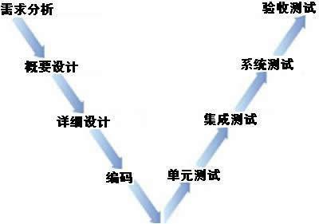
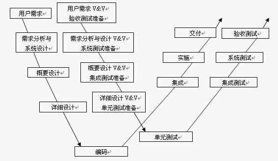
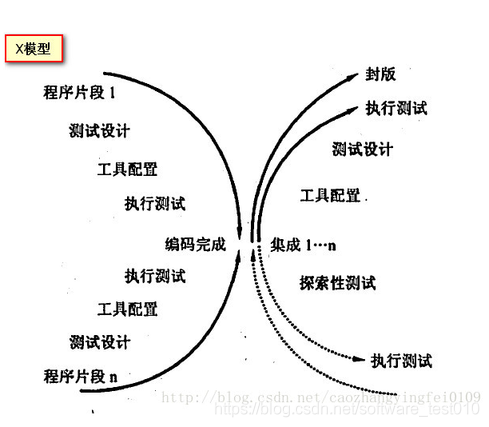

<link rel="stylesheet" href="style.css">
<h1> 软件测试模型与过程 </h1>
<h2> 1 软件测试模型 </h2>
<h3> 1.1 V 模型 </h3>
<h4> V 模型示意图 </h4>

  

<h4> 局限性 </h4>

  - V模型仅仅把测试作为在编码实现后的一个阶段，是针对程序进行的寻找错误的活动，而忽视了测试活动对需求分析，系统设计等活动的验证和确认

<h3> 1.2 W 模型 </h3>
<h4> W 模型示意图 </h4>

  

<h3> 1.2 X 模型 </h3>
<h4> X 模型示意图 </h4>

  

<h3> 1.2 H 模型 </h3>

  - 可以独立测试