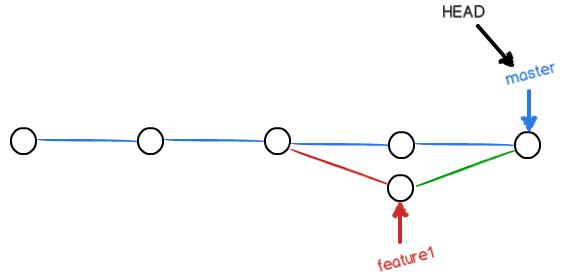
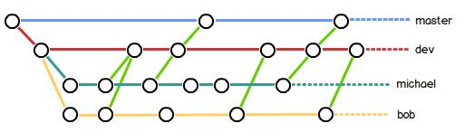

<link rel="stylesheet" href="style.css">

<h1> Git command </h1>

> 参考文献  
> - CSDN: [github常用指令](https://so.csdn.net/so/search/s.do)
> - aift: [Git学习笔记](https://blog.csdn.net/ft_sunshine/article/details/87010772)
> - 廖雪峰: [创建与合并分支](https://www.liaoxuefeng.com/wiki/896043488029600/900003767775424)
> - Song先森：[简单使用Git与github（一）](https://blog.csdn.net/Song_74110/article/details/80233861)

<h2> Git 基本指令与理论 </h2>
<h3> 1. 版本库与文件操作 </h3>

<h4>1.1 创建版本库</h4>

  - git.init 创建仓库  

<h4>1.2 添加文件</h4>

  -  git add "filename"   将文件添加到暂存区(stage)
  -  git commit -m "message"  把暂存区内容添加到当前分支，添加到版本库，message时提交描述
    -  git status  查看仓库状态
      -  Changes not staged for commit  文件更改后未进入暂存区，需要add
      -  Changes to be committed  文件已进入暂存区，但还未提交到版本库，需要commit
      -  Untracked files  表示该文件还从来没有被添加进版本库
    -  git diff "filename"  查看修改内容

<h4>1.3 版本退回</h4>

  -  git log  查看历史
    -  git log --pretty=oneline  使每个日志单独成行
  -  git reset --hard HEAD^num  退回num个版本
  -  git reset --hard commit_id  到指定的commit_id版本
    -  新版本的commit id可以只写id号的前几位，Git会自动去找 
  -  git reflog  查看命令历史，以便确定要回到未来的哪个版本

<h4> 1.4 工作区和暂存区 </h4>

  - 工作区：当前的工作目录
  - 版本库：工作区里面隐藏的.git目录就是Git的版本库
  - 暂存区：Git的版本库中stage/index
  - 分支：Git为我们自动创建的第一个分支master，指向master的一个指针叫HEAD
  - 提交流程
    -  git add + git commit  需要提交的文件修改通通放到暂存区，然后，一次性提交暂存区的所有修改  
      
  -  git diff #是工作区(work dict)和暂存区(stage)的比较,比较的是工作区文件与暂存区文件的区别（上次git add 的内容）。  
  git diff --cached #是暂存区(stage)和分支(master)的比较,比较的是暂存区的文件与仓库分支里（上次git commit 后的内容）的区别 。 

<h4> 1.5 撤销修改 </h4>

  -  git checkout -- "filename"  直接丢弃工作区的修改
    -  若文件自修改后还没有被放到暂存区，现在，撤销修改就回到和版本库一模一样的状态  
    若文件已经添加到暂存区后，又作了修改，现在，撤销修改就回到添加到暂存区后的状态
     
  -  git reset HEAD "file"  把暂存区的修改撤销掉

<h4> 1.6 删除文件 </h4>

  -  rm "fileName"  删除工作区中的文件
  -  git add/rm "fileName"  删除版本库中文件
  -  git checkout -- "file"  把误删的文件恢复到最新版本

<h3> 2. 远程仓库 </h3>

<h4> 2.1 创建SSH Key </h4>

  -  ssh-keygen -t rsa -C "youremail@example.com" : SSH在系统user文件下.ssh目录里
    -  id_rsa  私钥
    -  id_rsa.pub  公钥

<h4> 2.2 github中使用 </h4>

  -  setting &rarr; SSH and GPG keys 

<h4> 2.3 添加远程库 </h4>

  -  git remote add origin URL  把本地仓库的内容推送到GitHub仓库
  -  git push -u origin "filename"  第一次推送,把本地的file分支和远程的file分支关联
  -  git push origin "filename"  本地提交后，如有必要，可推送本地的最新修改

<h4> 2.4 从远程库克隆 </h4>

  -  git clone URL  从URL获取链接克隆到本地仓库

<h3> 3. 分支管理 </h3>

深入学习参考文章：廖雪峰: [创建与合并分支](https://www.liaoxuefeng.com/wiki/896043488029600/900003767775424)

<h4> 3.1 分支与管理 </h4>

  -  git branch  查看分支
  -  git branch "name"  创建分支（相当于增加了一个dev指针）
  -  git checkout "name"  切换分支
  -  git checkout -b "name"  创建+切换分支
  -  git merge "name"  合并某分支到当前分支
  -  git branch -d "name" <name>  删除分支
    -  只有在commit之后才能创建并使用branch 
  - 合并到主分支例子
    1.  git checkout -b dev  创建分支dev
    2. 在dev分支上进行一通操作
    3.  git checkout master  切换到主分支
    4.  git merge dev  合并
    5.  git branch -d dev  删除分支  
  
  
  
  

<h4> 3.2 解决冲突 </h4>

  - 合并分支时就可能出现代码冲突，任何合并冲突都必须人去解决
  - 冲突的本质：不同的分支修改了代码相同的部分，从而导致合并分支时出现冲突
  - 解决冲突：Git合并失败的文件进行手动修复，改为我们想要的内容再提交

<h4> 3.3 分支管理策略 </h4>

  -  Fast Farword  默认合并分支模式，这种合并看不到合并历史，删除分支会丢掉分支信息。
  -  git merge --no-ff -m "merge with no-ff" dev  
    -  --no-ff  禁用Fast forward模式
    -  -m  合并要创建一个新的commit，所以加上-m参数，把commit描述写进去  
    
    

<h4> 3.4 Bug 分支 </h4>
  
  - 修复bug，每个bug都可以通过一个新的临时分支来修复，修复后，合并分支，然后将临时分支删除
  -  git stash  把当前分支“储藏”起来，等以后恢复现场后继续工作
  -  git stash list  查看stash内容
  -  git stash pop  恢复的同时把stash内容也删了继续工作
  -  git stash apply  恢复后stash内容并不删除，你需要用  git stash drop   来删除

<h4> 3.5 强制删除 </h4>

  -  git branch -D <name>  强行删除

<h4> 3.6 多人协作 </h4>

  - 远程仓库
    -  origin  远程仓库默认名
  - 推动分支
    -  git remote / git remote -v  查看远程库的信息
    -  git push origin master  将本地master分支推送到远程主分支
  - 抓取分支
    -  git clone URL  从远程库克隆
    -  git checkout -b dev origin/dev  创建远程origin的dev分支到本地
    - 多人合作时，若队友先push到了origin，需要pull最新的提交，再push
  - 多人协作的工作模式
    -  git push origin "branch-name"  推送自己的修改
    -  git pull  推送失败，则因为远程分支比你的本地更新,需要合并
    -  git push origin "branch-name"  再尝试推送自己的修改
      -  no tracking information  说明本地分支和远程分支的链接关系没有创建
      -  git branch --set-upstream-to "branch-name" origin/"branch-name"  创建链接

<h3> 4. 标签管理 </h3>

<h4> 4.0 前言 </h4>

  - 标签是指向某个commit的指针，分支可以移动，标签不能移动

<h4> 4.1 创建标签 </h4>

  - 切换到需要打标签的分支上
  -  git tag <tagname> [commit id]  新建一个标签，默认标签是打在最新提交的commit上的，也可以指定一个commit id
    -  git log --pretty=oneline --abbrev-commit <tagname>  找到历史提交的commit id
  -  git tag -a <tagname> -m "describe" [commit id]  指定标签信息
  -  git tag  查看所有标签
  -  git show "tagname"  查看标签信息

<h4> 4.2 创建标签 </h4>

  - 默认创建的标签都只存储在本地，不会自动推送到远程，所以，打错的标签可以在本地安全删除
  -  git push origin "tagname"  推送一个本地标签到远程库
  -  git push origin --tags  推送全部未推送过的本地标签到远程库
  -  git tag -d "tagname"  删除一个本地标签
  -  git push origin :refs/tags/"tagname"  可以删除一个远程标签（先从本地删除）

<h3> 5. Github的使用 </h3>

<h4> 5.1 pull代码 </h4>

  - 在电脑上建立一个文件夹，在这个文件夹进入“Git Bash Here”
  -  git init  初始化
  - git remote add origin git@github.com:用户id/仓库名.git  建立远程连接
  -  git pull git@github.com:用户id/仓库名.git  pull 代码下来
  -  git clone URL  从URL获取链接克隆到本地仓库

<h4> 5.2 push代码 </h4>

  -  git add .  增加到git管理
  -  git commit -m "message"  提交日志
  -  git push git@github.com:用户id/仓库名.git  push到GitHub

 
 

<h2> GitBash常见操作 </h2>

<h3> 创建链接 </h3>

>  创建与GitHub的代码库链接 

  - 全局设置
    -  一台设备只需要设置一次 
    -  git config --global user.name "name"  设置全局用户名
    -  git config --global user.email "address"  设置全局邮箱
    -  ssh-keygen -t rsa -C "youremail@example.com" : SSH在系统user文件下.ssh目录里
  - 与GitHub链接
    -  git init  初始化，创建本地代码库
    - git remote add origin git@github.com:用户id/仓库名.git  建立远程连接

<h3> 同步操作 </h3>

>  基本的pull和push操作 

  - pull 下载
    -  git pull git@github.com:用户id/仓库名.git  pull 代码下来
    -  git clone URL  从URL获取链接克隆到本地仓库
  - push 上传
    -  git add .  将文件增加到git暂存区
    -  git commit -m "message"  暂存区全部上传
    -  git push git@github.com:用户id/仓库名.git  push到GitHub

<h3> 删除文件 </h3>

>  只改变GitHub文件，不更改本地文件 
  -  git rm -r --cached "filename"  暂存区中说明要删除文件
  -  git commit -m "message"  提交删除文件
  -  git push -u origin master  向GitHub仓库(origin)提交分支(master)

<h3> 常见问题 </h3>

>  GitHub同步过程常见问题解决 
  - 仓库历史不匹配  refusing to merge unrelated histories 
    - 解决链接：[记Git报错-refusing to merge unrelated histories](https://blog.csdn.net/u012145252/article/details/80628451)
    - 解决方案： --allow-unrelated-history  在pull后面加入该指令
      -  $git pull origin master --allow-unrelated-histories 

<h2> Github 常用指令 </h2>
<h3> 指令列表 </h3>

| 指令                            | 说明                                                                      |
| ------------------------------- | ------------------------------------------------------------------------- |
| git init                        | 新建一个空仓库                                                            |
| git status                      | 查看状态                                                                  |
| git branch                      | 查看所有分支                                                              |
| git branch newname              | 创建名为newname的分支                                                     |
| git checkout newname            | 切换到newname分支上                                                       |
| git add .                       | 添加当前目录下所有文件                                                    |
| git rm -r xxx.txt              | 删除xxx文件                                                               |
| git commit -m'注释'             | 提交添加的文件并备注说明                                                  |
| git remote add origin address   | 连接到远程仓库address                                                     |
| git push origin master          | 将本地文件推送到远程文件                                                  |
| git pull origin master          | 将远程仓库文件更新到本地文件                                              |
| git remote -v                   | 查看远程仓库                                                              |
| git fetch origin   master:newname | 本地新建一个分支， 将远程origin仓库的master分支代码下载到本地newname分支 |
| git diff newname                | 比较本地代码与刚刚从远程下载下来的代码的区别                              |
| git merge newname               | 把newname分支合并到当前分支上                                             |
| git branch -d newname           | 删除newname分支                                                           |
| git log                         | 查看 变更日志                                                             |
| git reset --hard                | 版本号前六位，回到指定版本                                                |
| git pull origin master          | 将master分支上的内容拉到本地上                                            |
|                                 |                                                                           |
