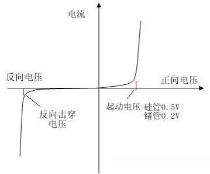

# **门电路**
## **概述**
> <big>门电路的概念</big>
- 门电路的概念
  - 实现基本和常用逻辑运算的电子电路
- 逻辑变量与两种状态开关
  - 二值量：0 1
- 高低电平与正负逻辑
  -  书P74 
- 分立元件门电路和集成门电路
  - 分立元件门电路： 分立的元器件和导线连接
  - 集成门电路：制作在一块半导体芯片上
- 数字集成电路的集成度
- 集成度：在一块芯片中含有等效逻辑门的个数或元器件的个数
  
 

## **半导体二极管，三极管和MOS管的开关特性**
> <big> 理想开关的开关特性 </big>
- 显著特点：单向导电特性
- 静态特性： 书P75 
- 动态特性： 书P75 

> <big> 半导体二极管的开关特性 </big>
- 静态特性
  - 结构示意图和符号
    - 半导体二极管是一种两层，一结，两端器件
    - 两层：P,N
    - 一结：PN 结
    - 两端：阳极 A, 阴极 K
  - 伏安特性
    -  书P76 
     
- 动态特性
  - 二极管的电容效应
    - 结电容: $C_{j}$
    - 扩散电容: $C_{D}$
  - 二极管的开关时间
    -  书P78 

> <big> 半导体三极管的开关特性 </big>
- 显著特点： 放大能力
- 备注：默认基极电阻为 0.7 $\Omega$
- 静态特性
  - 结构示意图和符号
    - 半导体三极管是一种三层，两结，三端器件
    - 三层：发射区，基区，集电区
    - 两结：$J_{1}　J_{2}$
    - 两端：发射极e，基极b，集电集c
  - 输入特性
    -  书P80 
  - 输出特性
    -  书P80 
- 动态特性
  - 波形图
    -  书P83 

> <big> MOS管的开关特性 </big>
- 静态特性
  - 结构示意图和符号
    - 结构：金属 - 氧化物 - 半导体
    - N沟道：源极S，漏极D，栅极G
  - 漏极特性
  - 转移特性
  - P沟道：与N沟道有明显的对偶关系
- 动态特性

 

## **分立元器件门电路**
> <big> 二极管与或和或门 </big>
- 