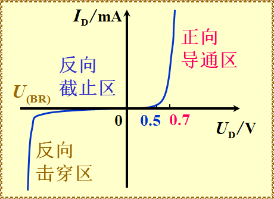
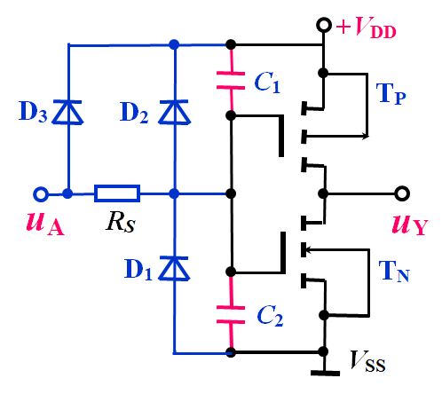

<link rel=stylesheet href=style.css>

# **门电路**
## **概述**
> <big>门电路的概念</big>
- 门电路的概念
  - 实现基本和常用逻辑运算的电子电路
- 逻辑变量与两种状态开关
  - 二值量：0 1
- 高低电平与正负逻辑
  -  书P74 
- 分立元件门电路和集成门电路
  - 分立元件门电路： 分立的元器件和导线连接
  - 集成门电路：制作在一块半导体芯片上
- 数字集成电路的集成度
- 集成度：在一块芯片中含有等效逻辑门的个数或元器件的个数
  
 

## **半导体二极管，三极管和MOS管的开关特性**
> <big> 理想开关的开关特性 </big>
- 显著特点：单向导电特性
- 静态特性：
  - 断开：$R_{OFF}=\infin, I_{OFF}=0$
  - 闭合：$R_{ON}=O, U_{AK}=0$ 
    - AK:开关
- 动态特性：
  - 开关时间：$t_{on}=0, t_{off}=0$

> <big> 半导体二极管的开关特性 </big>
- 静态特性
  - 结构示意图和符号
    - [PN结工作原理](https://blog.csdn.net/kagaobin/article/details/106456293)
    - 半导体二极管是一种两层，一结，两端器件
    - 两层：P,N
    - 一结：PN 结
    - 两端：阳极 A, 阴极 K
  - 半导体符号

    

  - 伏安特性曲线
  
    

  - 二极管导通电压
    - $U_{D}=0.7 V$

- 动态特性
  - 二极管的电容效应：二极管的通断需要一段延迟时间才能完成
    - 结电容: $C_{j}$
    - 扩散电容: $C_{D}$
  - 二极管开关时间
    - $t_{on}<<t_{off}≤5ns$
  - 二极管导通曲线

    

> <big> 半导体三极管的开关特性 </big>
- 显著特点： 放大能力
- 备注：默认基极电阻为 0.7 $\Omega$
- 静态特性
  - 结构示意图和符号
    - 半导体三极管是一种三层，两结，三端器件
    - 三层：发射区，基区，集电区
    - 两结：$J_{1}　J_{2}$
    - 两端：发射极e，基极b，集电集c
  - 结构与符号

    
    

  - 输入特性
    - $i_{B}=f(u_{BE})|_{u_{CE}}$
      |   状态   |           电流关系           |          条件          |
      | :------: | :--------------------------: | :--------------------: |
      |   放大   |     $i_{C}=\beta i_{B}$      | 发射结正偏，集电结反偏 |
      | 饱和临界 |     $i_{C}<\beta i_{B}$      |       两个结正偏       |
      |   截止   | $i_{C}\approx i_{B}\approx0$ |       两个结反偏       |

  - 输出特性
  
    

- 动态特性
  - 波形图

    

> <big> MOS管的开关特性 </big>
- 静态特性
  - 结构示意图和符号
    - 结构：金属 - 氧化物 - 半导体：Mental–Oxide–Semiconductor
    - N沟道：源极S，漏极D，栅极G
    - 高电平导通，低电平开路

      
      

    - P沟道：与N沟道有明显的对偶关系
    - 低电平导通，高电平开路

      
      

 

## **分立元器件门电路**
> <big> 二极管与或和或门 </big>
  - 二极管与门

    

  - 二极管或门

    

> <big> 三极管非门 </big>
  - 半导体三极管非门

    

> <big> MOS三极管非门 </big>
  - 半导体三极管非门

    

## **CMOS 集成门电路**
> <big>CMOS 反相器</big>
  - [视频讲解](https://www.bilibili.com/video/BV1GQ4y1P7pB/?spm_id_from=333.788.videocard.0)
  - 电路图

    

  - 电流传输特性

    

> <big> CMOS 与非门、或非门、与门和或门 </big>
  - [视频讲解](https://www.bilibili.com/video/BV1zg4y1i7XJ?from=search&seid=8868570902640216976)
  - CMOS 与非门电路图

    

  - CMOS 或非门电路图

    

  - CMOS 与门电路图

    

  - CMOS 或门电路图

    

  - 带缓冲的 CMOS 与非门和或非门
    - 基本电路的主要缺点
      - 电路的输出特性不对称
      - 当输入状态不同时，输出等效电阻不同
  - 带缓冲的门电路
    - 在原电路的输入端和输出端加反相器

> <big>CMOS 与或非门和异或门</big>
- CMOS 与或非门
  - 电路组成
    - 由CMOS 基本电路(与非门和反相器)组成
  - 工作原理

    

- CMOS 异或门
  - 电路组成
    - 由CMOS 基本电路(与非门)组成
  - 工作原理

    

> <big>CMOS 传输门、三态门和漏极开路门</big>
- CMOS传输门 (TG 门 — Transmission Gate)
  - 电路组成

    

  - 工作原理
    |   C   | $\overline{C}$ | $T_{N}$ | $T_{P}$ |       结果        |
    | :---: | :------------: | :-----: | :-----: | :---------------: |
    |   1   |       0        |  导通   |  导通   |   $u_{o}=u_{I}$   |
    |   0   |       1        |  截止   |  截止   | $u_{o}\neq u_{I}$ |

- CMOS 三态门
  - 电路组成

    

  - 工作原理
    | $\overline{EN}$ |   A   |   Y    |
    | :-------------: | :---: | :----: |
    |        1        |  0/1  | 高阻态 |
    |        0        |  0/1  |  1/0   |
  - 逻辑符号

    

- CMOS 漏极开路门 (OD门 — Open Drain)
  - 电路组成

    

  - 逻辑符号

    

  - 主要特点
    - 漏极开路，工作时必须外接电源和电阻
    - 可以实现线与功能
    - 可实现逻辑电平变换
    - 带负载能力强

> <big>CMOS 电路使用中应注意的几个问题</big>
- CC4000 和 C000 系列集成电路
  - CC4000 系列
    - 符合国家标准，电源电压为 3-18 V，功能和外部引线排列与对应序号的国外产品相同
  - C000 系列
    - 早期集成电路，电源电压为 7-15 V，外部引线排列顺序与 CC4000 不同，用时需查阅有关手册
- CMOS 集成电路的主要特点
  - 功耗极低
  - 电源电压范围宽
  - 抗干扰能力强
  - 逻辑摆幅大
  - 输入阻抗极高
  - 扇出能力强
  - 集成度很高，温度稳定性好
  - 抗辐射能力强
  - 成本低