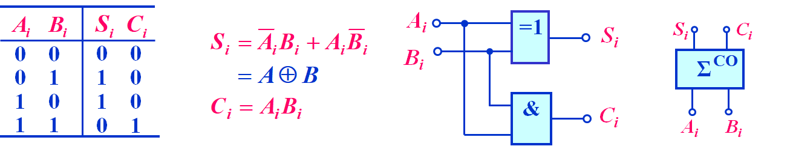
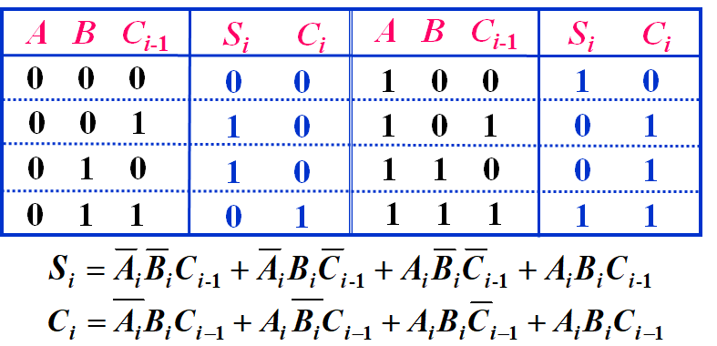
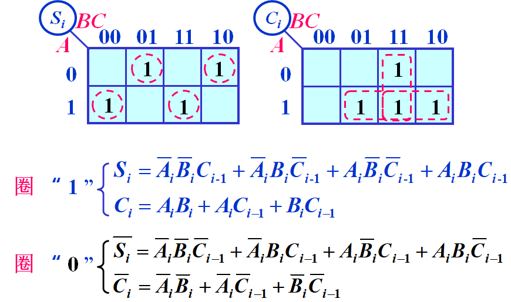
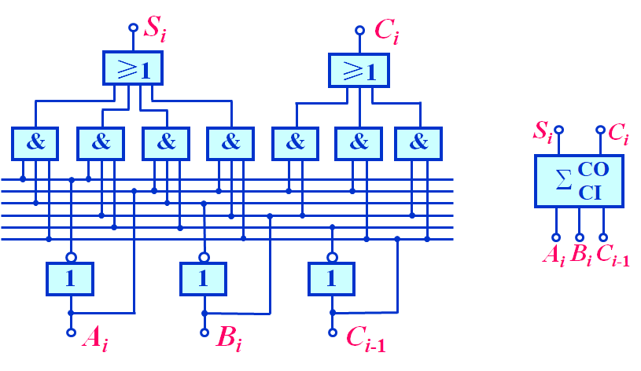
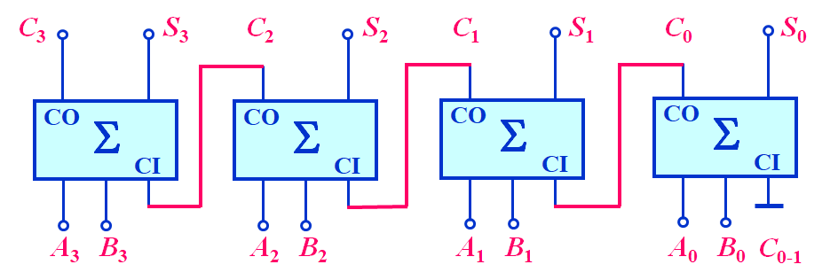

<link rel=stylesheet href=style.css>

# **组合逻辑电路**
## **概述**
> <big>组合电路的特点</big>
  - 逻辑功能的特点
    - 电路在任何时刻的输出状态只取决于该时刻的输入状态，而与原来的状态无关
  - 电路结构特点
    - 输出、输入之间没有反馈延迟电路
    - 不包含记忆性元件(触发器)，仅由门电路构成
> <big>组合电路逻辑功能表示方法</big>
  - 真值表，卡诺图，逻辑表达式，时间图(波形图)
> <big>组合电路分类</big>
  - 按逻辑功能不同
    - 加法器 比较器 编码器 译码器 数据选择器和分配器 只读存储器

## **组合电路的分析方法和设计方法**
> <big> 组合电路的基本分析方法 </big>
  - 分析步骤
    - 逻辑图 &rarr; 逻辑表达式 &rarr; 化简 &rarr; 真值表 &rarr; 说明功能
  - 解题步骤
    - 逻辑表达式 &rarr; 化简 &rarr; 列真值表 &rarr; 功能说明
> <big> 组合电路的基本设计方法 </big>
  - 设计步骤
    - 逻辑抽象 &rarr; 列真值表 &rarr; 写表达式化简/变换 &rarr; 画逻辑图

## **加法比较器和数值比较器**
> <big> 加法器 </big>
  - 半加器（Half  Adder）
    - 定义：两个 1 位二进制数相加不考虑低位进位

        
  - 全加器（Full  Adder）
    - 定义：两个 1 位二进制数相加，考虑低位进位
  
      
      
      

  - 加法器
    - 4 位串行进位加法器
      - 特点：电路简单，连接方便；速度低

      

    - 超前进位加法器
      - 特点：速度快，电路比较复杂

> <big> 数值比较器 </big>
  - 1位数值比较器