<link rel=stylesheet href=style.css>

# **触发器**

## **概述**
> 基本要求
  - 有两个稳定的状态(0、1)，以表示存储内容
  - 能够接收、保存和输出信号
> 现态和次态
  - 现态：$Q^{n}$ 触发器接收输入信号之前的状态
  - 次态：$Q^{n+1}$ 触发器接收输入信号之后的状态
> 分类
  - 按电路结构和工作特点：基本、同步、主从和边沿
  - 按逻辑功能分：RS、JK、D 和 T
  - 其他：TTL 和 CMOS，分立和集成

## **基本触发器**
> 由与非门组成
  - 电路及符号

    

  - 工作原理
    - $\overline{S}=0　\overline{R}=1　Q=1　\overline{Q}=0　1态$
    - $\overline{S}=1　\overline{R}=0　Q=0　\overline{Q}=1　0态$
    - $\overline{S}=1　\overline{R}=1　Q=Q　\overline{Q}=\overline{Q}　保持$
    - $\overline{S}=0　\overline{R}=0　Q和\overline{Q}都是高电压态$
      - $\overline{R} 先撤销：1态$
      - $\overline{S} 先撤销：0态$
      - 同时撤销：状态不稳定
  - 简化波形图

    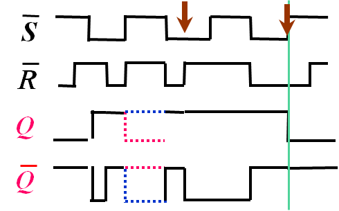

  - 特性表和特性方程
  
    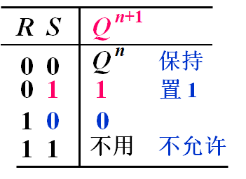

> 由或非门组成
  - 电路及符号

    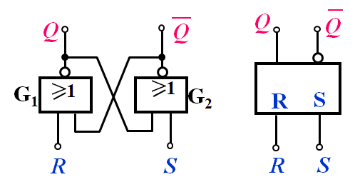

  - 工作原理
    - $S=0　R=1　Q=0　\overline{Q}=1　1态$
    - $S=1　R=0　Q=1　\overline{Q}=0　0态$
    - $S=1　R=1　Q和\overline{Q}都是高电压态$
    - $S=0　R=0　保持$
      - 同时撤销：状态不稳定
  - 简化波形图

    

## **同步触发器**
> 同步 RS 触发器  
  - 同步触发器：触发器的工作状态不仅受输入端 (R、S) 控制，而且还受时钟脉冲(CP) 的控制
  - CP (Clock  Pulse)：等周期、等幅的脉冲串
  - 基本 RS 触发器
    - S — 直接置位端
    - R — 直接复位端
    - 不受 CP 控制
  - 同步触发器
    - 同步 RS 触发器
    - 同步 D 触发器
  - 电路组成及工作原理
    - 电路及逻辑符号

        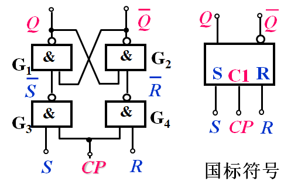

    - 工作原理
      - $CP=0　\overline{S}=\overline{R}=1　Q^{n+1}=Q^{n} 保持$
      - $CP=1　与基本RS触发器相同$

> 同步 D 触发器
  - 电路组成及工作原理
    - 电路及逻辑符号

        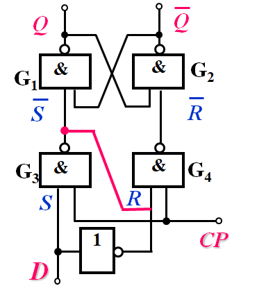

    - 工作原理
      - $S=D,R=\overline{D},Q^{n+1}=D$
    - 主要特点
      - 时钟电平控制，无约束问题
      - CP = 1 时跟随

> 集成同步 D 触发器
  - TTL：74LS375
  - CMOS：CC4042

## **主从触发器**
> 主从 RS 触发器
  - 工作原理
    - 接受信号
      - $Q^{n+1}_{M}=S+\overline{R}Q^{n}$
      - $RS=0$
  - 电路组成及符号

    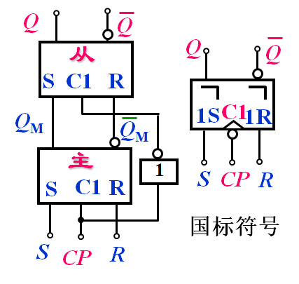

  - 波形图

    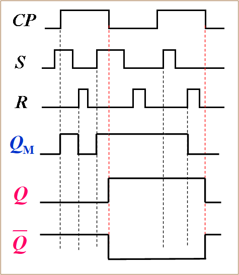

  - 主要特点
    - 主从控制，时钟脉冲触发
      - CP=1: 主触发器接受输入信号
      - CP 1&rarr;0：从触发器按照主触发器的内容更新状态
      - 从触发器输出端的变化只能发生在 CP 的下降沿
    - R、S 之间有约束
      - CP 下降沿到来时，若违背约束条件：S=R=1 ，则可能出现竞态现象
  - 异步输入端的作用
    - 电路组成及符号

        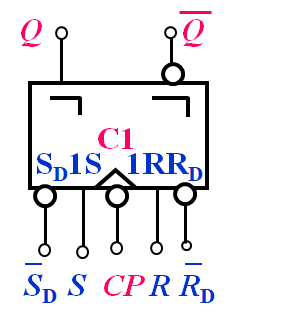
    
    - 主要特点
      - $R、S$ — 同步输入端受时钟 CP 同步控制
      - $\overline{R}_{D},\overline{S}_{D}$ — 异步输入端不受时钟 CP 控制

> 主从 JK 触发器
  - 解决 R、S 之间有约束的问题

      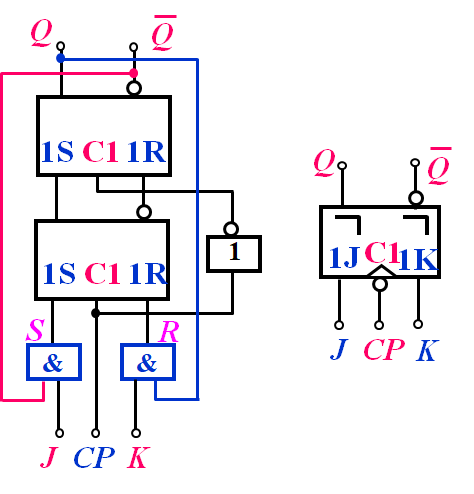

  - 工作原理
    - 特性方程 $Q_{n+1}=J\overline{Q^{n}}+\overline{K}Q^{n}$
  - 特性表
      |   J   |   K   |     $Q^{n+1}$      | 功能  |
      | :---: | :---: | :----------------: | :---: |
      |   0   |   0   |      $Q^{n}$       | 保持  |
      |   0   |   1   |         0          |   0   |
      |   1   |   0   |         1          |   1   |
      |   1   |   1   | $\overline{Q^{n}}$ | 翻转  |

## **边沿触发器**
> 边沿 D 触发器 
  - 电路组成及符号

    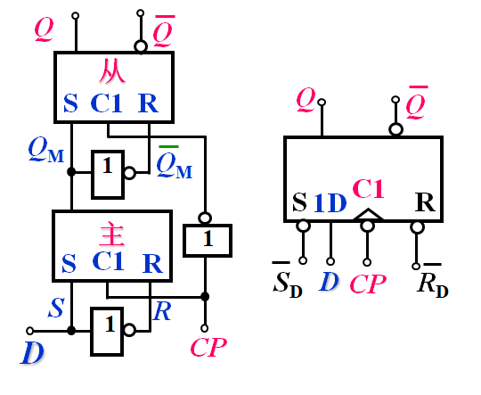

  - 工作原理
    - $Q^{n+1}=D$
  - 波动图：CP 下降沿时刻有效

    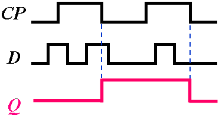

> 边沿 JK 触发器
  - 电路组成及符号

    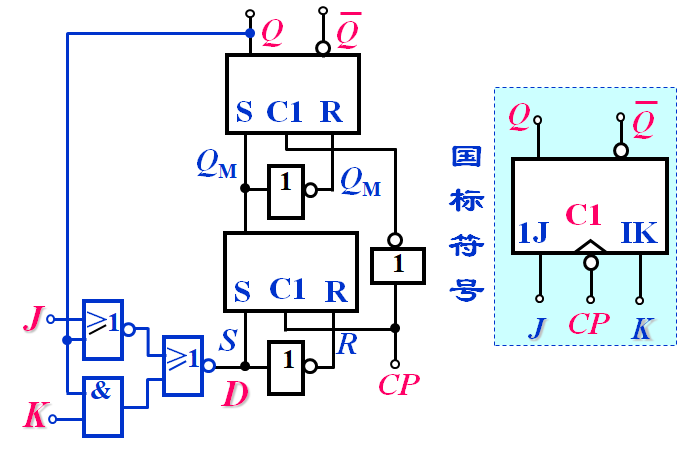

  - 工作原理
    - $Q^{n+1}=J\overline{Q^{n}}+\overline{K}Q^{n}$
    - CP 下降沿有效

> 集成边沿 JK 触发器
  - CMOS 边沿 JK 触发器

    

  - 特性表

    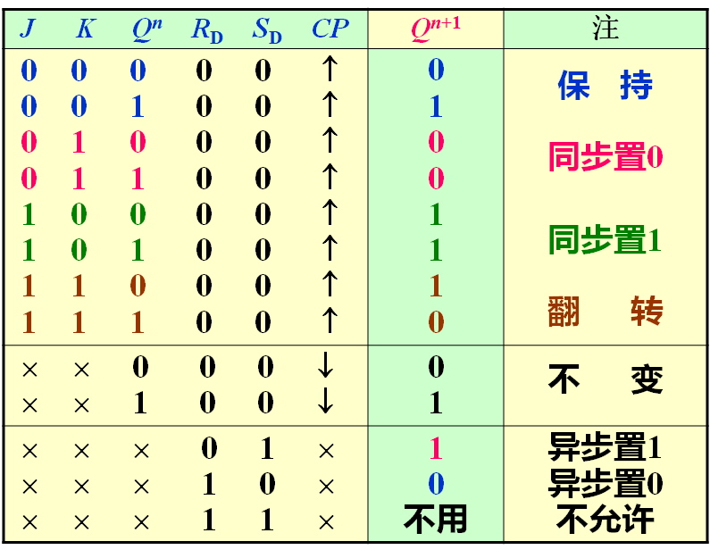

> 波形图
  - 设输出端初态为 0

    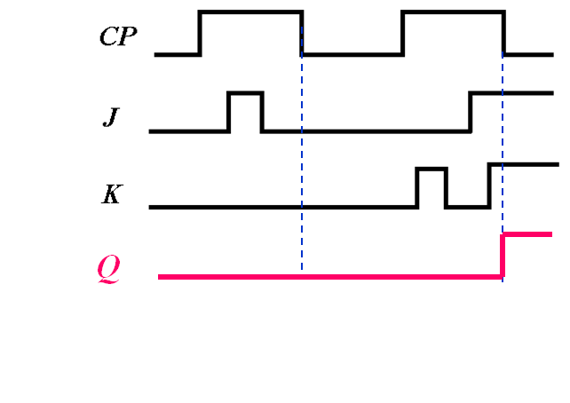

## **时钟触发器的功能分类及转换**
> 时钟触发器功能分类
  - RS 型触发器

    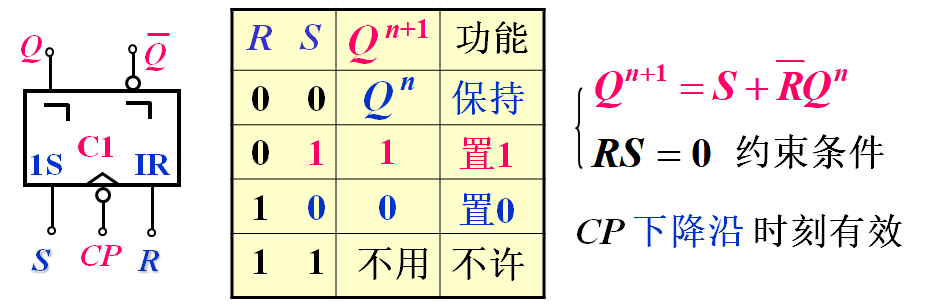

  - JK 型触发器

    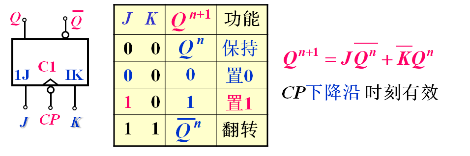

  - D 型触发器

    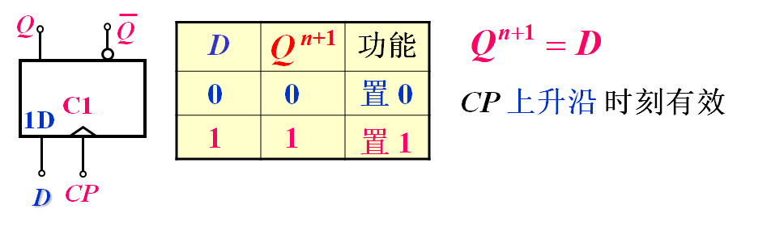

  - T 型触发器

    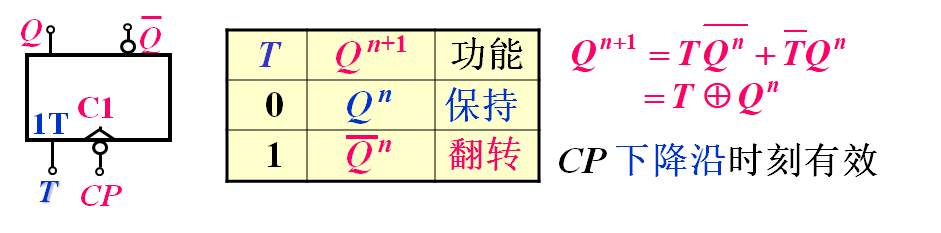

  - T' 型触发器

    

> 不同类型时钟触发器间的转换
  - 转换方法
    - 转换要求

      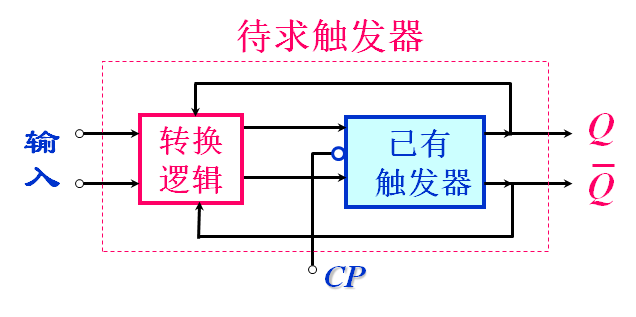

    - 转换步骤
      - 写已有、待求触发器的特性方程
      - 将待求触发器的特性方程变换为与已有触发器一致
      - 比较两个的特性方程，求出转换逻辑
      - 画电路图
  - JK &rarr; D、T、T'、RS
    - JK &rarr; D

      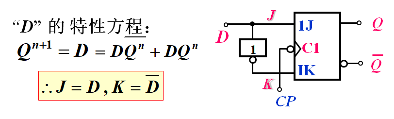

    - JK &rarr; T

      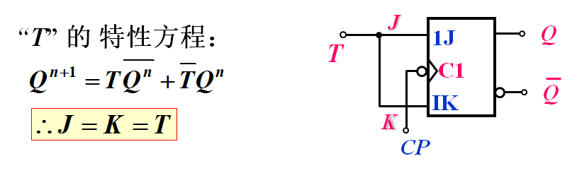

    - JK &rarr; T'

      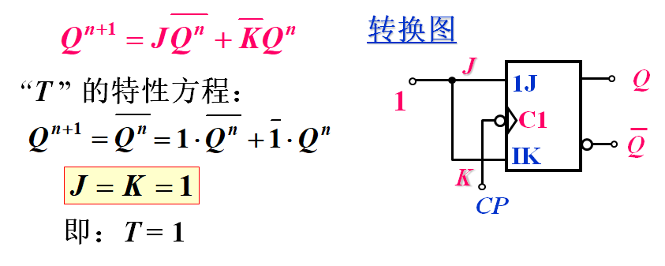

    - JK &rarr; RS

      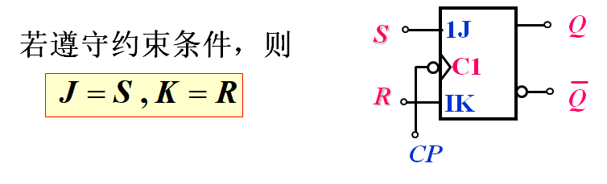

  - D &rarr; JK、T、T'、RS
    - D &rarr; JK

      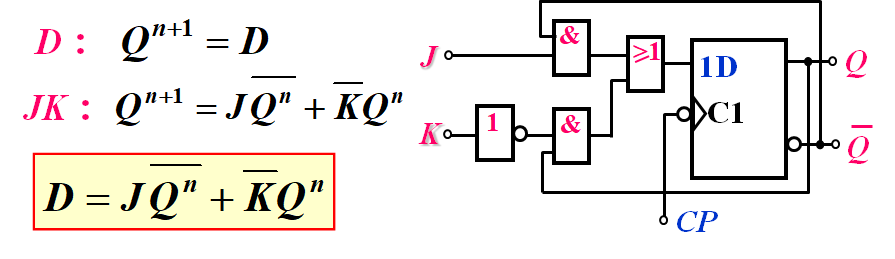

    - D &rarr; T

      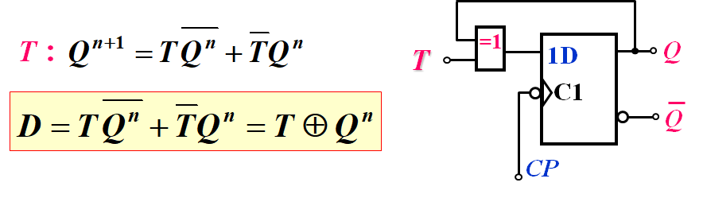

    - D &rarr; T'

      

    - D &rarr; RS

      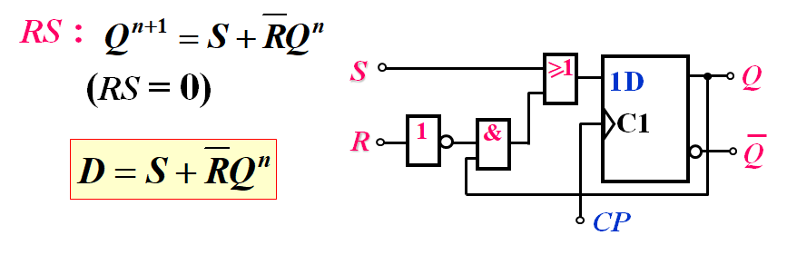

## **触发器逻辑功能表示方法及转换**
> 触发器逻辑功能表示方法
  - 特性表(真值表)、卡诺图、特性方程、状态图和时序图
  - 状态图和时序图

    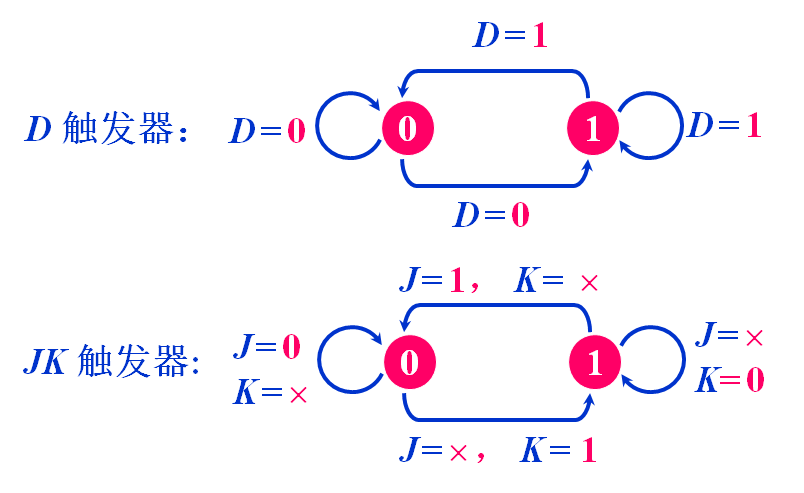
    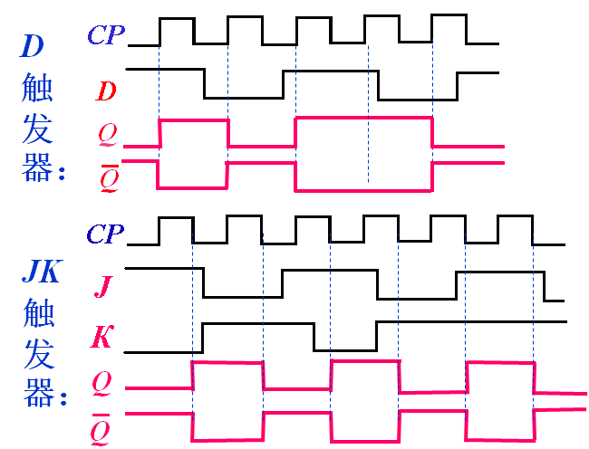

  - 表示方法之间的互相转换

## **触发器的电气特性**
> 静态特性
  - CMOS 触发器
    - 由于 CMOS 触发器的输入、输出以 CMOS反相器作为缓冲级，故特性与 CMOS 反相器相同
  - TTL 触发器
    - 与 TTL 反相器相同，不赘述